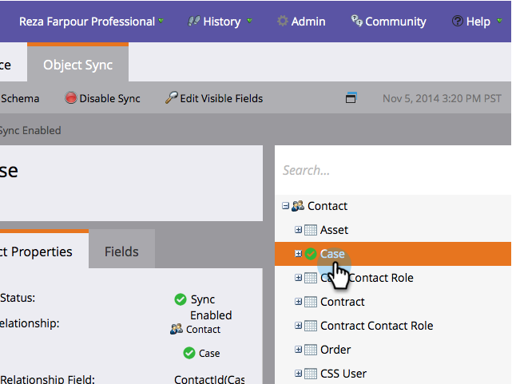

# Adicionar/Remover Campo de Objeto Personalizado como Lista Inteligente/Restrições de Acionador {#add-remove-custom-object-field-as-smart-list-trigger-constraints}

O Marketo fornece controle de fundo sobre a sincronização de objetos personalizados do Salesforce. Isso permite selecionar os campos disponíveis como restrições em filtros de objetos personalizados e usá-los como disparadores em campanhas inteligentes.

>[!NOTE]
>
>**Permissões de administrador necessárias**

1. Clique em **Admin.**

   

1. Clique em **Admin** e depois em **Sincronização de Objetos do Salesforce.**

   

1. **O Salesforce Objects** é sincronizado na coluna da esquerda.

   

1. Selecione o objeto que deseja modificar.

   

1. Clique em **Editar campos visíveis**.

   >[!TIP]
   >
   >Se o botão **Editar campos visíveis** estiver acinzentado, o objeto está em uso no momento em uma lista inteligente ou campanha inteligente. Remova todas as associações para continuar.

   

1. Se a sincronização global estiver ativada, clique em **Desativar Sincronização Global**.

   

1. Marque as caixas ao lado das restrições de filtro/disparo necessárias e clique em **Salvar**.

   

   >[!NOTE]
   >
   >Todos os campos são selecionados por padrão para serem restrições em filtros.

1. Clique na guia **Fields** para confirmar as alterações.

   

   >[!NOTE]
   >
   >Não se esqueça de reativar sua sincronização global!

Uau! Agora, suas listas inteligentes e campanhas inteligentes têm ainda mais poder.

>[!MORELIKETHIS]
>
>[Ativar/Desativar Sincronização de Objeto Personalizado](/help/marketo/product-docs/crm-sync/salesforce-sync/setup/optional-steps/enable-disable-custom-object-sync.md)
