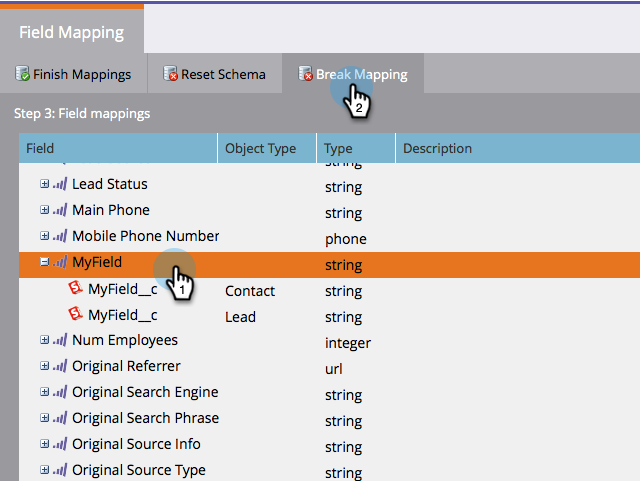

# Editar Mapeamentos de Campo Iniciais {#edit-initial-field-mappings}

>[!NOTE]
>
>Esse recurso só pode ser acessado antes da sincronização inicial com o Salesforce! Depois que o botão **Sincronizar agora** é pressionado, isso não pode mais ser feito.

Durante a sincronização inicial com o Salesforce, o Marketo combina automaticamente os campos personalizados com nomes semelhantes em um único campo no lado do Marketing para garantir que os dados possam ser trocados com os objetos Lead e Contact no CRM. Este artigo explica como personalizar esses mapeamentos.

## Mapear campos não mapeados {#map-unmapped-fields}

Quando um campo é exibido na pasta Campos não mapeados, isso significa que ele não está mapeado para um campo semelhante no Lead ou Contato no Salesforce. Você pode consertar isso.

1. Clique em **Editar mapeamentos**.

1. Abra a pasta **Campos personalizados não mapeados**.

   

1. Arraste um campo personalizado não mapeado para outro para mapeá-lo.

   >[!NOTE]
   >
   >Você só pode editar mapeamentos de campos personalizados. Não é possível modificar mapeamentos de campos padrão.

   

1. Clique em **Concluir mapeamentos** quando terminar.

   

## Quebrar mapeamento existente {#break-existing-mapping}

Se você tiver campos com nomes semelhantes no cliente potencial e o objeto de contato Marketo os mapeará automaticamente. Você pode considerá-los diferentes e manter dados diferentes. Quebre o mapeamento assim.

1. Clique em **Editar mapeamentos**.

   

1. Realce um campo mapeado e clique em **Quebrar mapeamento** para separar os campos.

   

1. Clique em **Concluir mapeamentos** quando terminar.

   

   Legal! Você está quase terminando a sincronização inicial.

## Redefinir Schema {#reset-schema}

1. Se você fizer algumas alterações no schema no Salesforce ao trabalhar nos mapeamentos, poderá fazer as alterações clicando em **Redefinir Schema**.

   * Todas as alterações de mapeamento serão redefinidas!
   * A redefinição do schema apenas adicionará campos, não removerá (mesmo se você os ocultar do usuário de sincronização).
   
