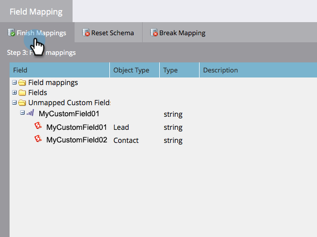

# Editar mapeamentos de campo iniciais {#edit-initial-field-mappings}

>[!NOTE]
>
>Esse recurso só pode ser acessado antes da sincronização inicial com o Salesforce. Quando a variável **[!UICONTROL Sincronizar agora]** for pressionado, isso não poderá mais ser feito.

Durante a sincronização inicial com o Salesforce, o Marketo Engage combina automaticamente campos personalizados com nomes semelhantes em um único campo no lado do Marketo para garantir que os dados possam ser trocados com objetos de cliente potencial e de contato no CRM. Este artigo explica como personalizar esses mapeamentos.

## Mapear campos não mapeados {#map-unmapped-fields}

Quando você vir um campo na variável [!UICONTROL Campos não mapeados] significa que não está mapeado para um campo semelhante no cliente potencial ou contato no Salesforce. Você pode consertar isso.

1. Clique em **[!UICONTROL Editar Mapeamentos]**.

1. Abra o **[!UICONTROL Campos personalizados não mapeados]** pasta.

   

1. Arraste um campo personalizado não mapeado para outro para mapeá-los juntos.

   >[!NOTE]
   >
   >Você só pode editar mapeamentos de campos personalizados. Não é possível modificar os mapeamentos de campo padrão.

   

1. Clique em **[!UICONTROL Concluir Mapeamentos]** quando terminar.

   

## Interromper mapeamento existente {#break-existing-mapping}

Se você tiver campos nomeados de forma semelhante no cliente potencial e no objeto de contato, o Marketo os mapeará automaticamente. Você pode considerá-los diferentes e manter dados diferentes. Quebre o mapeamento assim.

1. Clique em **[!UICONTROL Editar Mapeamentos]**.

   

1. Realce um campo mapeado e clique em **[!UICONTROL Quebrar mapeamento]** para separar os campos.

   

1. Clique em **[!UICONTROL Concluir Mapeamentos]** quando terminar.

   

   Legal! Você está quase terminando a sincronização inicial.

## Redefinir esquema {#reset-schema}

1. Se fizer algumas alterações no esquema do Salesforce ao trabalhar nos mapeamentos, você poderá extrair as alterações clicando em **[!UICONTROL Redefinir esquema]**.

   * Todas as alterações de mapeamento serão redefinidas.
   * A redefinição do esquema só adicionará campos, não removerá (mesmo se você os ocultar do usuário de sincronização).

   
