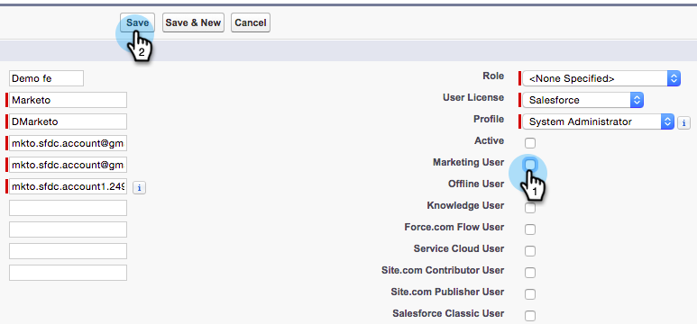

# Transformar o usuário de sincronização do Marketo em um usuário de marketing {#make-marketo-sync-user-a-marketing-user}

O [usuário de sincronização do Marketo](/help/marketo/product-docs/crm-sync/salesforce-sync/setup/enterprise-unlimited-edition/step-2-of-3-create-a-salesforce-user-for-marketo-enterprise-unlimited.md){target="_blank"} precisa ser um usuário de marketing para que a sincronização da campanha do Salesforce funcione corretamente. Veja como tornar o usuário um usuário de marketing no Salesforce.

>[!NOTE]
>
>**Permissões de administrador são necessárias**

1. Faça logon no Salesforce. Procure usuários na barra de pesquisa à esquerda e clique em **[!UICONTROL Usuários]** em **[!UICONTROL Gerenciando Usuários]**.

   

1. Localize o usuário de sincronização e clique no nome dele.

   

1. Clique em **[!UICONTROL Editar]**.

   

1. Marque a caixa de seleção **[!UICONTROL Usuário de Marketing]** e clique em **[!UICONTROL Salvar]**.

   

   Esse usuário de sincronização do Marketo agora é um usuário de marketing.
