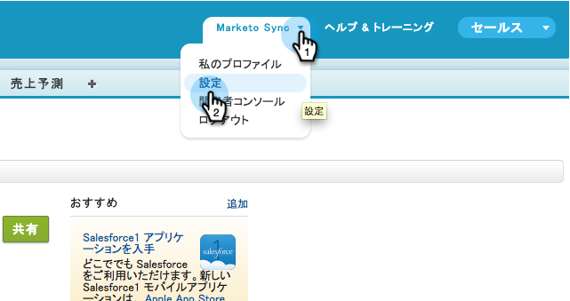
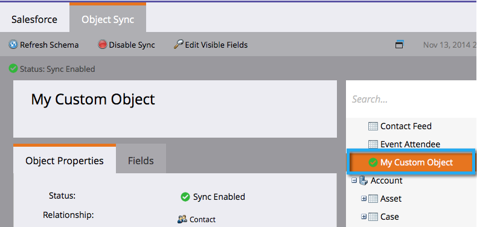

# Habilitar a sincronização de objetos personalizados com idioma diferente do inglês {#enable-non-english-custom-object-sync}

Se o usuário de sincronização do Marketo estiver definido com um idioma diferente do inglês, talvez ocorra um erro ao tentar habilitar uma sincronização de objeto personalizado.

## O erro {#the-error}

## Contornando-Se {#getting-around-it}

1. Faça logon em [!DNL Salesforce] usando a marcação para sincronizar usuário.

   

1. No nome de usuário, vá para **[!UICONTROL Instalação]**.

   

1. Em **[!UICONTROL Informações Pessoais]**, clique em **[!UICONTROL Minhas Informações Pessoais]**.

   

1. Clique em **[!UICONTROL Editar]**.

   

1. Altere o **[!UICONTROL Idioma]** para **[!UICONTROL Inglês]**.

   

1. Clique em **[!UICONTROL Salvar]**.

   

1. De volta ao Marketo, em **[!UICONTROL Admin]** > **[!UICONTROL Salesforce]** > **[!UICONTROL Objetos]**, clique em **[!UICONTROL Atualizar Esquema]**.

   

1. Isso obterá a lista de objetos em inglês. Agora selecione o objeto de sua escolha e clique em **[!UICONTROL Habilitar Sincronização]**.

   

1. Observe que o objeto personalizado agora está habilitado e sincronizando.

   

1. Agora, volte para [!DNL Salesforce] e use as etapas acima para alterar o usuário de sincronização de volta para seu idioma preferido.

>[!NOTE]
>
>Não se esqueça de atualizar o esquema uma última vez para obter os objetos de volta no seu idioma.
