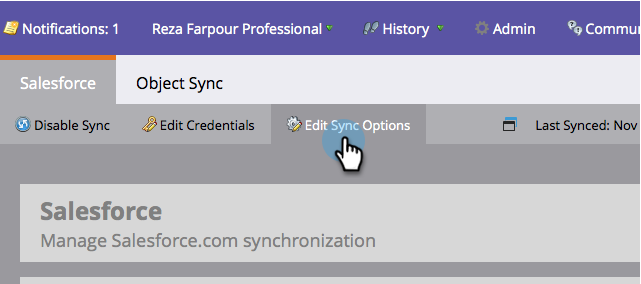

# Definir sobrenome da pessoa padrão e nome da empresa {#set-default-person-last-name-and-company-name}

O Salesforce requer (no mínimo) o sobrenome e o nome da empresa para seus clientes em potencial e contatos. Registros incompletos não serão sincronizados com o Salesforce. Se quiser sincronizar registros parciais, defina valores padrão para o Marketo para usar com o Salesforce.

1. Ir para **[!UICONTROL Admin]** e clique em **[!DNL Salesforce]**.

   

1. Clique em **[!UICONTROL Editar Opções de Sincronização]**.

   

1. Insira um **[!UICONTROL Sobrenome da pessoa padrão]** e uma **[!UICONTROL Empresa pessoal padrão]** e, em seguida, clique em **[!UICONTROL Salvar]**.

   

   >[!NOTE]
   >
   >O Marketo Engage só atribui um valor padrão quando o registro é sincronizado inicialmente com o Salesforce e somente se qualquer um dos campos obrigatórios estiver vazio.

E é isso! Toda vez que uma pessoa não tiver um sobrenome e/ou nome da empresa, o Marketo adicionará o valor padrão à medida que sincroniza o registro.
