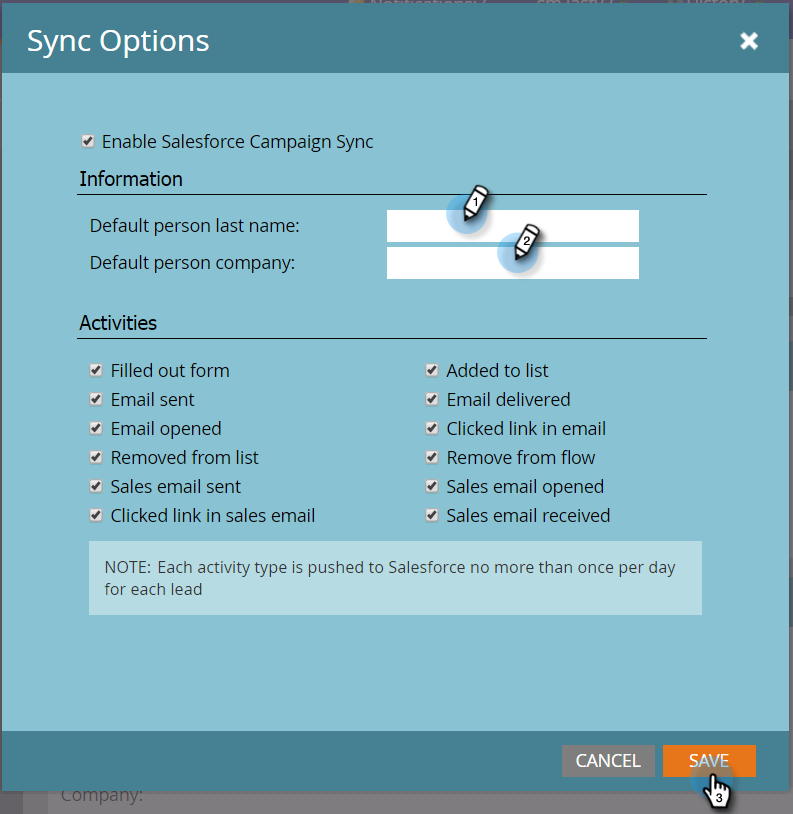

# Definir sobrenome da pessoa e nome da empresa padrão {#set-default-person-last-name-and-company-name}

[!DNL Salesforce] requer (mínimo) sobrenome e nome da empresa para seus clientes em potencial e contatos. Registros incompletos não serão sincronizados com [!DNL Salesforce]. Se quiser sincronizar registros parciais, defina valores padrão para o Marketo a serem usados com [!DNL Salesforce].

1. Vá para **[!UICONTROL Admin]** e clique em **[!DNL Salesforce]**.

   

1. Clique em **[!UICONTROL Editar opções de sincronização]**.

   

1. Insira um **[!UICONTROL Sobrenome da pessoa padrão]** e uma **[!UICONTROL Empresa da pessoa padrão]** e clique em **[!UICONTROL Salvar]**.

   

   >[!NOTE]
   >
   >O Marketo Engage só atribui um valor padrão quando o registro é sincronizado inicialmente com o Salesforce e somente se qualquer um dos campos obrigatórios estiver vazio.

Toda vez que uma pessoa não tiver um sobrenome ou nome da empresa, o Marketo adicionará o valor padrão à medida que sincroniza o registro.
