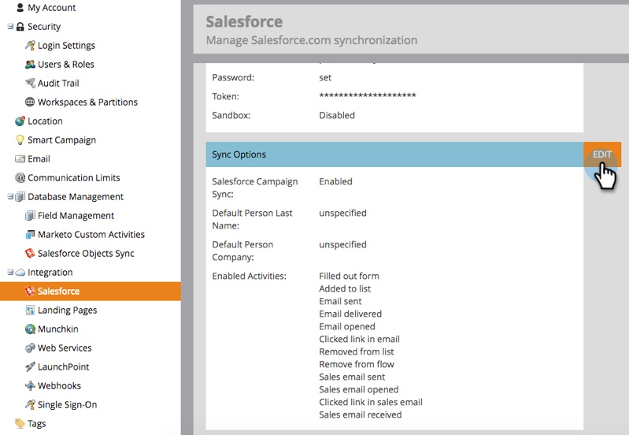

# Desativar notificações por email para o proprietário do lead {#turn-off-email-notifications-to-lead-owner}

Você pode desabilitar as notificações por email automáticas enviadas aos Proprietários Principais em [!DNL Salesforce] após a Atribuição de Cliente Potencial. Veja como.

1. Vá para **[!UICONTROL Admin]**.

   

1. Clique em **[!DNL Salesforce]**.

   

1. Em **[!UICONTROL Opções de sincronização]**, clique em **[!UICONTROL Editar]**.

   

1. Desmarque a caixa **[!UICONTROL Enviar notificação por email ao proprietário no Salesforce após atribuição de cliente potencial]**. Clique em **[!UICONTROL Salvar]**.

   
