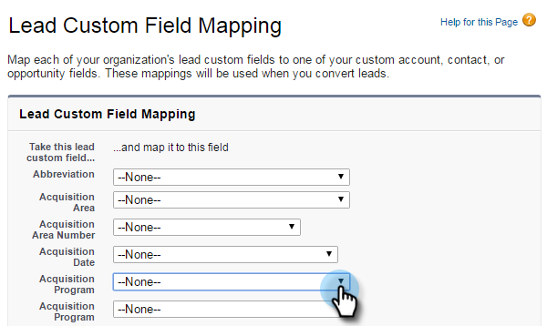

# Etapa 1 de 3: Adicionar campos de marketing ao Salesforce (Professional) {#step-of-add-marketo-fields-to-salesforce-professional}

>[!PREREQUISITES]
>
>Sua instância do Salesforce deve ter acesso às APIs do Salesforce para sincronizar dados entre o Marketo e o Salesforce.

O Marketo usa um conjunto de campos para capturar certos tipos de informações relacionadas ao marketing. Se você desejar esses dados no Salesforce, siga as instruções abaixo.

1. Crie três campos personalizados no Salesforce nos objetos de cliente potencial e contato: Pontuação, Programa de aquisição e Data de aquisição.
1. Mapeie esses campos personalizados entre clientes potenciais e contatos para que, na conversão no Salesforce, os valores continuem.
1. Você pode criar outros campos, se necessário (consulte a tabela abaixo).

Todos esses campos personalizados são opcionais e não precisam sincronizar o Marketing e o Salesforce. Como prática recomendada, recomendamos que você crie campos para Pontuação, Programa de aquisição e Data de aquisição.

## Adicionar campos de marketing ao Salesforce {#add-marketo-fields-to-salesforce}

Adicione três campos personalizados nos objetos de cliente potencial e contato no Salesforce listados acima. Se desejar adicionar mais, consulte a tabela de campos disponíveis no final desta seção.

Execute as seguintes etapas para cada um dos três campos personalizados para adicioná-los. Start com **Pontuação**.

1. Faça logon no Salesforce e clique em **Configuração.**

   ** 

   **

1. No menu Criar à esquerda, clique em **Personalizar** e selecione **Clientes potenciais**. Clique em **Campos**.

   

1. Clique em **Novo** na seção Campos personalizados e Relações, na parte inferior da página.

   

1. Escolha o tipo de campo apropriado (para Pontuação — **number**; Programa de aquisição — **text**; Data de aquisição — **Data/Hora**).

   

1. Clique em **Próximo**.

   

1. Digite o Rótulo do campo, o Comprimento e o Nome do campo para o campo, conforme mostrado na tabela abaixo.

<table> 
 <thead> 
  <tr> 
   <th> 
    

      Rótulo do campo 
    
</th> 
   <th> 
    

      Nome do campo 
    
</th> 
   <th> 
    

      Tipo de dados 
    
</th> 
   <th> 
    

      Atributos de campo 
    
</th> 
  </tr> 
 </thead> 
 <tbody> 
  <tr> 
   <td>Pontuação</td> 
   <td>mkto71_Lead_Score</td> 
   <td>Número</td> 
   <td>Extensão 10 Casas decimais 0 </td> 
  </tr> 
  <tr> 
   <td>Data de aquisição</td> 
   <td>mkto71_Acquisition_Date</td> 
   <td>Data/hora</td> 
   <td> </td> 
  </tr> 
  <tr> 
   <td>Programa de aquisição</td> 
   <td>mkto71_Acquisition_Programa</td> 
   <td>Texto</td> 
   <td>Extensão 255</td> 
  </tr> 
 </tbody> 
</table>

>[!NOTE]
>
>O Salesforce anexa __c aos Nomes de campo quando os usa para criar Nomes de API.

>[!NOTE]
>
>Os campos de texto e número exigem um comprimento, mas os campos de Data/Hora não o exigem. Uma descrição é opcional.

1. Clique em **Próximo**.

   

1. Especifique as configurações de acesso e clique em **Próximo**:

   * Defina todas as funções como **Visível **e **Somente leitura**

   * Desmarque a caixa de seleção **Somente leitura** para o perfil do usuário de sincronização:

      * Se você tiver um usuário com o perfil de um *Administrador do sistema* como o usuário de sincronização, desmarque a caixa de seleção **Somente leitura** para o perfil Administrador do sistema (conforme mostrado abaixo)

      * Se você criou um *perfil personalizado* para o usuário de sincronização, desmarque a caixa de seleção **Somente leitura** desse perfil personalizado

   

1. Escolha os layouts de página que devem exibir o campo.

   

1. Clique em **Salvar e Novo** para voltar e criar cada um dos outros dois campos personalizados. Clique em **Salvar** com os três.

   

1. No menu Criar à esquerda, clique em **Personalizar **e selecione **Contatos**. Clique em **Campos**.
1. Execute as etapas de 3 a 10 para os campos Pontuação, Data de aquisição e Programa de aquisição no objeto de contato, assim como fez para o objeto de cliente potencial.
1. Como opção, use o procedimento acima para quaisquer campos personalizados adicionais desta tabela.

<table> 
 <tbody> 
  <tr> 
   <th>Rótulo do campo</th> 
   <th>Nome do campo</th> 
   <th>Tipo de dados</th> 
   <th>Atributos de campo</th> 
  </tr> 
  <tr> 
   <td>ID do Programa de aquisição</td> 
   <td>mkto71_Acquisition_Programa_Id</td> 
   <td>Número</td> 
   <td>Extensão 18 Casas decimais 0 </td> 
  </tr> 
  <tr> 
   <td>Quem indicou original</td> 
   <td>mkto71_Original_Quem indicou</td> 
   <td>Texto</td> 
   <td>Extensão 255</td> 
  </tr> 
  <tr> 
   <td>Mecanismo de pesquisa original</td> 
   <td>mkto71_Original_Search_Engine</td> 
   <td>Texto</td> 
   <td>Extensão 255</td> 
  </tr> 
  <tr> 
   <td>Frase de pesquisa original</td> 
   <td>mkto71_Original_Search_Phrase</td> 
   <td>Texto</td> 
   <td>Extensão 255</td> 
  </tr> 
  <tr> 
   <td>Informações de origem originais</td> 
   <td>mkto71_Original_Source_Info</td> 
   <td>Texto</td> 
   <td>Extensão 255</td> 
  </tr> 
  <tr> 
   <td>Tipo de origem original</td> 
   <td>mkto71_Original_Source_Type</td> 
   <td>Texto</td> 
   <td>Extensão 255</td> 
  </tr> 
  <tr> 
   <td>Cidade Inferida</td> 
   <td>mkto71_Inferred_City</td> 
   <td>Texto</td> 
   <td>Extensão 255</td> 
  </tr> 
  <tr> 
   <td>Empresa inferida</td> 
   <td>mkto71_Inferred_Empresa</td> 
   <td>Texto</td> 
   <td>Extensão 255</td> 
  </tr> 
  <tr> 
   <td>País Inferior</td> 
   <td>mkto71_Inferred_Country</td> 
   <td>Texto</td> 
   <td>Extensão 255</td> 
  </tr> 
  <tr> 
   <td>Área metropolitana inferida</td> 
   <td>mkto71_Inferred_Metropolitan_Area</td> 
   <td>Texto</td> 
   <td>Extensão 255</td> 
  </tr> 
  <tr> 
   <td>Código de área do telefone inferior</td> 
   <td>mkto71_Inferred_Phone_Area_Code</td> 
   <td>Texto</td> 
   <td>Extensão 255</td> 
  </tr> 
  <tr> 
   <td>Código postal inferido</td> 
   <td>mkto71_Inferred_Postal_Code</td> 
   <td>Texto</td> 
   <td>Extensão 255</td> 
  </tr> 
  <tr> 
   <td>Região do Estado Inferior</td> 
   <td>mkto71_Inferred_State_Region</td> 
   <td>Texto</td> 
   <td>Extensão 255</td> 
  </tr> 
 </tbody> 
</table>

## Mapear campos personalizados para conversões {#map-custom-fields-for-conversions}

Um campo personalizado no objeto de cliente potencial no Salesforce deve ser mapeado para um campo de contato no objeto de contato para que os dados sejam transmitidos quando ocorrer uma conversão.

1. No canto superior direito, clique em Configuração.

   

1. Digite &quot;fields&quot; na Pesquisa de navegação sem pressionar Enter. Os campos aparecem sob diferentes objetos; Clique em Campos em Clientes potenciais.

   

1. Vá para a seção Campos personalizados de cliente potencial e Relações e clique em Mapear campos de pontilhado.

   

1. Clique na lista suspensa ao lado do campo que deseja mapear.

   

1. Selecione o campo personalizado de contato correspondente.

   

1. Repita as etapas acima para qualquer outro campo criado.
1. Clique em Salvar quando terminar.

Fácil o suficiente, certo?

>[!NOTE]
>
>**Mergulho profundo**
>
>Aqui está um vídeo [de todo o processo](https://nation.marketo.com/videos/1475) que deve torná-lo cristalino!

>[!NOTE]
>
>**Artigos relacionados**
>
>* [Etapa 2 de 3: Criar um usuário do Salesforce para marketing (Professional)](step-2-of-3-create-a-salesforce-user-for-marketo-professional.md)

>

