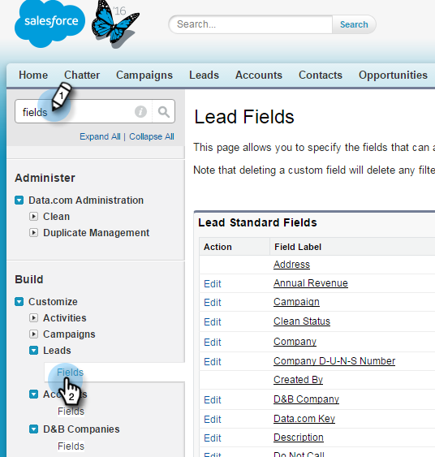

# Etapa 1 de 3: Adicionar campos do Marketo ao Salesforce (Professional) {#step-of-add-marketo-fields-to-salesforce-professional}

>[!PREREQUISITES]
>
>A instância do Salesforce deve ter acesso às APIs do Salesforce para sincronizar dados entre o Marketo e o Salesforce.

O Marketo usa um conjunto de campos para capturar determinados tipos de informações relacionadas ao marketing. Se desejar estes dados no Salesforce, siga as instruções abaixo.

1. Crie três campos personalizados no Salesforce no lead e nos objetos de contato: Pontuação, Programa de aquisição e Data de aquisição.
1. Mapeie esses campos personalizados entre leads e contatos para que, na conversão no Salesforce, os valores continuem.
1. É possível criar outros campos adicionais, se necessário (consulte a tabela abaixo).

Todos esses campos personalizados são opcionais e não são necessários para sincronizar o Marketo e o Salesforce. Como prática recomendada, recomendamos que você crie campos para Pontuação, Programa de aquisição e Data de aquisição.

## Adicionar campos do Marketo ao Salesforce {#add-marketo-fields-to-salesforce}

Adicione três campos personalizados nos objetos lead e contact no Salesforce listados acima. Se desejar adicionar mais, consulte a tabela de campos disponíveis no final desta seção.

Execute as etapas a seguir para cada um dos três campos personalizados para adicioná-los. Comece com **Pontuação**.

1. Faça logon no Salesforce e clique em **Configuração.**

   

1. No menu Criar à esquerda, clique em **Personalizar** e selecione **Clientes potenciais**. Clique em **Campos**.

   

1. Clique em **Novo** na seção Campos e relações personalizados , na parte inferior da página.

   

1. Escolha o tipo de campo apropriado (para Pontuação — **número**; Programa de aquisição — **texto**; Data de aquisição — **Data/Hora**).

   

1. Clique em **Próximo**.

   

1. Insira o Rótulo do campo, o Comprimento e o Nome do campo, conforme mostrado na tabela abaixo.

<table> 
 <thead> 
  <tr> 
   <th> 
    

      Rótulo do campo 
    
</th> 
   <th> 
    

      Nome do campo 
    
</th> 
   <th> 
    

      Tipo de dados 
    
</th> 
   <th> 
    

      Atributos do campo 
    
</th> 
  </tr> 
 </thead> 
 <tbody> 
  <tr> 
   <td>Pontuação</td> 
   <td>mkto71_Lead_Score</td> 
   <td>Número</td> 
   <td>Comprimento 10 Casas decimais 0 </td> 
  </tr> 
  <tr> 
   <td>Data da aquisição</td> 
   <td>mkto71_Acquisition_Date</td> 
   <td>Data/hora</td> 
   <td> </td> 
  </tr> 
  <tr> 
   <td>Programa de aquisição</td> 
   <td>mkto71_Acquisition_Program</td> 
   <td>Texto</td> 
   <td>Comprimento 255</td> 
  </tr> 
 </tbody> 
</table>

>[!NOTE]
>
>O Salesforce anexa __c aos Nomes de Campo quando os usa para criar Nomes de API.

>[!NOTE]
>
>Os campos de texto e número exigem um comprimento, mas os campos Data/Hora não o exigem. Uma descrição é opcional.

1. Clique em **Próximo**.

   

1. Especifique as configurações de acesso e clique em **Próximo**:

   * Definir todas as funções como **Visível** e **Somente leitura**

   * Limpe o **Somente leitura** caixa de seleção do perfil do usuário de sincronização:

      * Se você tiver um usuário com o perfil de um _Administrador do sistema_ como o usuário de sincronização, limpe o **Somente leitura** caixa de seleção para o perfil Administrador do sistema (como mostrado abaixo)

      * Se você criou uma _perfil personalizado_ para o usuário de sincronização, limpe o **Somente leitura** caixa de seleção desse perfil personalizado

   

1. Escolha os layouts de página que devem exibir o campo .

   

1. Clique em **Salvar e Novo** para voltar e criar cada um dos outros dois campos personalizados. Clique em **Salvar** com você terminou com os três.

   

1. No menu Criar à esquerda, clique em **Personalizar** e selecione **Contatos**. Clique em **Campos**.
1. Execute as etapas de 3 a 10 para os campos Pontuação, Data de aquisição e Programa de aquisição no objeto de contato, como fez com o objeto de lead.
1. Opcionalmente, use o procedimento acima para quaisquer campos personalizados adicionais desta tabela.

<table> 
 <tbody> 
  <tr> 
   <th>Rótulo do campo</th> 
   <th>Nome do campo</th> 
   <th>Tipo de dados</th> 
   <th>Atributos do campo</th> 
  </tr> 
  <tr> 
   <td>Id Do Programa De Aquisição</td> 
   <td>mkto71_Acquisition_Program_Id</td> 
   <td>Número</td> 
   <td>Comprimento 18 Casas decimais 0 </td> 
  </tr> 
  <tr> 
   <td>Responsável pela indicação original</td> 
   <td>mkto71_Original_Referrer</td> 
   <td>Texto</td> 
   <td>Comprimento 255</td> 
  </tr> 
  <tr> 
   <td>Mecanismo de pesquisa original</td> 
   <td>mkto71_Original_Search_Engine</td> 
   <td>Texto</td> 
   <td>Comprimento 255</td> 
  </tr> 
  <tr> 
   <td>Frase de pesquisa original</td> 
   <td>mkto71_Original_Search_Phrase</td> 
   <td>Texto</td> 
   <td>Comprimento 255</td> 
  </tr> 
  <tr> 
   <td>Informações da fonte original</td> 
   <td>mkto71_Original_Source_Info</td> 
   <td>Texto</td> 
   <td>Comprimento 255</td> 
  </tr> 
  <tr> 
   <td>Tipo de fonte original</td> 
   <td>mkto71_Original_Source_Type</td> 
   <td>Texto</td> 
   <td>Comprimento 255</td> 
  </tr> 
  <tr> 
   <td>Cidade inferida</td> 
   <td>mkto71_Inferred_City</td> 
   <td>Texto</td> 
   <td>Comprimento 255</td> 
  </tr> 
  <tr> 
   <td>Empresa inferida</td> 
   <td>mkto71_Inferred_Company</td> 
   <td>Texto</td> 
   <td>Comprimento 255</td> 
  </tr> 
  <tr> 
   <td>País inferido</td> 
   <td>mkto71_Inferred_Country</td> 
   <td>Texto</td> 
   <td>Comprimento 255</td> 
  </tr> 
  <tr> 
   <td>Área metropolitana inferida</td> 
   <td>mkto71_Inferred_Metropolitan_Area</td> 
   <td>Texto</td> 
   <td>Comprimento 255</td> 
  </tr> 
  <tr> 
   <td>Código de área telefônica inferido</td> 
   <td>mkto71_Inferred_Phone_Area_Code</td> 
   <td>Texto</td> 
   <td>Comprimento 255</td> 
  </tr> 
  <tr> 
   <td>Código postal inferido</td> 
   <td>mkto71_Inferred_Postal_Code</td> 
   <td>Texto</td> 
   <td>Comprimento 255</td> 
  </tr> 
  <tr> 
   <td>Região inferida</td> 
   <td>mkto71_Inferred_State_Region</td> 
   <td>Texto</td> 
   <td>Comprimento 255</td> 
  </tr> 
 </tbody> 
</table>

>[!NOTE]
>
>Os valores nos campos atribuídos automaticamente pelo Marketo não estarão disponíveis imediatamente no Salesforce quando o novo campo for criado. A Marketo sincronizará os dados com o Salesforce na próxima atualização do registro em qualquer sistema (ou seja, uma atualização para qualquer um dos campos em sincronia entre o Marketo e o Salesforce).

## Mapear campos personalizados para conversões  {#map-custom-fields-for-conversions}

Um campo personalizado no objeto de lead no Salesforce deve ser mapeado para um campo de contato no objeto de contato para que os dados sejam transferidos quando ocorrer uma conversão.

1. No canto superior direito, clique em Configurar.

   

1. Digite &quot;campos&quot; na Pesquisa de navegação sem pressionar Enter. Os campos aparecem em diferentes objetos; Clique em Campos em Leads.

   

1. Vá para a seção Campos personalizados de lead e Relações e clique em Mapear campos de lead.

   

1. Clique na lista suspensa ao lado do campo que você deseja mapear.

   

1. Selecione o campo personalizado de contato correspondente.

   

1. Repita as etapas acima para qualquer outro campo que você tenha criado.

1. Clique em Salvar ao concluir.

Fácil o suficiente, certo?

>[!MORELIKETHIS]
>
>[Etapa 2 de 3: Criar um usuário do Salesforce para Marketo (Professional)](/help/marketo/product-docs/crm-sync/salesforce-sync/setup/professional-edition/step-2-of-3-create-a-salesforce-user-for-marketo-professional.md)
