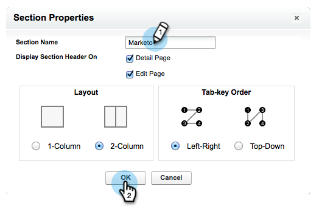
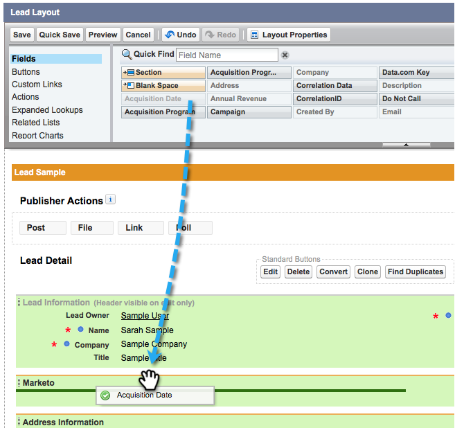

# Etapa 2 de 3: Criar um usuário do Salesforce para Marketo (Professional) {#step-of-create-a-salesforce-user-for-marketo-professional}

>[!NOTE]
>
>Essas etapas devem ser concluídas por um administrador do Salesforce.

>[!PREREQUISITES]
>
>[Etapa 1 de 3: Adicionar campos do Marketo ao Salesforce (Professional)](/help/marketo/product-docs/crm-sync/salesforce-sync/setup/professional-edition/step-1-of-3-add-marketo-fields-to-salesforce-professional.md){target="_blank"}

Neste artigo, você personalizará permissões de campo com um Layout de página do Salesforce e criará um usuário de sincronização Marketo-Salesforce.

## Definir Layouts de Página {#set-page-layouts}

O Salesforce Professional define a acessibilidade em nível de campo com Layouts de página, em vez dos Perfis do Salesforce Enterprise/Unlimited. Seguir essas etapas permitirá que o usuário de sincronização do Marketo atualize os campos personalizados.

1. Digite &quot;[!UICONTROL layouts de página]&quot; na barra de pesquisa de navegação sem pressionar **[!UICONTROL Enter]** e clique em **[!UICONTROL Layout da página]** em **[!UICONTROL Clientes potenciais]**.

   

1. Clique em **[!UICONTROL Editar]** ao lado de Layout do cliente potencial.

   

1. Clique e arraste uma nova **[!UICONTROL Seção]** para o layout da página.

   

1. Insira &quot;Marketo&quot; para **[!UICONTROL Nome da Seção]** e clique em **[!UICONTROL OK]**.

   

1. Clique e arraste o campo **[!UICONTROL Data de aquisição]** para a seção **Marketo**.

   

1. Repita a etapa acima para os seguintes campos:

   * Programa de aquisição
   * ID do programa de aquisição
   * Cancelamento de opção de e-mail
   * Cidade indicada
   * Empresa indicada
   * País indicado
   * Área metropolitana indicada
   * Código de área telef. indic.
   * Código postal indicado
   * Estado/região indicado
   * Pontuação do lead
   * Responsável pela indicação original
   * Mecanismo de pesquisa original
   * Frase de pesquisa original
   * Informações da fonte original
   * Tipo de fonte original

   >[!NOTE]
   >
   >Esses campos precisam estar no layout da página para que o Marketo possa ler/gravar neles.

   >[!TIP]
   >
   >Crie duas colunas para os campos arrastando para o lado direito da página. Você pode mover campos de um lado para o outro para equilibrar os comprimentos de coluna.

1. Clique em **[!UICONTROL Salvar]** quando terminar de adicionar campos.

   

1. Repita todas as etapas acima para o **[!UICONTROL Layout da página de contato]** do Salesforce.

   

1. Lembre-se de clicar em **[!UICONTROL Salvar]** quando terminar de usar o **[!UICONTROL Layout da Página de Contato]**.

   

   >[!NOTE]
   >
   >Verifique se o campo **[!UICONTROL Evento de dia inteiro]** foi adicionado ao **[!UICONTROL Layout da página do evento]**.

## Criar usuário de sincronização {#create-sync-user}

O Marketo exige credenciais para acessar o Salesforce. Isso é melhor feito com um usuário dedicado criado com as etapas abaixo.

>[!NOTE]
>
>Se sua organização não tiver licenças adicionais do Salesforce, você poderá usar um usuário de marketing existente com o perfil de administrador do sistema.

1. Insira &quot;usuários&quot; na barra de pesquisa de Navegação e clique em **[!UICONTROL Usuários]** em **[!UICONTROL Gerenciar usuários]**.

   

1. Clique em **[!UICONTROL Novo Usuário]**.

   

1. Preencha os campos obrigatórios, selecione a **[!UICONTROL Licença de usuário: Salesforce]**, defina o **[!UICONTROL Perfil: Administrador do sistema]**, marque **[!UICONTROL Usuário de marketing]** e clique em **[!UICONTROL Salvar]**.

   

   >[!TIP]
   >
   >Verifique se o endereço de email inserido é válido. Você precisará fazer logon como o usuário de sincronização para redefinir a senha.

Excelente! Agora você tem uma conta que o Marketo pode usar para se conectar ao Salesforce. Vamos fazer isso.

>[!MORELIKETHIS]
>
>[Etapa 3 de 3: Conectar o Marketo e o Salesforce (Professional)](/help/marketo/product-docs/crm-sync/salesforce-sync/setup/professional-edition/step-3-of-3-connect-marketo-and-salesforce-professional.md){target="_blank"}
