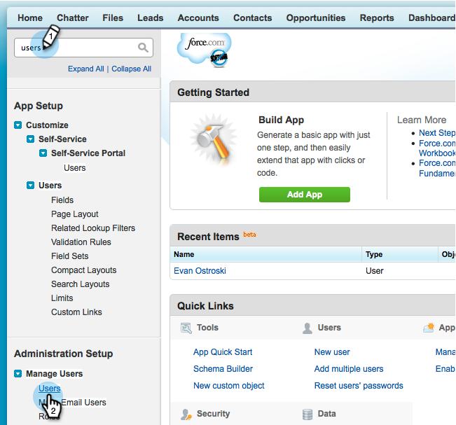

# Etapa 2 de 3: Criar um usuário do Salesforce para Marketo (Professional) {#step-of-create-a-salesforce-user-for-marketo-professional}

>[!NOTE]
>
>Essas etapas devem ser concluídas por um administrador do Salesforce

>[!PREREQUISITES]
>
>[Etapa 1 de 3: Adicionar campos do Marketo ao Salesforce (Professional)](/help/marketo/product-docs/crm-sync/salesforce-sync/setup/professional-edition/step-1-of-3-add-marketo-fields-to-salesforce-professional.md)

Neste artigo, você personalizará permissões de campo com um Layout de página do Salesforce e criará um usuário de sincronização Marketo-Salesforce .

## Definir Layouts de Página {#set-page-layouts}

O Salesforce Professional define a acessibilidade de nível de campo com layouts de página, em vez dos perfis do Salesforce Enterprise/Unlimited. Seguindo essas etapas, o usuário do Marketo sync poderá atualizar os campos personalizados.

1. Digite **layouts de página** na barra de pesquisa de navegação sem pressionar **Enter** e clique em **Layout de página** em **Leads**.

   

1. Clique em **Editar** ao lado do Layout de lead.

   

1. Clique e arraste uma nova **Seção** para o layout da página.

   

1. Insira &quot;Marketo&quot; para **Nome da Seção** e clique em **OK**.

   

1. Clique e arraste o campo **Data de aquisição** até a seção **Marketo**.

   

1. Repita a etapa acima para os seguintes campos:

   * Programa de aquisição
   * Id Do Programa De Aquisição
   * Cancelamento de opção de e-mail
   * Cidade indicada
   * Empresa indicada
   * País indicado
   * Área metropolitana indicada
   * Código de área telef. indic.
   * Código postal indicado
   * Estado/região indicado
   * Pontuação do lead
   * Responsável pela indicação original
   * Mecanismo de pesquisa original
   * Frase de pesquisa original
   * Informações da fonte original
   * Tipo de fonte original

   >[!NOTE]
   >
   >Esses campos precisam estar no layout da página para que o Marketo possa ler/gravar neles.

   >[!TIP]
   >
   >Crie duas colunas para os campos arrastando para baixo no lado direito da página. É possível mover campos de um lado para o outro para equilibrar as comprimentos da coluna.

1. Clique em **Salvar** ao concluir a adição de campos.

   

1. Repita todas as etapas acima para o Salesforce **Contact Page Layout**.

   

1. Lembre-se de clicar em **Salvar** quando terminar com o **Layout da Página de Contato**.

   

   >[!NOTE]
   >
   >Verifique se o campo **Evento de todos os dias** foi adicionado ao **Layout da página de evento**.

## Criar Usuário de Sincronização {#create-sync-user}

A Marketo requer credenciais para acessar o Salesforce. Isso é melhor com um usuário dedicado criado com as etapas abaixo.

>[!NOTE]
>
>Se sua organização não tiver licenças adicionais do Salesforce, você poderá usar um **usuário de marketing** existente com o perfil **Administrador do sistema**.

1. Digite &quot;usuários&quot; na barra de pesquisa de navegação e clique em **Usuários** em **Gerenciar usuários**.

   

1. Clique em **Novo Usuário**.

   

1. Preencha os campos obrigatórios, selecione a **Licença de usuário: Salesforce**, defina o **Perfil: Administrador do sistema**, marque **Usuário de marketing** e clique em **Salvar**.

   

   >[!TIP]
   >
   >Certifique-se de que o endereço de email inserido é válido. Você precisará fazer logon como o usuário de sincronização para redefinir a senha.

Excelente! Agora você tem uma conta que a Marketo pode usar para se conectar ao Salesforce. Vamos fazer isso.

>[!MORELIKETHIS]
>
>[Etapa 3 de 3: Conecte o Marketo e o Salesforce (Professional)](/help/marketo/product-docs/crm-sync/salesforce-sync/setup/professional-edition/step-3-of-3-connect-marketo-and-salesforce-professional.md)
