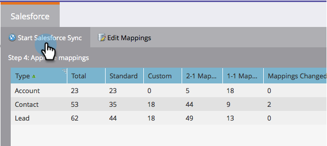

# Etapa 3 de 3: Conectar o Marketo e o [!DNL Salesforce] (Professional) {#step-of-connect-marketo-and-salesforce-professional}

Neste artigo, você configurará o Marketo Engage para sincronizar com a instância configurada do Salesforce.

>[!PREREQUISITES]
>
>* [Etapa 1 de 3: Adicionar Campos do Marketo ao Salesforce (Professional)](/help/marketo/product-docs/crm-sync/salesforce-sync/setup/professional-edition/step-1-of-3-add-marketo-fields-to-salesforce-professional.md){target="_blank"}
>* [Etapa 2 de 3: Criar um Usuário do Salesforce para Marketo (Professional)](/help/marketo/product-docs/crm-sync/salesforce-sync/setup/professional-edition/step-2-of-3-create-a-salesforce-user-for-marketo-professional.md){target="_blank"}

## Recuperar Token de Segurança do Usuário de Sincronização {#retrieve-sync-user-security-token}

>[!TIP]
>
>Se você já tiver o token de segurança, prossiga diretamente para Definir credenciais de usuário de sincronização e kudos para a preparação!

1. Faça logon no Salesforce com o Usuário de sincronização do Marketo, clique no nome do usuário de sincronização e em **[!UICONTROL Minhas configurações]**.

   

1. Na barra de pesquisa de Navegação, digite &quot;redefinir&quot; e clique em **[!UICONTROL Redefinir Meu Token de Segurança]**.

   

1. Clique em **[!UICONTROL Redefinir token de segurança]**.

   

   O token de segurança será enviado a você por email.

## Definir Credenciais de Usuário de Sincronização {#set-sync-user-credentials}

1. No Marketo, vá para **[!UICONTROL Admin]**, selecione **[!UICONTROL CRM]** e clique em **[!UICONTROL Sincronizar com o Salesforce.com]**.

   

   >[!NOTE]
   >
   >Certifique-se de [ocultar todos os campos desnecessários](/help/marketo/product-docs/crm-sync/salesforce-sync/sfdc-sync-details/hide-a-salesforce-field-from-the-marketo-sync.md){target="_blank"} no Marketo do usuário de sincronização antes de clicar em **[!UICONTROL Sincronizar Campos]**. Depois de clicar em Sincronizar campos, todos os campos que o usuário puder ver serão criados no Marketo permanentemente e não poderão ser excluídos.

1. Insira as credenciais de Usuário da Sincronização do Salesforce criadas na parte 2 da configuração do Salesforce ([Professional](/help/marketo/product-docs/crm-sync/salesforce-sync/setup/professional-edition/step-2-of-3-create-a-salesforce-user-for-marketo-professional.md), [Enterprise](/help/marketo/product-docs/crm-sync/salesforce-sync/setup/enterprise-unlimited-edition/step-2-of-3-create-a-salesforce-user-for-marketo-enterprise-unlimited.md)) e clique em **[!UICONTROL Sincronizar Campos]**.

   

   >[!NOTE]
   >
   >Marque **[!UICONTROL Sandbox]** se estiver sincronizando uma Sandbox da Marketo com uma Sandbox da Salesforce.

1. Leia o aviso e clique em **[!UICONTROL Confirmar Credenciais]**.

   

   >[!CAUTION]
   >
   >Se você quiser examinar os [mapeamentos e personalizá-los](/help/marketo/product-docs/crm-sync/salesforce-sync/setup/optional-steps/edit-initial-field-mappings.md){target="_blank"}, esta é sua única chance! Depois de clicar em Iniciar sincronização do Salesforce, está concluído.

## Iniciar Sincronização de [!DNL Salesforce] {#start-salesforce-sync}

1. Clique em **[!UICONTROL Iniciar Sincronização do Salesforce]** para iniciar a sincronização persistente Marketo-Salesforce.

   

   >[!CAUTION]
   >
   >A Marketo não desduplicará automaticamente em uma sincronização [!DNL Salesforce] ou ao inserir clientes em potencial manualmente.

1. Clique em **[!UICONTROL Iniciar sincronização]**.

   

   >[!NOTE]
   >
   >O tempo para concluir a sincronização inicial varia dependendo do tamanho e da complexidade do banco de dados.

## Verificar sincronização {#verify-sync}

O Marketo fornece mensagens de status para a sincronização [!DNL Salesforce] na área de Administração. Você pode verificar se a sincronização está funcionando corretamente seguindo estas etapas.

1. No Marketo, clique em **[!UICONTROL Admin]** e depois em **Salesforce**.

   

1. O status da sincronização está visível no canto superior direito. Ele mostrará uma das três mensagens: **[!UICONTROL Última Sincronização]**, **[!UICONTROL Sincronização em Andamento]** ou **[!UICONTROL Falha]**.

   

   

   

Você acabou de configurar um dos recursos mais avançados do Marketo, clique!

>[!MORELIKETHIS]
>
>* [Instalar o pacote Marketo Sales Insight no Salesforce AppExchange](/help/marketo/product-docs/marketo-sales-insight/msi-for-salesforce/installation/install-marketo-sales-insight-package-in-salesforce-appexchange.md){target="_blank"}
>* [Configurar o Marketo Sales Insight no Salesforce Professional Edition](/help/marketo/product-docs/marketo-sales-insight/msi-for-salesforce/configuration/configure-marketo-sales-insight-in-salesforce-professional-edition.md){target="_blank"}
