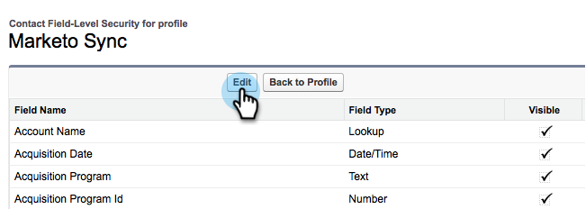

# Adicionar um campo [!DNL Salesforce] existente à sincronização do Marketo {#add-an-existing-salesforce-field-to-the-marketo-sync}

>[!NOTE]
>
>**Permissões de administrador necessárias**

Normalmente, os novos campos personalizados no Salesforce são sincronizados com o Marketo Engage automaticamente. Caso contrário, os campos podem não estar visíveis para o usuário do Marketo Sync. Veja como você pode corrigir isso.

1. Clique no seu nome e selecione **[!UICONTROL Instalação]**.

   

1. Insira &quot;perfil&quot; na barra de pesquisa à esquerda e clique em **[!UICONTROL Perfis]** em **[!UICONTROL Gerenciar usuários]**.

   

1. Clique em sincronizar perfil do usuário.

   

1. Na seção **[!UICONTROL Segurança em Nível de Campo]**, clique em **[!UICONTROL Exibir]** ao lado do objeto que contém o campo.

   

1. Clique em **[!UICONTROL Editar]**.

   

1. Marque a caixa de seleção **[!UICONTROL Visível]** para o campo que você deseja adicionar à sincronização e clique em **[!UICONTROL Salvar]**.

   

   No próximo ciclo de sincronização, o Marketo verá o campo e iniciará a mágica.

   >[!NOTE]
   >
   > Se o campo já tiver valores em [!DNL Salesforce], esses valores não serão sincronizados com o Marketo até a próxima atualização de registro.
