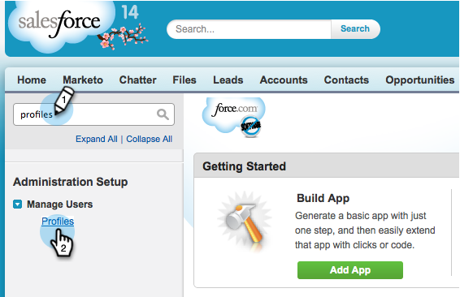

# Ocultar um campo do Salesforce da sincronização com o Marketo {#hide-a-salesforce-field-from-the-marketo-sync}

>[!NOTE]
>
>**Permissões de administrador necessárias**

Nem todos os campos no Salesforce são úteis para Marketing. Você pode otimizar o desempenho da sincronização incluindo apenas os campos necessários. Veja como ocultar um campo do Marketo Engage.

1. Clique no menu do seu nome e selecione **[!UICONTROL Instalação]**.

   

1. Insira &quot;perfis&quot; na barra de pesquisa e clique em **[!UICONTROL Perfis]** em **[!UICONTROL Gerenciar usuários]**.

   

1. Clique em sincronizar perfil do usuário.

   

1. Na seção **[!UICONTROL Segurança em Nível de Campo]**, clique em **[!UICONTROL Exibir]** ao lado do objeto que contém o campo de destino.

   

1. Clique em **[!UICONTROL Editar]**.

   

1. Desmarque a caixa de seleção **[!UICONTROL Visível]** ao lado do campo que você deseja ocultar. Clique em **[!UICONTROL Salvar]**.

   

   >[!NOTE]
   >
   >Se o campo ocultado no Salesforce já tiver sido sincronizado com o Marketo, será necessário ocultá-lo no Marketo, também se você não quiser usá-lo.

   Pronto! Você não verá mais esse campo no Marketo após a conclusão da próxima sincronização.

   >[!MORELIKETHIS]
   >
   >[Ocultar e Reexibir um Campo](/help/marketo/product-docs/administration/field-management/hide-and-unhide-a-field.md){target="_blank"}
