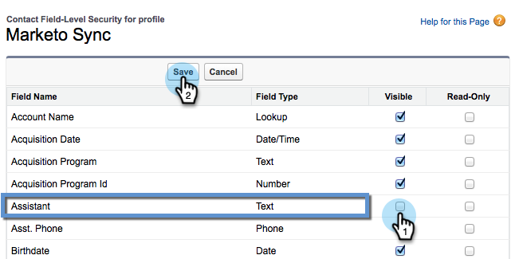

# Ocultar um campo do Salesforce na sincronização do Marketo {#hide-a-salesforce-field-from-the-marketo-sync}

>[!NOTE]
>
>**Permissões de administrador necessárias**

Nem todos os campos no Salesforce são úteis para Marketing. Você pode otimizar o desempenho da sincronização incluindo apenas os campos necessários. Veja como ocultar um campo do Marketo.

1. Clique no menu de nome e selecione **Configuração**.

   

1. Enter **perfis** na barra de pesquisa e clique em **Perfis** under **Gerenciar usuários**.

   

1. Clique no perfil do usuário de sincronização.

   

1. Em **Segurança no nível do campo** seção , clique em **Exibir** ao lado do objeto que contém o campo target .

   

1. Clique em **Editar**.

   

1. Desmarque a opção **Visível** caixa de seleção ao lado do campo que deseja ocultar. Clique em **Salvar**.

   

   >[!NOTE]
   >
   >Se o campo oculto no Salesforce já tiver sido sincronizado com o Marketo, você também precisará ocultá-lo no Marketo se não quiser usá-lo.

   Pronto! Esse campo não será mais exibido no Marketo após a conclusão da próxima sincronização.

   >[!MORELIKETHIS]
   >
   >[Ocultar e mostrar um campo](/help/marketo/product-docs/administration/field-management/hide-and-unhide-a-field.md)
