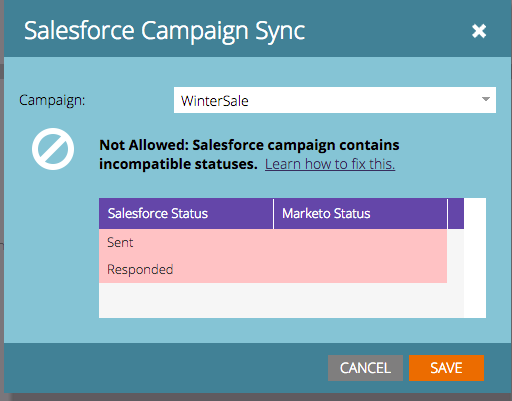

# Como fazer a correspondência entre os status do programa e [!DNL Salesforce] status da campanha antes da sincronização {#how-to-match-program-statuses-and-salesforce-campaign-statuses-prior-to-sync}

Este artigo descreve como corrigir um erro de status incompatível e mapear status antes da sincronização do Programa Marketo e do [!DNL Salesforce] Campaign.

## O que você faz se receber uma mensagem de erro {#what-do-you-do-if-you-received-an-error-message}

Se você tentar sincronizar com uma Campanha [!DNL Salesforce] existente que contém clientes potenciais e a campanha contém um ou mais status incompatíveis, será exibida uma mensagem de erro. Um Programa Marketo e uma [!DNL Salesforce] Campanha *não* serão sincronizados se os status não forem uma correspondência exata.

Nessa mensagem de erro, você pode optar por:

1. Selecione uma campanha diferente para sincronização no menu suspenso OU
1. Você pode cancelar, corrigir os erros de status e tentar sincronizar depois que os erros forem reparados. Para corrigir os erros de status, siga um destes procedimentos:

   * Faça logon no Salesforce e remova ou renomeie os Status de membros incompatíveis do Campaign para mapear para os Status de programa do Marketo usados para o tipo de canal associado ao seu programa do Marketo.
   * Modifique os Status do programa no Marketo para mapear para os Estados membros do Salesforce Campaign que você tem em vigor. Esta é uma função de administrador do Marketo. Para obter detalhes, consulte [Criar um canal de programa](/help/marketo/product-docs/administration/tags/create-a-program-channel.md){target="_blank"}.
