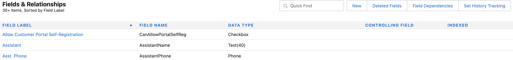

# Etapa 1 de 3: Adicionar campos do Marketo ao Veeva CRM {#step-1-of-3-add-marketo-fields-to-veeva-crm}

>[!PREREQUISITES]
>
>Sua instância do Veeva CRM deve ter acesso às APIs do Salesforce para sincronizar dados entre o Marketo Engage e o Veeva CRM.

O Marketo Engage usa um conjunto de campos para capturar determinados tipos de informações relacionadas a marketing. Se você quiser esses dados em Veeva CRM, por favor, siga as instruções abaixo.

`1.` Criar um campo personalizado no Veeva CRM nos objetos de contato: Pontuação

`2.` Você pode criar campos adicionais, se desejar (consulte a tabela abaixo).

Todos esses campos personalizados são opcionais e não são necessários para sincronizar Marketo Engage e Veeva CRM.

## Adicionar campos do Marketo ao Veeva CRM {#add-marketo-fields-to-veeva-crm}

Adicione um campo personalizado ao cliente potencial e aos objetos de contato no Veeva CRM listados acima. Se quiser adicionar mais, consulte a tabela de campos disponíveis no final desta seção.

Execute as seguintes etapas para que o campo Score o adicione.

1. Faça logon no Veeva CRM e clique em **[!UICONTROL Configuração]**.

   

1. Clique em **[!UICONTROL Objetos e campos]** e selecione **[!UICONTROL Gerenciador de objetos]**.

   

1. Na barra de pesquisa, pesquise por &quot;Contato&quot;.

   

1. Clique em **[!UICONTROL Contato]** objeto.

1. Selecionar **[!UICONTROL Campos e Relações]**.

1. Clique em **[!UICONTROL Novo]**.

   

1. Escolha o tipo de campo apropriado (para Pontuação - número).

   

1. Clique em **[!UICONTROL Próximo]**.

   

1. Insira o **[!UICONTROL Rótulo do campo]**, **[!UICONTROL Length]**, e **[!UICONTROL Nome do campo]** para o campo, conforme mostrado na tabela abaixo.

<table>
 <tbody>
  <tr>
   <th>Rótulo do campo
   <th>Nome do campo
   <th>Tipo de dados
   <th>Atributos do campo
  </tr>
  <tr>
   <td>Pontuação</td>
   <td>mkto71_Lead_Score</td>
   <td>Número</td>
   <td>Comprimento 10 
Casas decimais 0</td>
  </tr>
 </tbody>
</table>

>[!NOTE]
>
>O Veeva CRM anexa __c a Nomes de campos quando os usa para criar Nomes de API.

>[!NOTE]
>
>Os campos de texto e número exigem comprimento, mas os campos de Data/Hora não. Uma descrição é opcional.

1. Clique em **[!UICONTROL Próximo]**.

   

1. Especifique as configurações de acesso e clique em **[!UICONTROL Próxima]**.

1. Defina todas as funções como Visível e Somente leitura.

1. Desmarque a caixa de seleção Somente leitura para o perfil do seu usuário de sincronização:

* Se você tiver um usuário com o perfil de Administrador do sistema como o usuário de sincronização, desmarque a caixa de seleção Somente leitura do perfil de Administrador do sistema (como mostrado abaixo).
* Se você criou um perfil personalizado para o usuário de sincronização, desmarque a caixa de seleção Somente leitura desse perfil personalizado.

  

1. Escolha os layouts de página que devem exibir o campo.

1. Clique em **[!UICONTROL Salvar e novo]** para voltar e criar cada um dos outros dois campos personalizados.

1. Clique em **[!UICONTROL Salvar]** quando terminar com todos os três.

   

>[!NOTE]
>
>Ao adicionar o campo ao objeto de Contato, eles também são adicionados ao objeto de Conta de pessoa.

OPCIONAL: Use o procedimento acima para qualquer campo personalizado adicional da tabela abaixo.

<table>
 <tbody>
  <tr>
   <th>Rótulo do campo
   <th>Nome do campo
   <th>Tipo de dados
   <th>Atributos do campo
  </tr>
  <tr>
   <td>Cidade inferida</td>
   <td>mkto71_Cidade_inferida</td>
   <td>Texto</td>
   <td>Comprimento 255</td>
  </tr>
  <tr>
   <td>Empresa inferida</td>
   <td>mkto71_Inferred_Company</td>
   <td>Texto</td>
   <td>Comprimento 255</td>
  </tr>
  <tr>
   <td>País inferido</td>
   <td>mkto71_Inferred_Country</td>
   <td>Texto</td>
   <td>Comprimento 255</td>
  </tr>
  <tr>
   <td>Área metropolitana inferida</td>
   <td>mkto71_Inferred_Metropolitan_Area</td>
   <td>Texto</td>
   <td>Comprimento 255</td>
  </tr>
  <tr>
   <td>Código de área telefônica inferido</td>
   <td>mkto71_Inferred_Phone_Area_Code</td>
   <td>Texto</td>
   <td>Comprimento 255</td>
  </tr>
  <tr>
   <td>Código postal inferido</td>
   <td>mkto71_Inferred_Postal_Code</td>
   <td>Texto</td>
   <td>Comprimento 255</td>
  </tr>
  <tr>
   <td>Região inferida</td>
   <td>mkto71_Inferred_State_Region</td>
   <td>Texto</td>
   <td>Comprimento 255</td>
  </tr>
 </tbody>
</table>

>[!NOTE]
>
>Os valores nos campos atribuídos automaticamente pelo Marketo não estarão imediatamente disponíveis no Veeva CRM quando o novo campo for criado. O Marketo sincronizará os dados com o Veeva CRM na próxima atualização do registro em qualquer sistema (ou seja, uma atualização para qualquer um dos campos sincronizados entre o Marketo e o Veeva CRM).
