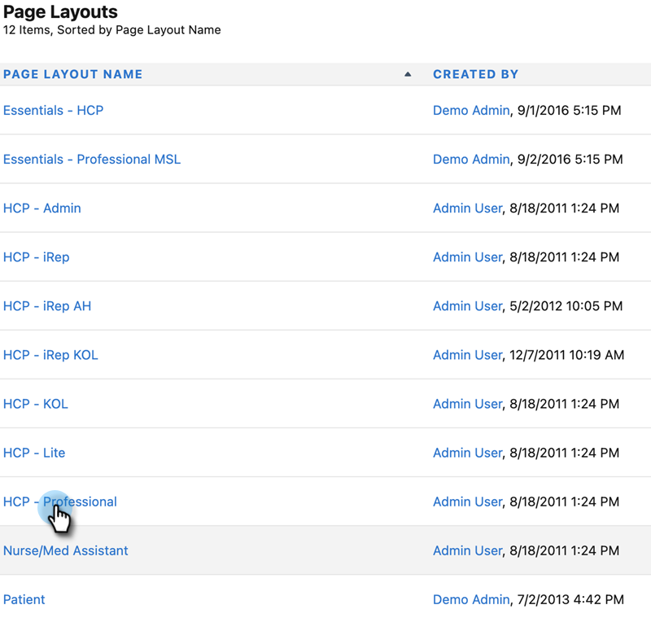

# Etapa 2 de 3: Criar um usuário do Veeva CRM para Marketo Engage {#step-2-of-3-create-a-veeva-crm-user-for-marketo-engage}

>[!NOTE]
>
>As etapas deste artigo devem ser concluídas por um administrador do Veeva CRM.

>[!PREREQUISITES]
>
>[Etapa 1 de 3: Adicionar campos do Marketo ao Salesforce (Professional)](/help/marketo/product-docs/crm-sync/veeva-crm-sync/setup/step-1-of-3-add-marketo-fields-to-veeva-crm.md){target="_blank"}

Neste artigo, você personalizará permissões de campo com um Layout de página do Veeva CRM e criará um usuário de sincronização do Marketo-Veeva CRM.

## Definir Layouts de Página {#set-page-layouts}

Seguir essas etapas permitirá que o usuário de sincronização do Marketo atualize os campos personalizados.

1. Clique nos layouts de página Conta (conta de pessoa) na barra de pesquisa de navegação sem pressionar Enter e clique em Layout da página em Contatos.

   

1. Clique em **Layouts de página**.

   

1. Clique em **HCP - Profissional**.

   

1. Clique e arraste um novo **Seção** no layout da página.

1. Insira &quot;Marketo&quot; para o Nome da seção e clique em **OK**.

   

1. Clique e arraste o campo Score para a seção Marketo.

   

1. Repita a etapa acima para os seguintes campos:

   * Cidade indicada
   * Empresa indicada
   * País indicado
   * Área metropolitana indicada
   * Código de área telef. indic.
   * Código postal indicado
   * Estado/região indicado

   >[!NOTE]
   >
   >Esses campos precisam estar no layout da página para que o Marketo possa ler/gravar neles.

   >[!TIP]
   >
   >Crie duas colunas para os campos arrastando para o lado direito da página. Você pode mover campos de um lado para o outro para equilibrar os comprimentos de coluna.

1. Quando terminar com o Layout HCP-Profissional, clique em **Salvar**.

   

>[!NOTE]
>
>Repita isso para outros Layouts de página da conta.

## Criar um perfil {#create-a-profile}

1. Clique em **Configuração**.

   

1. Digite &quot;perfis&quot; na barra de pesquisa de navegação e clique no link **Perfis** link.

   

1. Clique em **Novo**.

   

1. Selecione Usuário padrão, nomeie o perfil como &quot;Marketo-Salesforce Sync&quot; e clique em **Salvar**.

   

## Definir permissões de perfil {#set-profile-permissions}

1. Clique em **Editar** para definir as permissões de segurança.

   

1. Na seção Permissões administrativas, verifique se API ativada está selecionada.

   

   >[!TIP]
   >
   >Certifique-se de marcar a caixa A senha nunca expira.

1. Na seção Permissões gerais de usuário, verifique se Editar eventos e Editar tarefas estão selecionados.

   

1. Na seção Permissões de objeto padrão, verifique se as permissões Ler, Criar, Editar e Excluir estão marcadas para Contas e Contatos.

   

1. Na seção Permissões de objeto personalizado, verifique se as permissões de Leitura estão marcadas para Chamada, Mensagem principal de chamada e quaisquer outros Objetos personalizados desejados.

   

1. Quando terminar, clique em **Salvar** na parte inferior da página.

   

## Definir permissões de campo {#set-field-permissions}

1. Converse com seus profissionais de marketing para descobrir quais campos personalizados são necessários para a sincronização.

>[!NOTE]
>
>Essa etapa impedirá que campos desnecessários sejam exibidos no Marketo, o que reduzirá a desordem e acelerará a sincronização.

1. Na página de detalhes do perfil, vá para a seção Segurança em nível de campo. Clique em Exibir para editar a acessibilidade dos objetos Contato e Conta.

   

>[!TIP]
>
>Você pode configurar outros objetos de acordo com as necessidades de sua organização.

1. Para cada objeto, clique em **Editar**.

   

Localize os campos desnecessários, verifique se as opções Acesso de leitura e Acesso de edição estão **executar** marcado. Clique em **Salvar** quando terminar.

>[!NOTE]
>
>Edite somente a acessibilidade para os campos personalizados.

1. Depois de terminar de desativar todos os campos desnecessários, marque Acesso de leitura e Acesso de edição para os seguintes campos de objeto. Clique em Salvar ao concluir.

<table>
 <tbody>
  <tr>
   <th>Objeto
   <th>Campos
  </tr>
  <tr>
   <td>Conta</td>
   <td>Campo de tipo</td>
  </tr>
  <tr>
   <td>Evento</td>
   <td>Todos os campos</td>
  </tr>
  <tr>
   <td>Tarefa</td>
   <td>Todos os campos</td>
  </tr>
 </tbody>
</table>

## Criar usuário de sincronização {#create-sync-user}

O Marketo requer credenciais para acessar o Veeva CRM. Isso é melhor feito com um usuário dedicado criado com as etapas abaixo.

>[!NOTE]
>
>Se sua organização não tiver licenças adicionais do Veeva CRM, você poderá usar um usuário de Marketing existente com o perfil de Administrador do sistema.

1. Digite &quot;usuários&quot; na barra de pesquisa de navegação e clique em **Usuários** em Gerenciar usuários.

   

1. Clique em **Novo usuário**.

   

1. Preencha os campos obrigatórios, selecione a Licença do usuário: Salesforce, defina o Perfil: usuário do Marketo Sync e clique em **Salvar**.

   

>[!TIP]
>
>Verifique se o endereço de email inserido é válido. Você precisará fazer logon como o usuário de sincronização para redefinir a senha.

Excelente! Agora você tem uma conta que o Marketo Engage pode usar para se conectar ao Veeva CRM. Vamos fazer isso.

>[!MORELIKETHIS]
>
>[Etapa 3 de 3: Conectar o Marketo e o Veeva CRM](/help/marketo/product-docs/crm-sync/veeva-crm-sync/setup/step-3-of-3-connect-marketo-engage-and-veeva-crm.md){target="_blank"}
