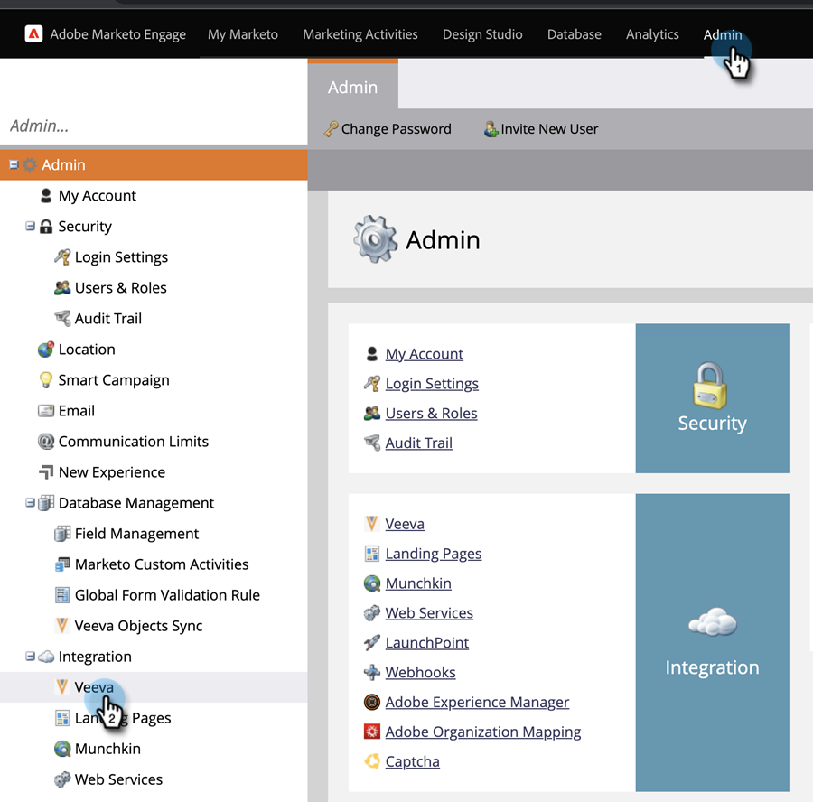

# Etapa 3 de 3: Conecte o Marketo Engage e Veeva CRM {#step-3-of-3-connect-marketo-engage-and-veeva-crm}

Neste artigo, você configurará o Marketo Engage para sincronizar com sua instância do Veeva CRM configurada. **Você verá o Salesforce em alguns dos pop-ups** como Veeva CRM é construído na plataforma Salesforce .

>[!PREREQUISITES]
>
>* [Etapa 1 de 3: Adicionar campos do Marketo ao Veeva](/help/marketo/product-docs/crm-sync/veeva-crm-sync/setup/step-1-of-3-add-marketo-fields-to-veeva-crm.md){target=&quot;_blank&quot;}
>* [Etapa 2 de 3: Criar um novo usuário para o Marketo](/help/marketo/product-docs/crm-sync/veeva-crm-sync/setup/step-2-of-3-create-a-veeva-crm-user-for-marketo-engage.md){target=&quot;_blank&quot;}

>[!IMPORTANT]
>
>Somente uma Instância do Marketo pode ser conectada a uma instância do Veeva CRM de cada vez.

## Conecte-se a Veeva CRM usando OAuth {#connect-to-veeva-crm-using-oauth}

1. No Marketo, Clique Em **Administrador**. Selecionar **CRM** e clique em **Sincronizar com Veeva**.

   

   >[!NOTE]
   >
   >Certifique-se de [ocultar todos os campos que não são necessários](/help/marketo/product-docs/crm-sync/salesforce-sync/sfdc-sync-details/hide-a-salesforce-field-from-the-marketo-sync.md){target=&quot;_blank&quot;} no Marketo do usuário de sincronização antes de clicar em Sincronizar campos. Depois de clicar em Sincronizar campos, todos os campos que o usuário pode ver serão criados no Marketo permanentemente e não poderão ser excluídos.

1. Clique em **Faça logon com Veeva**.

   

   >[!NOTE]
   >
   >Marque Sandbox se estiver sincronizando uma Sandbox da Marketo com uma Sandbox de Vídeo CRM.

1. Clique em **Confirmar Credenciais**.

   

1. Um pop-up com a página de logon do Salesforce será exibido. Insira suas credenciais do &quot;Marketo Sync User&quot; e clique em **Fazer logon**.

   

1. Insira o código de verificação recebido por email (enviado pelo Salesforce) e clique em **Verificar**.

   

1. Após a verificação bem-sucedida, a página de acesso será exibida solicitando o acesso. Clique em **Permitir**.

   

1. Em alguns minutos, um pop-up será exibido no Marketo Engae. Clique em **Confirmar Credenciais**.

   

## Iniciar Sincronização Veeva {#start-veeva-sync}

1. Clique em **Iniciar Sincronização Veeva** para iniciar a sincronização persistente do Marketo-Veeva CRM.

   

   >[!CAUTION]
   >
   >O Marketo não removerá automaticamente a duplicação em relação a uma sincronização de Veeva CRM ou quando você inserir leads manualmente.

1. Clique em **Iniciar Sincronização**.

   

>[!NOTE]
>
>O tempo para concluir a sincronização inicial varia dependendo do tamanho e da complexidade do banco de dados.

## Verificar Sincronização {#verify-sync}

O Marketo fornece mensagens de status para a sincronização de Veeva CRM na área de Administração. É possível verificar se a sincronização está funcionando corretamente seguindo essas etapas.

1. No Marketo, clique em **Administrador**, em seguida **Veeva**.

   

1. O status de sincronização é visível no canto superior direito. Ele mostrará uma das três mensagens: Última Sincronização, Sincronização em Andamento ou Falha.

>[!MORELIKETHIS]
>
>[Configurar objetos personalizados](/help/marketo/product-docs/crm-sync/veeva-crm-sync/sync-details/custom-object-sync.md){target=&quot;_blank&quot;}
