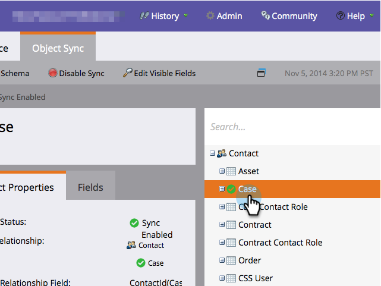
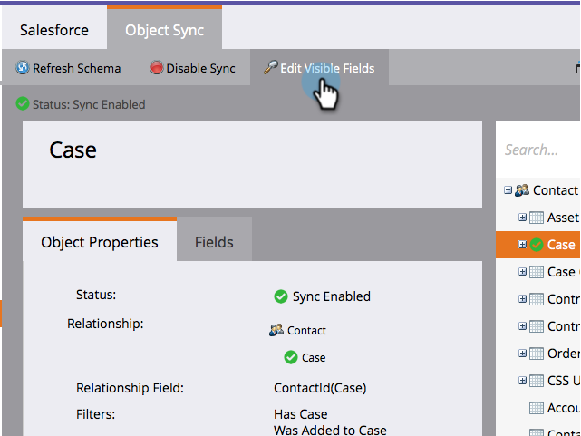
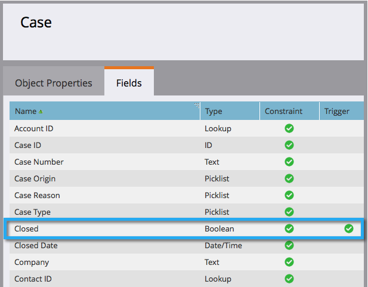

# Adicionar/remover campo de objeto personalizado como restrições de lista inteligente/acionador {#add-remove-custom-object-field-as-smart-list-trigger-constraints}

O Marketo Engage fornece controle específico sobre a sincronização de objetos personalizados [!DNL Veeva]. Isso permite selecionar os campos disponíveis como restrições em filtros de objeto personalizados e usá-los como acionadores em Campanhas inteligentes.

>[!NOTE]
>
>**Permissões de administrador são necessárias**

1. Clique em **[!UICONTROL Admin]**, depois em **[!UICONTROL Veeva Objects Sync]**.

   

1. Selecione o objeto que deseja modificar.

   

1. Clique em **[!UICONTROL Editar Campos Visíveis]**.

   

   >[!TIP]
   >
   >Se o botão [!UICONTROL Editar Campos Visíveis] estiver esmaecido, o objeto está sendo usado atualmente em uma lista inteligente ou campanha inteligente. Remova todas as associações para continuar.

1. Se sua sincronização global estiver habilitada, clique em **[!UICONTROL Desabilitar Sincronização Global]**.

   

1. Marque as caixas ao lado das restrições de filtro/acionador desejadas e clique em **[!UICONTROL Salvar]**.

   

   >[!NOTE]
   >
   >Por padrão, todos os campos são selecionados para serem restrições em filtros.

1. Clique na guia **[!UICONTROL Campos]** para confirmar as alterações.

   

>[!IMPORTANT]
>
>Lembre-se de reativar a sincronização global.

Agora, suas Smart Lists e Campanhas inteligentes têm ainda mais poder.

>[!MORELIKETHIS]
>
>[Habilitar/Desabilitar a Sincronização de Objetos Personalizados](/help/marketo/product-docs/crm-sync/veeva-crm-sync/sync-details/enable-disable-custom-object-sync.md){target="_blank"}
