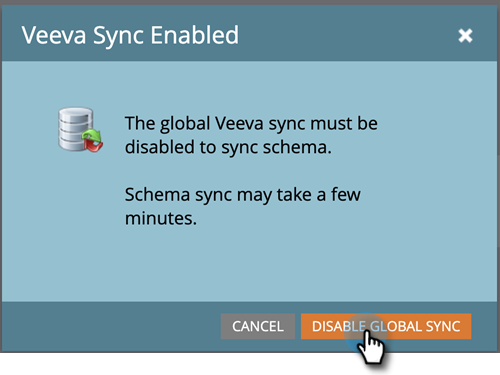

# Sincronização de objeto personalizado {#custom-object-sync}

Objetos personalizados criados em sua instância do CRM [!DNL Veeva] também podem fazer parte do Marketo Engage. Veja como configurar isso.

>[!NOTE]
>
>**Permissões de administrador necessárias**

>[!PREREQUISITES]
>
>Para usar um objeto personalizado, ele deve estar associado a um contato ou objeto de conta no [!DNL Veeva] CRM.

## Habilitar objeto personalizado {#enable-custom-object}

1. No Marketo, clique em **[!UICONTROL Admin]** e depois em **[!UICONTROL Veeva Objects Sync]**.

   

1. Se este for seu primeiro Objeto Personalizado, clique em **[!UICONTROL Sincronizar Esquema]**.

   

1. Clique em **[!UICONTROL Desabilitar sincronização global]**.

   

   >[!NOTE]
   >
   >A sincronização inicial do esquema do objeto personalizado [!DNL Veeva] pode levar alguns minutos.

1. Arraste o objeto personalizado que você deseja sincronizar para a tela de desenho.

   

   >[!NOTE]
   >
   >Os objetos personalizados devem ter nomes exclusivos. O Marketo não oferece suporte a dois objetos personalizados diferentes com o mesmo nome.

1. Clique em **[!UICONTROL Habilitar sincronização]**.

   

1. Clique em **[!UICONTROL Habilitar Sincronização]** novamente.

   

1. Volte para a guia **[!UICONTROL Veeva]**.

   

1. Clique em **[!UICONTROL Habilitar sincronização]**.

   

1. Para exibir todos os seus [!DNL Veeva] objetos personalizados, clique em **[!UICONTROL Admin]** e **[!UICONTROL Veeva Objects Sync]**.

   

   >[!NOTE]
   >
   >O Marketo só oferece suporte a entidades personalizadas vinculadas a entidades padrão de um a dois níveis de profundidade.

Excelente! Agora você pode usar dados desse objeto personalizado em Campanhas inteligentes e Smart Lists.

>[!MORELIKETHIS]
>
>* [Sincronizando Mensagens de Chamada e Chave de Chamada](/help/marketo/product-docs/crm-sync/veeva-crm-sync/sync-details/syncing-call-and-call-key-messages.md){target="_blank"}
>* [Adicionar/Remover Campo de Objeto Personalizado como Lista Inteligente/Restrições do Acionador](/help/marketo/product-docs/crm-sync/veeva-crm-sync/sync-details/add-remove-custom-object-field-as-smart-list-trigger-constraints.md){target="_blank"}
