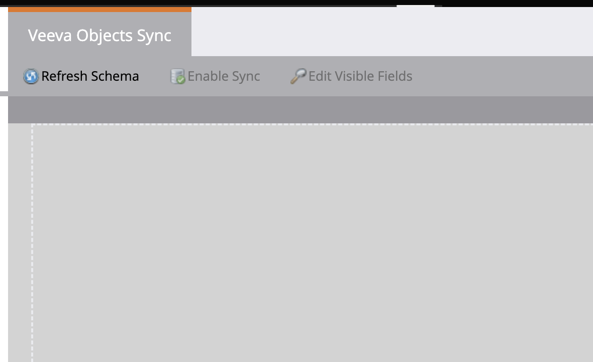

# Habilitar/desabilitar a sincronização de objetos personalizados {#enable-disable-custom-object-sync}

Objetos personalizados criados em sua instância do CRM [!DNL Veeva] também podem fazer parte do Marketo Engage. Veja como configurar.

## Ativar ou desativar a sincronização de objetos personalizados {#enable-or-disable-the-custom-object-sync}

>[!NOTE]
>
>**Permissões de administrador necessárias**

1. No Marketo, clique em **[!UICONTROL Admin]** e depois em **[!UICONTROL Veeva Objects Sync]**.

   

1. Se este for seu primeiro Objeto Personalizado, clique em **[!UICONTROL Sincronizar Esquema]**. Caso contrário, clique em **[!UICONTROL Atualizar esquema]** para garantir que você tenha o mais recente.

   

1. Se sua sincronização global estiver em execução, desabilite-a clicando em **[!UICONTROL Desabilitar Sincronização Global]**.

   

   >[!NOTE]
   >
   >A sincronização do esquema do objeto personalizado [!DNL Veeva] pode levar alguns minutos.

1. Clique em **[!UICONTROL Atualizar Esquema]**.

   

Selecione o objeto que deseja sincronizar e clique em **[!UICONTROL Habilitar Sincronização]**.

>[!TIP]
>
>O Marketo só pode sincronizar um objeto personalizado se tiver uma relação direta com o objeto de Conta ou Contato no [!DNL Veeva] CRM.

1. Clique em **[!UICONTROL Habilitar Sincronização]** novamente.

   

1. Volte para a guia [!UICONTROL Veeva] e clique em **[!UICONTROL Habilitar sincronização]**.

   

## Usar seus objetos personalizados {#using-your-custom-objects}

>[!NOTE]
>
>Não é possível usar objetos personalizados em campanhas inteligentes com acionadores.

1. Na sua [!UICONTROL Smart List], arraste sobre o filtro &quot;**[!UICONTROL Tem Oportunidade]**&quot; e defina como **[!UICONTROL Verdadeiro]**.

   

1. Como opção, use restrições de filtro para restringir o foco.

   

Agora você pode usar os dados deste objeto personalizado em [!UICONTROL Campanhas inteligentes] e [!UICONTROL Listas inteligentes].

>[!MORELIKETHIS]
>
>[Adicionar/Remover Campo de Objeto Personalizado como Lista Inteligente/Restrições do Acionador](/help/marketo/product-docs/crm-sync/veeva-crm-sync/sync-details/add-remove-custom-object-field-as-smart-list-trigger-constraints.md){target="_blank"}
