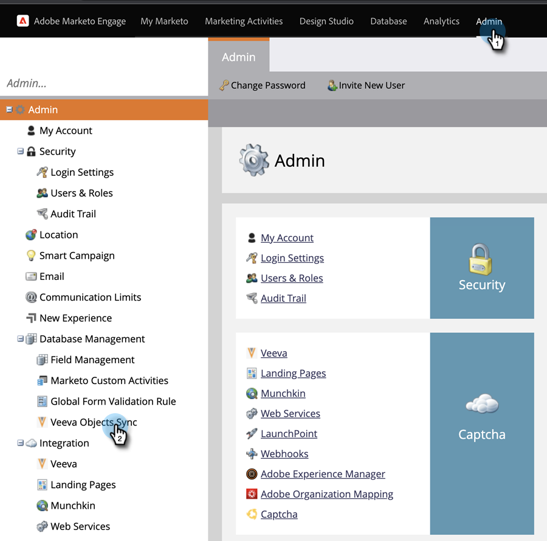

# Ativar/Desativar Sincronização de Objeto Personalizado {#enable-disable-custom-object-sync}

Os objetos personalizados criados na sua instância de Veeva CRM também podem fazer parte do Marketo Engage. Veja como configurá-lo.

## Ativar ou desativar a sincronização de objetos personalizados {#enable-or-disable-the-custom-object-sync}

>[!NOTE]
>
>**Permissões de administrador necessárias**

1. No Marketo, clique em **Administrador**, em seguida **Sincronização de Objetos Veeva**.

   

1. Se este for seu primeiro Objeto Personalizado, clique em Sincronizar Esquema. Caso contrário, clique em **Atualizar esquema** para garantir que você tenha o mais recente.

   

1. Se a sincronização global estiver em execução, desative-a clicando em **Desativar Sincronização Global**.

   

   >[!NOTE]
   >
   >Uma sincronização do esquema de objeto personalizado Veeva pode levar alguns minutos.

1. Clique em **Atualizar esquema**.

   

Selecione o objeto que deseja sincronizar e clique em Habilitar sincronização.

>[!TIP]
>
>O Marketo só poderá sincronizar um objeto personalizado se ele tiver um relacionamento direto com o objeto Contato ou Conta em Veeva CRM.

1. Clique em **Ativar Sincronização** novamente.

   

1. Volte para a guia Veeva e clique em **Ativar Sincronização**.

   

## Uso de objetos personalizados {#using-your-custom-objects}

>[!NOTE]
>
>Não é possível usar objetos personalizados em campanhas inteligentes com acionadores.

1. Na Smart List, arraste o filtro &quot;Tem oportunidade&quot; e defina como **Verdadeiro**.

   

1. Como opção, use restrições de filtro para limitar o foco.

   

Excelente! Agora você pode usar os dados desse objeto personalizado em Campanhas inteligentes e Listas inteligentes.

>[!MORELIKETHIS]
>
>[Adicionar/remover campo de objeto personalizado como restrições de lista inteligente/acionador](/help/marketo/product-docs/crm-sync/veeva-crm-sync/sync-details/add-remove-custom-object-field-as-smart-list-trigger-constraints.md){target=&quot;_blank&quot;}
