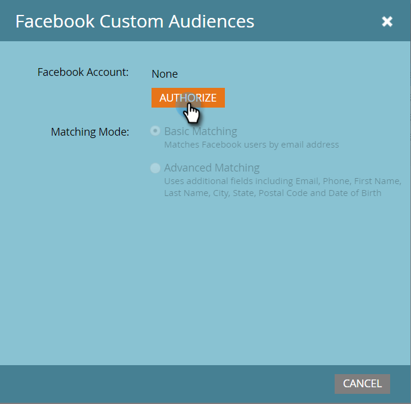

# Adicionar públicos-alvo personalizados do Facebook como um serviço do LaunchPoint {#add-facebook-custom-audiences-as-a-launchpoint-service}

>[!NOTE]
>
>**Permissões de administrador necessárias**

Com essa integração, você pode enviar dados de público-alvo de Marketo Engage estático e Smart Lists para o Facebook para serem usados como Públicos-alvo personalizados em Campanhas de anúncios do Facebook. Veja como configurar isso.

1. Ir para o Marketo **[!UICONTROL Admin]**.

   

1. Ir para **[!UICONTROL LaunchPoint]**, clique em **[!UICONTROL Novo]** e selecione **[!UICONTROL Novo serviço]**.

   

1. Insira um **[!UICONTROL Nome de exibição]** para o seu serviço e selecione o **[!UICONTROL Públicos-alvo personalizados do facebook]** serviço do **[!UICONTROL Serviço]** menu suspenso.

   

1. Abra uma nova guia no mesmo navegador e vá para [facebook.com](https://www.facebook.com/){target="_blank"}. Faça logon no Facebook usando a conta que deseja usar para a integração.

   >[!CAUTION]
   >
   >Para que o Marketo envie públicos-alvo em várias contas do Ad Manager, o usuário do Facebook autorizado nas etapas a seguir precisa ter acesso a *all* dessas contas.

   

1. Depois de fazer logon no Facebook, volte para a Marketo. Clique em **[!UICONTROL Autorizar]**.

   

   >[!NOTE]
   >
   >Você _deve_ use uma conta do Facebook Business Manager para que a integração de Públicos personalizados funcione. Para saber como configurar uma conta do Business Manager, consulte [Ajuda do facebook](https://www.facebook.com/business/help/1710077379203657){target="_blank"}.

1. Se solicitado, clique em **[!UICONTROL OK]** para aceitar a instalação do aplicativo Marketo no Facebook.

   

1. Agora você está autorizado! Selecione um modo correspondente e clique em **[!UICONTROL Criar]**.

   >[!NOTE]
   >
   >**Correspondência básica** O usa somente endereços de email. **Correspondência avançada** O usa sete campos adicionais, o que aumenta a taxa de correspondência, para obter mais conversão. No entanto, se a política de privacidade da sua empresa não permitir o compartilhamento de campos adicionais ou se os dados não os incluírem, selecione Correspondência básica.

   

   Excelente trabalho! Agora é possível acessar qualquer lista estática ou inteligente no Marketo e enviar dados do público-alvo para o Facebook.

   >[!CAUTION]
   >
   >Oh, antes de ir, certifique-se de [Aceitar os termos de públicos-alvo personalizados da Facebook](https://www.facebook.com/ads/manage/customaudiences/tos.php){target="_blank"} na sua conta da Facebook. Sem fazer isso, as atualizações de público-alvo falharão.

>[!MORELIKETHIS]
>
>* [Criar um público-alvo personalizado no Facebook](/help/marketo/product-docs/demand-generation/facebook/create-a-custom-audience-in-facebook.md){target="_blank"}
>
>* [Configurar Anúncios De Cliente Potencial Da Facebook](/help/marketo/product-docs/demand-generation/facebook/set-up-facebook-lead-ads.md){target="_blank"}
