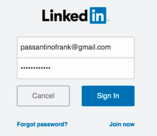

# Adicionar [!DNL LinkedIn] Públicos-alvo correspondentes como um serviço [!DNL LaunchPoint] {#add-linkedin-matched-audiences-as-a-launchpoint-service}

>[!IMPORTANT]
>
>O LinkedIn está atualizando as APIs de marketing usadas pelas integrações do Marketo Engage LinkedIn. Essas alterações exigirão reautenticação de todos os serviços do LinkedIn LaunchPoint no menu **Admin** > **LaunchPoint** entre 7 de junho e 15 de dezembro de 2024 para evitar a interrupção do serviço. Para obter mais informações, consulte as [Perguntas frequentes sobre migração](https://nation.marketo.com/t5/employee-blogs/linkedin-re-authentication-required/ba-p/347794){target="_blank"}.

>[!NOTE]
>
>**Permissões de administrador necessárias**

Conecte sua conta do Marketo com [!DNL LinkedIn] Públicos-alvo correspondentes para usar uma lista estática ou lista inteligente do Marketo como um segmento de público-alvo [!DNL LinkedIn].

1. Vá para a seção **[!UICONTROL Admin]**.

   

1. Selecione **[!UICONTROL LaunchPoint]**.

   

1. Selecione **[!UICONTROL Novo]** e **[!UICONTROL Novo serviço]**.

   

1. Insira um **[!UICONTROL Nome para exibição]** e escolha **[!UICONTROL Públicos-alvo correspondentes do LinkedIn]**. Clique em **[!UICONTROL Criar]**.

   

1. Para conectar uma conta [!DNL LinkedIn], clique em **[!UICONTROL Autorizar]**.

   

   >[!CAUTION]
   >
   >Para que o Marketo envie públicos-alvo através de várias contas de anúncio do [!DNL LinkedIn], o usuário [!DNL LinkedIn] autorizado nas etapas a seguir precisa ter acesso a *todas* dessas contas de anúncio em seus respectivos Gerentes de campanha.

1. [!DNL LinkedIn] abre em uma nova guia. Daqui, faça logon na sua conta do [!DNL LinkedIn].

   

1. Revise as permissões solicitadas e clique em **[!UICONTROL Permitir]**.

   

1. Sua conta [!DNL LinkedIn] agora está conectada ao Marketo. Clique em **[!UICONTROL Criar]**.

   

   Fantástico! Agora você verá [!DNL LinkedIn] Públicos-alvo correspondentes listados como um serviço [!DNL LaunchPoint] na guia Serviços instalados.

   

>[!MORELIKETHIS]
>
>[Usar uma lista do Marketo ou uma lista inteligente como um [!DNL LinkedIn] Segmento de público-alvo](/help/marketo/product-docs/demand-generation/social/social-functions/use-a-marketo-list-or-smart-list-as-a-linkedin-audience-segment.md)
