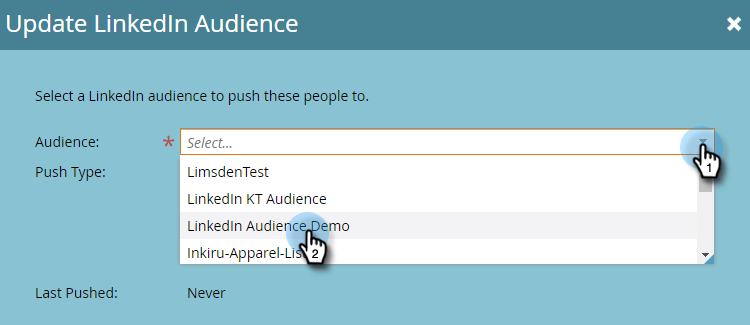

# Enviar uma lista para uma rede de anúncios {#send-a-list-to-an-ad-network}

Saiba como enviar uma lista estática para o LinkedIn, Facebook ou Google.

## Como enviar uma lista {#how-to-send-a-list}

1. No Marketo, selecione a lista, clique no menu suspenso **List Actions** e selecione **Send to Ad Network**.

   

1. Escolha entre LinkedIn, Facebook ou Google (as outras opções não estão disponíveis no momento). Neste exemplo, estamos escolhendo **LinkedIn**. Clique em **Next**.

   

1. Clique no menu suspenso Público-alvo e selecione o público-alvo desejado.

   

   >[!TIP]
   >
   >Se precisar verificar, é possível ver o público-alvo de destino para o qual uma lista está sendo sincronizada por meio da guia Status .

1. Escolha o Tipo de push desejado e clique em **Atualizar**.

   

   >[!NOTE]
   >
   >Se você selecionar &quot;Ativar sincronização contínua de público-alvo&quot;, o Marketo manterá a lista atualizada na Rede de publicidade escolhida, conforme a associação à lista é alterada em sua instância do Marketo.

1. E é isso! Clique em **OK** para sair.

   

## Perguntas frequentes {#faq}

**Uma única lista estática pode ser sincronizada com vários públicos de publicidade?**

Não, uma lista só pode ser sincronizada com um único público-alvo de destino.

**Se eu ativar a sincronização contínua com um público-alvo de anúncio existente, o público-alvo existente será substituído?**

Não, o público-alvo existente será adicionado, não substituído.
