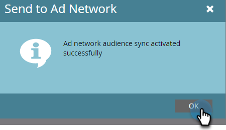

# Enviar uma lista para o Google {#send-a-list-to-google}

Para aqueles que usam o Google Customer Match, siga as etapas abaixo para enviar uma lista estática do Marketo Engage para sua conta do Google.

1. No Marketo Engage, localize e selecione a lista desejada.

   

1. Clique no menu suspenso **Ações de Lista** e selecione **Enviar para a Rede de Publicidade**.

   

1. Escolha Google e clique em **Avançar**.

   

1. Escolha a Conta publicitária desejada. Você pode escolher um público existente ou criar um novo. Neste exemplo, estamos criando um novo. Nomeie seu novo público-alvo.

   

1. Faça suas seleções opcionais.

   

   >[!NOTE]
   >
   >* Selecionar **Manter a associação de público-alvo em sincronia** mantém a lista atualizada conforme ela muda na sua instância. Adicionamos/removemos pessoas do público-alvo quando são adicionadas/removidas da lista estática.
   >
   >* Marcar a caixa de seleção na parte inferior envia o status de consentimento como CONCEDIDO para dados do usuário enviados ao Google Ads para fins de publicidade e personalização de anúncios. Deixá-la desmarcada envia o status de consentimento como NÃO ESPECIFICADO. Para aqueles que planejam carregar dados para usuários no Espaço Econômico Europeu (EEA), a Google elaborou uma lista de [Perguntas frequentes](https://support.google.com/google-ads/answer/14310715){target="_blank"}, bem como detalhes adicionais descrevendo a [política de consentimento do usuário da EU](https://www.google.com/about/company/user-consent-policy/){target="_blank"}.

1. Clique **Atualizar**.

   

1. Clique em **OK** para sair.

   
