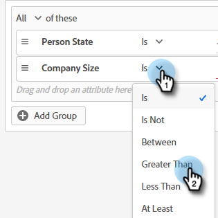

# Critérios de público {#audience-criteria}

Semelhante às Smart Lists do Marketo Engage, os atributos de Critérios de público-alvo permitem definir o público-alvo. Você pode direcionar pessoas conhecidas ou desconhecidas usando atributos inferidos, de pessoa ou de empresa (ou uma combinação desses atributos).

## Prioridade {#priority}

A prioridade determina qual diálogo um lead recebe caso se qualifique para mais de um. É estabelecido quando você [criar sua caixa de diálogo](/help/marketo/product-docs/demand-generation/dynamic-chat-two/automated-chat/create-a-dialogue.md){target="_blank"}. Você pode alterar a prioridade de uma caixa de diálogo existente abrindo-a e acessando **Detalhes da caixa de diálogo** na guia Critérios de público-alvo.

## Eventos {#events}

Os eventos permitem direcionar os visitantes com base na rolagem ou no tempo em que estão na sua página/site. No exemplo abaixo, direcionamos os visitantes que estão em uma página específica há mais de 20 segundos.

1. Pegue o **Tempo na página** e arraste-o para a direita.

   

1. Defina o tempo &quot;Maior que&quot; para 20 segundos.

   

1. Adicione o URL da página desejada na [Target](#target) seção.

   

## Atributos {#attributes}

**Pessoas conhecidas**

Há _muitos_ combinações de atributos para escolher. No exemplo abaixo, estamos direcionando todos os **pessoas conhecidas** na Califórnia, que trabalham em uma empresa com mais de 50 funcionários.

1. Pegue o **Estado da pessoa** e arraste-o para a direita.

   

1. _É_ é definido por padrão. No campo Select Values, digite CA (você também pode clicar no menu suspenso e selecionar na lista).

   

1. Pegue o **Tamanho da empresa** atributo e arraste-o para onde diz _arraste e solte um atributo aqui_.

   

   >[!NOTE]
   >
   >Você também pode escolher um atributo clicando em seu **+** ícone.

1. Clique no menu suspenso do operador e selecione **Maior que**.

   

1. Digite 50 e clique em outro lugar na tela para salvar.

   

E é isso!

**Pessoas anônimas**

Há uma maneira fácil de direcionar especificamente as pessoas que ainda não estão no banco de dados. Neste exemplo, estamos direcionando todos os **pessoas anônimas** localizado na área de Nova York.

1. Pegue o **Email da pessoa** e arraste-o para a direita.

   

1. Clique no menu suspenso do operador e selecione **Está vazio**.

   

1. Pegue o **Estado inferido** atributo e arraste-o para onde diz _arraste e solte um atributo aqui_.

   

   >[!NOTE]
   >
   >Quando alguém visita seu site, [Munchkin](/help/marketo/product-docs/administration/additional-integrations/add-munchkin-tracking-code-to-your-website.md){target="_blank"} os cookies e os coloca no sistema. Pesquisamos o IP deles em um banco de dados especial e inferimos todos os tipos de informações boas.

1. _É_ é definido por padrão. No campo Selecionar valores, digite NY (também é possível clicar no menu suspenso e selecionar na lista).

   

## Associação {#membership}

Use as Smart Lists do Marketo Engage para o público-alvo da sua caixa de diálogo.

1. Em Associação, capture **Membro da lista inteligente** e solte-o na tela.

   

1. Selecione a lista inteligente desejada.

   

## Adicionar grupos {#add-groups}

Você tem a opção de agrupar atributos também, caso queira ter todos os atributos específicos juntamente com &quot;todos ou qualquer um&quot; de outro. Você pode adicionar vários grupos.

## Destino {#target}

Aqui é onde você insere o( s) URL( s) que você deseja que uma caixa de diálogo específica seja exibida. Você também tem a opção de adicionar exclusões.

Formatos aceitáveis:

* `http://website.com`
* `https://*.website.com`
* `http://website.com/folder/*`
* `https://*.website.com/folder/*`

>[!NOTE]
>
>O uso de um asterisco atua como um curinga &quot;catch-all&quot; (global). Então `https://*.website.com` O colocaria a caixa de diálogo do em cada página do site, incluindo subdomínios (por exemplo: `support.website.com`). E `https://website.com/folder/*` O colocaria a caixa de diálogo em cada página de HTML na pasta subsequente (por exemplo: nesse caso, digamos que a pasta seja &quot;esportes&quot;, portanto: website.com/sports/baseball.html, website.com/sports/football.html etc.).

**Exclusões**

Use exclusões para garantir que a caixa de diálogo **não** são exibidos em uma página/área específica do site. As exclusões seguem o mesmo formato que as inclusões.

>[!MORELIKETHIS]
>
>* [Criar uma caixa de diálogo](/help/marketo/product-docs/demand-generation/dynamic-chat-two/automated-chat/create-a-dialogue.md){target="_blank"}
>* [Designer de fluxo](/help/marketo/product-docs/demand-generation/dynamic-chat-two/automated-chat/stream-designer.md){target="_blank"}
