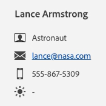

# Caixa de entrada do agente {#agent-inbox}

Os agentes colocarão bate-papos em tempo real dentro da Caixa de entrada do agente. Além das conversas ativas, eles podem ver conversas passadas, informações de visitantes e muito mais.

## Alternância de disponibilidade {#availability-toggle}

No lado superior direito da tela Caixa de entrada do agente, você tem a opção de definir seu status como disponível ou indisponível.

>[!IMPORTANT]
>
>**Isso substituirá** o [disponibilidade do chat ao vivo](/help/marketo/product-docs/demand-generation/dynamic-chat-two/setup-and-configuration/agent-settings.md#live-chat-availability){target="_blank"} estabelecido em Configurações do agente. O status permanecerá até que você o alterne de volta ou para o próximo bloco de tempo em sua disponibilidade.

>[!NOTE]
>
>Configurar seu status como indisponível não afetará nenhum bate-papo ativo.

## Notificações de bate-papo ao vivo {#live-chat-notifications}

Quando um chat ao vivo for roteado para um agente, ele verá um banner azul na parte superior da tela pedindo que ele aceite.

>[!TIP]
>
>Você também tem a opção de configurar notificações do navegador, que o alertará caso não esteja conectado ao Dynamic Chat.
>
>* Ativar notificações do navegador no [Google Chrome](https://support.google.com/chrome/answer/3220216?hl=en&amp;co=GENIE.Platform%3DDesktop){target="_blank"}
>* Ativar notificações do navegador no [Mozilla Firefox](https://support.mozilla.org/en-US/kb/push-notifications-firefox){target="_blank"}

### Itens a Observar {#things-to-note}

* Os agentes têm 45 segundos para responder antes que a mensagem &quot;Accept chat&quot; expire.
* No momento, há um limite de 10 bate-papos ao vivo por agente

## Conversas {#conversations}

No lado esquerdo da tela da Caixa de entrada do agente, você pode optar por exibir somente as conversas ativas, ou todas elas.

>[!NOTE]
>
>Embora você possa ver conversas passadas (inativas) de você mesmo e de outros agentes, você só poderá ver suas próprias conversas ativas.

## Informações sobre os visitantes {#visitor-information}

No lado direito da tela da Caixa de entrada do agente, você poderá ver (de cima para baixo) o nome, o cargo, o endereço de email, o número de telefone e o status do CRM. Qualquer informação não transmitida será exibida como um traço (-).

## Histórico de atividades {#activity-history}

Abaixo das informações do visitante está o histórico de atividades. Visualize tipos de atividades e datas, e até mesmo visualize transcrições do chat.

>[!NOTE]
>
>As informações são exibidas somente para os últimos 90 dias.

## Compartilhamento de calendário {#calendar-sharing}

Na parte inferior da janela de bate-papo ao vivo há um ícone que permite compartilhar o calendário do ou de outro agente com o visitante do bate-papo.

1. Clique no ícone do calendário.

   

1. Escolha o calendário do agente desejado e clique em **Enviar**.

   

1. O visitante do chat poderá agendar uma reunião.

   
