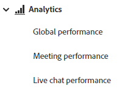

# Analytics {#analytics}

Embora os relatórios estejam disponíveis no nível da caixa de diálogo, verifique o envolvimento geral usando os três painéis abaixo.

>[!NOTE]
>
>Os dados do Dynamic Chat podem levar até 24 horas para serem refletidos na instância do Marketo Engage.

Acesse cada painel em **Analytics** na navegação à esquerda.

## Painel de Desempenho Global {#global-performance-dashboard}

Veja o desempenho de suas Caixas de diálogo, incluindo métricas de engajamento e desempenho (total e ao longo de um tempo), páginas de melhor desempenho e Caixas de diálogo de melhor desempenho.

Exibir caixas de diálogo, fluxos de conversa ou todos. Classifique por visitantes conhecidos, visitantes desconhecidos ou ambos. Selecione uma predefinição ou um intervalo de datas personalizado. Exporte os resultados clicando em um botão.

## Painel de Desempenho da Reunião {#meeting-performance-dashboard}

Veja quantas reuniões estão sendo marcadas e com quem elas estão sendo marcadas.

Exibir caixas de diálogo, fluxos de conversa ou todos. Selecione uma predefinição ou um intervalo de datas personalizado. Exporte os resultados clicando em um botão.

## Painel de Desempenho do Bate-papo ao Vivo {#live-chat-performance-dashboard}

Veja quantas conversas seus agentes de vendas ao vivo tiveram e quais equipes estão tendo o melhor desempenho.

Exibir caixas de diálogo, fluxos de conversa ou todos. Selecione uma predefinição ou um intervalo de datas personalizado. Exporte os resultados com apenas um clique.

## Definições {#definitions}

<table>
<thead>
<tbody>
  <tr>
    <td style="width:30%"><b>Concluído</b></td>
    <td>Um evento concluído ocorre quando um visitante atinge o último prompt em uma conversa <i>ou</i> quando um visitante esgota todo o conteúdo em uma conversa.
     Um evento concluído por visitante, por sessão.</td>
  </tr>
  <tr>
    <td style="width:30%"><b>As pessoas adquiriram</b></td>
    <td>Ocorre quando um visitante envia seu endereço de email.
     Uma aquisição por visitante, por sessão.</td>
  </tr>
  <tr>
    <td style="width:30%"><b>Taxa de engajamento</b></td>
    <td>Número de usuários respondidos (primeira entrada por usuário)/número de acionadores (chatbot exibido).</td>
  </tr>
  <tr>
    <td style="width:30%"><b>Taxa de conversões</b></td>
    <td>Usuário adquirido (novos emails capturados)/usuário envolvido.</td>
  </tr>
</tbody>
</table>
