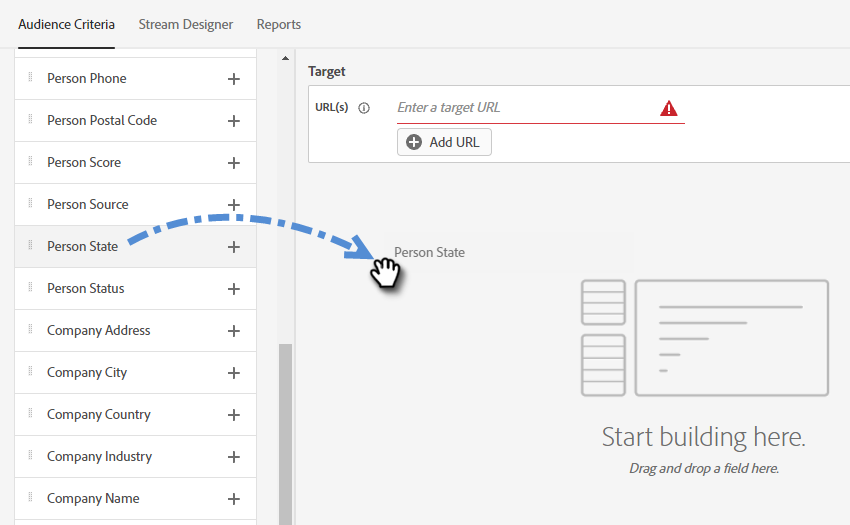

# Critérios de público {#audience-criteria}

Semelhante às Smart Lists do Marketo Engage, os atributos de Critérios de público-alvo permitem definir o público-alvo. Você pode direcionar pessoas conhecidas ou desconhecidas usando atributos inferidos, de pessoa ou de empresa (ou uma combinação desses atributos).

## Prioridade {#priority}

A prioridade determina qual diálogo um lead recebe caso se qualifique para mais de um. É estabelecido quando você [cria sua Caixa de Diálogo](/help/marketo/product-docs/demand-generation/dynamic-chat/automated-chat/create-a-dialogue.md){target="_blank"} pela primeira vez. Você pode alterar a prioridade de uma caixa de diálogo existente abrindo-a e acessando **[!UICONTROL Detalhes da caixa de diálogo]** na guia Critérios de público-alvo.

## Eventos {#events}

Os eventos permitem direcionar os visitantes com base na rolagem ou no tempo em que estão na sua página/site. No exemplo abaixo, direcionamos os visitantes que estão em uma página específica há mais de 20 segundos.

1. Pegue o evento **[!UICONTROL Tempo na página]** e arraste-o para a direita.

   

1. Defina o tempo &quot;Maior que&quot; para 20 segundos.

   

1. Adicione a URL da página desejada na seção [Target](#target).

   

## Atributos {#attributes}

**Pessoas conhecidas**

Há _muitas_ combinações de atributos para escolher. No exemplo abaixo, estamos direcionando todas as pessoas conhecidas na Califórnia que trabalham em uma empresa com mais de 50 funcionários.

1. Pegue o atributo **[!UICONTROL Estado da pessoa]** e arraste-o para a direita.

   

1. _Is_ está definido por padrão. No campo Select Values, digite CA (você também pode clicar no menu suspenso e selecionar na lista).

   

1. Pegue o atributo **[!UICONTROL Tamanho da Empresa]** e arraste-o para onde diz _arraste e solte um atributo aqui_.

   

   >[!NOTE]
   >
   >Você também pode escolher um atributo clicando em seu ícone **+**.

1. Clique na lista suspensa de operadores e selecione **[!UICONTROL Maior que]**.

   

1. Digite 50 e clique em outro lugar na tela para salvar.

   

E é isso!

**Pessoas Anônimas**

Há uma maneira fácil de direcionar especificamente as pessoas que ainda não estão no banco de dados. Neste exemplo, estamos direcionando todas as pessoas anônimas localizadas na área de Nova York.

1. Pegue o atributo **[!UICONTROL Email de pessoa]** e arraste-o para a direita.

   

1. Clique na lista suspensa de operadores e selecione **[!UICONTROL Está vazio]**.

   

1. Pegue o atributo **[!UICONTROL Estado inferido]** e arraste-o para onde diz _arraste e solte um atributo aqui_.

   

   >[!NOTE]
   >
   >Quando alguém visita o seu site, o [Munchkin](/help/marketo/product-docs/administration/additional-integrations/add-munchkin-tracking-code-to-your-website.md){target="_blank"} faz o cookie e o coloca no sistema. Pesquisamos o IP deles em um banco de dados especial e inferimos todos os tipos de informações boas.

1. _Is_ está definido por padrão. No campo Selecionar valores, digite NY (também é possível clicar no menu suspenso e selecionar na lista).

   

## Associação {#membership}

Use as Smart Lists do Marketo Engage para o público-alvo da sua caixa de diálogo.

>[!AVAILABILITY]
>
>Os critérios de Membro da Smart List ou Membro da Lista exigem o Dynamic Chat Prime. Entre em contato com a equipe de conta do Adobe (seu gerente de conta) para obter mais detalhes.

1. Em Associação, selecione **[!UICONTROL Membro da Smart List]** e solte-o na tela.

   

1. Selecione a lista inteligente desejada.

   

## Adicionar grupos {#add-groups}

Você tem a opção de agrupar atributos também, caso queira ter todos os atributos específicos juntamente com &quot;todos ou qualquer um&quot; de outro. Você pode adicionar vários grupos.

## Target {#target}

Aqui é onde você insere o( s) URL( s) que você deseja que uma caixa de diálogo específica seja exibida. Você também tem a opção de adicionar exclusões.

Formatos aceitáveis:

* `http://website.com`
* `https://*.website.com`
* `http://website.com/folder/*`
* `https://*.website.com/folder/*`

>[!NOTE]
>
>* O uso de um asterisco atua como um curinga &quot;catch-all&quot; (global). Assim, o `https://*.website.com` colocaria a caixa de diálogo em cada página do site, incluindo subdomínios (por exemplo: `support.website.com`). E o `https://website.com/folder/*` colocaria a caixa de diálogo em cada página de HTML na pasta subsequente (por exemplo: nesse caso, digamos que a pasta seja &quot;esportes&quot;, portanto: website.com/sports/baseball.html, website.com/sports/football.html etc.).
>
>* Os parâmetros de URL não são suportados no momento.

**Exclusões**

Use exclusões para garantir que a caixa de diálogo _não_ seja exibida em uma página/área específica do site. As exclusões seguem o mesmo formato que as inclusões.

>[!MORELIKETHIS]
>
>* [Criar uma caixa de diálogo](/help/marketo/product-docs/demand-generation/dynamic-chat/automated-chat/create-a-dialogue.md){target="_blank"}
>* [Designer de Stream](/help/marketo/product-docs/demand-generation/dynamic-chat/automated-chat/stream-designer.md){target="_blank"}
