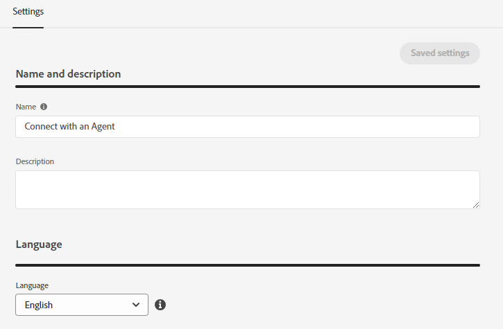

# Visão geral do fluxo de conversa {#conversational-flow-overview}

Crie um Fluxo de conversa e acione-o para qualquer visitante com base em uma ação específica (por exemplo, clicar em um botão de chamada para ação, no carregamento da página, tempo gasto na página etc.).

## Diálogos vs. Fluxos de conversa {#dialogues-vs-conversational-flows}

Embora Diálogos e Fluxos de conversa tenham várias semelhanças, eles são dois recursos separados.

<table> 
 <tbody> 
  <tr> 
   <th style="width:50%">Diálogos</th> 
   <th style="width:50%">Fluxos de conversação</th>
  </tr> 
  <tr> 
   <td>As caixas de diálogo são direcionadas — Você cria uma conversa para uma página e um público-alvo específicos com base nos parâmetros implementados.</td> 
   <td>Os fluxos de conversa são acionados — Você cria uma conversa que pode ser acionada com base na ação de um visitante, como preencher um formulário, clicar em um link etc.</td>
  </tr>
   <tr> 
   <td>Compatível somente com a interface Chatbot.</td> 
   <td>Atualmente compatível com uma interface pop-up, com mais interfaces planejadas.</td>
  </tr>
  </tr>
   <tr> 
   <td>Várias caixas de diálogo podem ser criadas para o mesmo segmento de clientes potenciais, com uma ordem de prioridade para que cada visitante veja a caixa de diálogo em sequência por prioridade enquanto continua participando.</td> 
   <td>Os Fluxos de conversa não têm ordem de prioridade e podem ser acionados várias vezes pelo mesmo lead com base na chamada para ação determinada.</td>
  </tr>
  <tr>
   <td>As conversas de chatbot são potencializadas por Diálogos.</td>
   <td><a href="/help/marketo/product-docs/demand-generation/dynamic-chat/automated-chat/conversational-flow-settings-for-marketo-engage-forms.md" target="_blank">Forms de conversa</a> em Marketo Engage são alimentados por Fluxos de conversa.</td>
  </tr>
 </tbody> 
</table>

## Guia Designer de fluxo {#stream-designer-tab}

O Designer de Fluxo para Fluxos de Conversação é quase idêntico ao das Caixas de Diálogo. [Saiba tudo sobre isso aqui](/help/marketo/product-docs/demand-generation/dynamic-chat/automated-chat/stream-designer.md){target="_blank"}.

## Guia Relatórios {#reports-tab}

A guia Relatórios é onde você poderá ver as métricas sobre o desempenho do seu Fluxo de conversa.

Visualize a taxa de envolvimento, a taxa de conversão, filtre por visitantes conhecidos e/ou desconhecidos e muito mais.

## Guia Configurações {#settings-tab}

Na metade superior da guia Configurações, é possível atualizar o nome do Fluxo de conversa, adicionar uma descrição opcional e alterar o idioma.

>[!NOTE]
>
>Selecionar um idioma diferente altera somente o idioma do texto do sistema. Você é responsável pela tradução do conteúdo.

### SDK de conversas {#conversations-sdk}

Na metade inferior da guia Configurações, personalize o acionador Conversação, também conhecido como SDK de conversas. Você pode decidir se a conversa será acionada no site quando um visitante clicar em qualquer link ou ao carregar a página.

>[!TIP]
>
>Consulte [SDK de conversas](https://experienceleague.adobe.com/tools/marketo-dynamic-chatbot/conversations-sdk/){target="_blank"} em ação!

>[!MORELIKETHIS]
>
>[Criar um Fluxo de Conversa](/help/marketo/product-docs/demand-generation/dynamic-chat/automated-chat/create-a-conversational-flow.md){target="_blank"}
