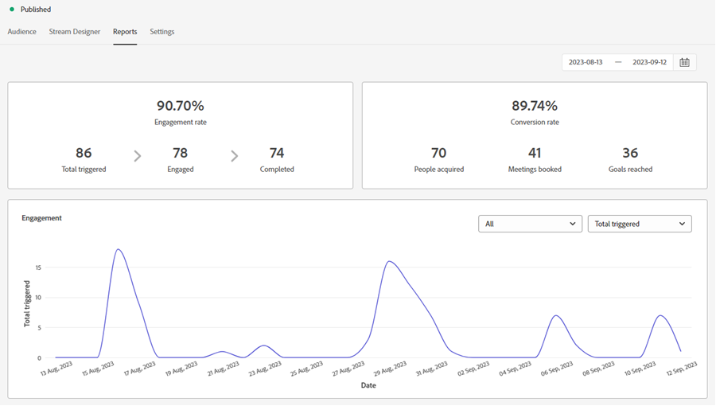

# Visão geral da caixa de diálogo {#dialogue-overview}

As caixas de diálogo são conversas individuais. Em cada caixa de diálogo, você decide onde a conversa de chat específica será exibida, para quem ela será exibida e qual será o conteúdo da conversa. Cada caixa de diálogo também tem sua própria página de relatório, onde é possível monitorar a eficácia.

## Critérios de público {#audience-criteria}

A variável [Critérios de público-alvo](/help/marketo/product-docs/demand-generation/dynamic-chat/automated-chat/audience-criteria.md){target="_blank"} seção de uma caixa de diálogo é onde você definirá onde e para quem sua conversa será exibida

## Designer de fluxo {#stream-designer}

A variável [Designer de fluxo](/help/marketo/product-docs/demand-generation/dynamic-chat/automated-chat/stream-designer.md){target="_blank"} seção de uma caixa de diálogo é onde você projetará a conversa que deseja ter com os visitantes do site.

## Relatórios {#reports}

A guia Relatórios é onde você poderá ver as métricas sobre o desempenho da caixa de diálogo.

<table>
 <tr>
  <td><strong>Total de acionados</strong></td>
  <td>Incrementa sempre que um visitante se qualifica para/recebe uma caixa de diálogo.
</td>
 </tr>
 <tr>
  <td><strong>Envolvido</strong></td>
  <td>Incrementa quando um visitante interage com pelo menos um cartão em uma caixa de diálogo (por exemplo, Pergunta, Captura de informações etc.)</td>
 </tr>
 <tr>
  <td><strong>Concluído</strong></td>
  <td>Incrementa toda vez que um visitante atinge o final de qualquer ramificação em uma caixa de diálogo.</td>
 </tr>
 <tr>
  <td><strong>As pessoas adquiriram</strong></td>
  <td>Incrementa sempre que um visitante fornece um endereço de email válido em um Fluxo de diálogo.</td>
 </tr>
 <tr>
  <td><strong>Reuniões reservadas</strong></td>
  <td>Incrementa toda vez que um visitante agenda com êxito um compromisso por meio do chatbot.</td>
 </tr>
 <tr>
  <td><strong>Metas alcançadas</strong></td>
  <td>Incrementa toda vez que um visitante atinge uma meta em qualquer fluxo de diálogo.</td>
 </tr>
</table>

## Desabilitar/Habilitar todas as caixas de diálogo {#disable-enable-all-dialogues}

Você pode desativar (e reativar) todas as caixas de diálogo publicadas ao mesmo tempo.

1. No Dynamic Chat, clique no botão **[!UICONTROL Configuração]** guia.

   

1. Alterne a **[!UICONTROL Chat habilitado]** desligue para desativar (e ligue novamente para reativar) todas as caixas de diálogo.

   
