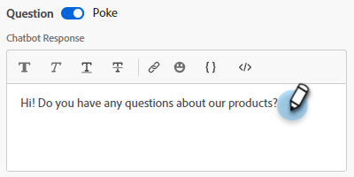

# Designer de fluxo {#stream-designer}

Há _muitas_ combinações de fluxo possíveis. Este artigo contém um exemplo em que o profissional de marketing pergunta ao visitante do site se ele tem alguma pergunta sobre o produto. Em caso positivo, o visitante pode agendar um compromisso. Se não, o visitante terá a opção de ingressar em uma lista de endereçamento para correspondência futura. Eles também recebem um PDF gratuito. O objetivo final é agendar um compromisso ou coletar o email do visitante.

>[!PREREQUISITES]
>
>Antes de usar o cartão Documento, você deve primeiro [configurá-lo](/help/marketo/product-docs/demand-generation/dynamic-chat/integrations/adobe-pdf-embed-api.md){target="_blank"} em sua conta Adobe.

## Placas Designer de transmissão {#stream-designer-cards}

O Stream Designer contém vários cartões que você pode adicionar para moldar a conversa de bate-papo.

<table>
 <tr>
  <td style="width:25%"><strong>Mensagem</strong></td>
  <td>Use quando quiser fazer uma declaração sem precisar de resposta (por exemplo: "Olá! Todos os itens têm 25% de desconto hoje com o código SAVE25").
</td>
 </tr>
 <tr>
  <td style="width:25%"><strong>Pergunta</strong></td>
  <td>Use quando quiser fazer uma pergunta de múltipla escolha, da qual você fornece as respostas disponíveis (por exemplo: Em que tipo de veículo você está interessado? Respostas = SUV, Compacto, Caminhão, etc.).</td>
 </tr>
 <tr>
  <td style="width:25%"><strong>Documento</strong></td>
  <td>Permite incorporar documentos PDF em caixas de diálogo e rastrear a atividade de envolvimento de documentos dos visitantes (quantas páginas foram visualizadas, se o documento foi baixado e/ou quaisquer termos de pesquisa usados).</td>
 </tr>
 <tr>
  <td style="width:25%"><strong>Captura de informações</strong></td>
  <td>Use quando quiser coletar informações (por exemplo, nome, endereço de email, cargo etc.). Depois de escolher a qual campo atribuir sua resposta, você pode escolher entre permitir que o visitante digite sua resposta ou selecionar opções de uma lista de opções determinada (dica: esta última pode ajudar na limpeza do banco de dados). Você também pode optar por substituir os dados listados atualmente para eles com a resposta ou ignorar a pergunta totalmente se você já tiver um valor para eles.</td>
 </tr>
 <tr>
  <td style="width:25%"><strong>Reserva de reunião</strong></td>
  <td>Fornece ao visitante um calendário de datas disponíveis para agendar uma reunião. Escolha a disponibilidade do calendário por meio de rodízio, de um agente específico ou usando regras personalizadas. Clique em <b>Adicionar atributo</b> se desejar capturar o nome ou endereço de email do agente e atribuí-lo ao registro pessoal do visitante do chat para consulta futura (dica: crie um <a href="/help/marketo/product-docs/administration/field-management/create-a-custom-field-in-marketo.md" target="_blank">campo personalizado</a> para mapear as informações do agente para que não substitua um campo Marketo Engage padrão).</td>
 </tr>
 <tr>
  <td style="width:25%"><strong>Meta</strong></td>
  <td>Essa é a única carta que os visitantes não verão. Cabe a você determinar em qual ponto uma meta é alcançada no chat específico (por exemplo: se coletar o email do visitante for a sua meta, coloque o cartão de Meta imediatamente após a Captura de informações no stream).</td>
 </tr>
 <tr>
  <td style="width:25%"><strong>Ação*</strong></td>
  <td>Semelhante aos campos ocultos em um formulário, com o cartão de ação você pode preencher qualquer atributo de cliente potencial ou de empresa (que tenha um <a href="/help/marketo/product-docs/administration/field-management/custom-field-type-glossary.md#string">tipo de dados de cadeia de caracteres</a>) com valores implícitos que você gostaria de capturar em um registro de cliente potencial. Você pode adicionar o cartão de ação em qualquer ponto da conversa e atualizar os respectivos atributos com um valor ou tokens nativos que preenchem automaticamente o respectivo valor.
  
<i>* Esta placa exige o Dynamic Chat Prime. Entre em contato com a equipe de conta do Adobe (seu gerente de conta) para obter mais detalhes.</i></td>
 </tr>
 <tr>
  <td style="width:25%"><strong>Chat ao vivo</strong></td>
  <td>Use o cartão de chat ao vivo quando quiser que os visitantes conversem com um agente ao vivo.
  <li>O cartão de chat ao vivo deve ser o último cartão na ramificação.</li>
  <li>Os visitantes serão encaminhados para um agente assim que chegarem a este cartão no stream, portanto, é recomendável preceder este cartão com um cartão de perguntas perguntando aos visitantes se eles gostariam de conversar com um agente ao vivo.</li></td>
 </tr>
 <tr>
  <td style="width:25%"><strong>Respostas geradas*</strong></td>
  <td>Crie uma mensagem para o visitante para quando ele atingir um determinado ponto na conversa. Defina várias perguntas que podem ser feitas de uma só vez para atingir o indicador principal de desempenho desejado.
  
<i>* Esta placa exige o Dynamic Chat Prime. Entre em contato com a equipe de conta do Adobe (seu gerente de conta) para obter mais detalhes.</i></td>
 </tr>
 <tr>
  <td style="width:25%"><strong>Ramificação condicional</strong></td>
  <td>Crie ramificações nos fluxos de diálogo com base em condições diferentes. Apresentar conteúdo diferente para pessoas diferentes no mesmo diálogo com base nos atributos do cliente potencial e da empresa no Marketo Engage.</td>
 </tr>
 <tr>
  <td style="width:25%"><strong>Fluxo de conversa</strong></td>
  <td>Simplifique várias etapas em um fluxo nos diálogos usando o cartão Fluxo de conversa.</td>
 </tr>
</table>

## Ícones de Designer de fluxo {#stream-designer-icons}

No canto superior direito do Stream Designer, você verá vários ícones. Aqui está o que eles fazem.

<table>
 <tr>
  <td style="width:10%"></td>
  <td>Aumenta o zoom, criando cartões maiores</td>
 </tr>
 <tr>
  <td style="width:10%"></td>
  <td>Diminui o zoom, criando cartões menores</td>
 </tr>
 <tr>
  <td style="width:10%"></td>
  <td>Abre uma janela para que você teste o seu bate- papo (pressione o mesmo botão para fechar)</td>
 </tr>
 <tr>
  <td style="width:10%"></td>
  <td>Permite pesquisar tipos de cartão ou conteúdo em seu fluxo</td>
 </tr>
 <tr>
  <td style="width:10%"></td>
  <td>Organiza todos os cartões em seu stream</td>
 </tr>
</table>

## Criar um fluxo {#create-a-stream}

Você pode criar fluxos para caixas de diálogo ou [Forms de conversação](/help/marketo/product-docs/demand-generation/dynamic-chat/automated-chat/conversational-flow-overview.md){target="_blank"}. Neste exemplo, criaremos um para uma caixa de diálogo.

1. Depois de [criar sua Caixa de Diálogo](/help/marketo/product-docs/demand-generation/dynamic-chat/automated-chat/create-a-dialogue.md){target="_blank"}, clique na guia **[!UICONTROL Stream Designer]**.

   

1. Arraste e solte o cartão [!UICONTROL Pergunta].

   

1. Em [!UICONTROL Resposta do Chatbot], responda à sua pergunta como você deseja.

   

   >[!TIP]
   >
   >Você pode personalizar a experiência de visitantes de bate-papo conhecidos usando tokens (por exemplo: Olá `{{lead.leadFirstName:""}}`). Basta clicar no ícone de chave à direita e fazer a seleção. Adicione um valor padrão entre aspas se quiser que visitantes anônimos vejam algo genérico (por exemplo: Hello `{{lead.leadFirstName:"there"}}`).

   >[!NOTE]
   >
   >O Poke está definido como ativado por padrão, o que exibe a pergunta de abertura ao lado do ícone do chat sem que o visitante precise clicar nele para vê-lo. O Poke só está disponível no primeiro cartão da conversa.

1. Insira suas Respostas de Usuário e clique em **[!UICONTROL Salvar]**.

   

   >[!NOTE]
   >
   >**[!UICONTROL Editar valores armazenados]** é uma etapa opcional para quem deseja armazenar um valor diferente no banco de dados do que está sendo exibido para os visitantes no chatbot para atributos mapeados no cartão de Pergunta (por exemplo: o visitante vê &quot;Otimização do mecanismo de pesquisa&quot;, você armazena esse valor como &quot;SEO&quot;).

1. Para &quot;Sim&quot;, queremos agendar um compromisso. Portanto, abaixo dessa opção, arraste o cartão Agendador de Compromissos.

   

1. Na coluna à direita, clique em **[!UICONTROL Salvar]**.

   

1. Como essa é uma meta, arraste o cartão [!UICONTROL Meta] abaixo do Agendador de Compromissos.

   

1. Nomeie sua meta (ou escolha uma existente) e clique em **[!UICONTROL Salvar]**.

   

1. Para o &quot;Não&quot;, queremos ver se eles vão entrar na lista de endereçamento. Portanto, abaixo dessa opção, arraste outro cartão [!UICONTROL Pergunta].

   

1. Insira sua resposta e adicione opções de resposta para o visitante. Clique em **[!UICONTROL Salvar]** quando terminar.

   

   >[!NOTE]
   >
   >Você pode adicionar mais respostas clicando em **[!UICONTROL Adicionar resposta]**.

1. Abaixo da resposta &quot;Sim&quot;, arraste o cartão Captura de informações para poder coletar o email do visitante.

   

1. Clique no menu suspenso **[!UICONTROL Tipo]** e selecione **[!UICONTROL Email]**.

   

1. Insira uma mensagem de chatbot e um espaço reservado. Verifique se o atributo está mapeado para o campo apropriado no Marketo Engage e clique em **[!UICONTROL Salvar]**.

   

   <table>
    <tr>
     <td style="width:30%"><strong>Tipo</strong></td>
     <td>O tipo de informação que você deseja capturar: Telefone, Texto, Email.</td>
    </tr>
    <tr>
     <td style="width:30%"><strong>Mensagem do chatbot</strong></td>
     <td>A mensagem que o visitante vê solicitando que forneça as informações.</td>
    </tr>
    <tr>
     <td style="width:30%"><strong>Espaço reservado</strong></td>
     <td>Texto de amostra que ajuda o visitante a ver o que inserir.</td>
    </tr>
    <tr>
     <td style="width:30%"><strong>Mapear resposta ao atributo</strong></td>
     <td>Permite sincronizar a resposta do visitante ao campo correspondente em seu registro de Pessoa na sua assinatura Marketo Engage.</td>
    </tr>
   </table>

1. Como coletar seus emails é uma meta, arraste o cartão [!UICONTROL Meta] abaixo da Captura de Informações.

   

1. Nomeie sua meta (ou escolha uma existente) e clique em **[!UICONTROL Salvar]**.

   

1. Lembre-se de adicionar uma resposta se eles responderem &quot;Não&quot;. Uma opção é arrastar um cartão de mensagem abaixo e dizer &quot;obrigado mesmo assim&quot;. Mas, neste exemplo, forneceremos a eles um documento PDF gratuito.

   

1. Neste exemplo, criaremos um novo documento. Nomeie, digite a URL do PDF que você já hospedou e clique em **[!UICONTROL Salvar]**.

   

1. Selecione o botão **[!UICONTROL Visualizar]** para visualizar sua caixa de diálogo.

   

1. Quando estiver pronto para ativar sua Caixa de Diálogo, clique em **[!UICONTROL Publish]**.

   

>[!NOTE]
>
>Antes de clicar em [!UICONTROL Publish], verifique se você [inseriu sua(s) URL(s) de destino](/help/marketo/product-docs/demand-generation/dynamic-chat/automated-chat/audience-criteria.md#target){target="_blank"}.

>[!MORELIKETHIS]
>
>* [Criar uma caixa de diálogo](/help/marketo/product-docs/demand-generation/dynamic-chat/automated-chat/create-a-dialogue.md){target="_blank"}
>* [Critério de público-alvo](/help/marketo/product-docs/demand-generation/dynamic-chat/automated-chat/audience-criteria.md){target="_blank"}
>* [API Incorporada do Adobe PDF](/help/marketo/product-docs/demand-generation/dynamic-chat/integrations/adobe-pdf-embed-api.md){target="_blank"}
