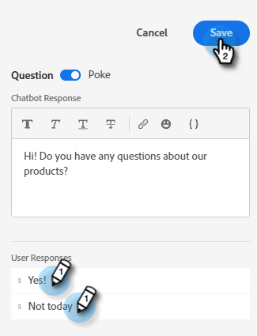
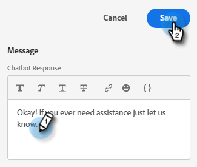

# Criar um fluxo {#create-a-stream}

Há _muitas_ combinações de fluxo que você pode criar. Abaixo está um exemplo em que o profissional de marketing pergunta ao visitante do site se ele tem alguma dúvida sobre o produto. Em caso positivo, o visitante pode agendar um compromisso. Se não, o visitante recebe a opção de ingressar em uma lista de endereços para correspondência futura. A meta é agendar um compromisso ou coletar o email do visitante.

1. Depois de [criar a caixa de diálogo](/help/marketo/product-docs/demand-generation/dynamic-chat/dialogues.md#create-a-new-dialogue), clique na guia **Stream Designer**.

   

1. Arraste e solte o cartão Pergunta .

   

1. Em Resposta do Chatbot, diga à sua pergunta como gostaria.

   

   >[!NOTE]
   >
   >O poke é definido para ativado por padrão, o que exibe a pergunta de abertura ao lado do ícone de chat sem que o visitante precise clicar nele para vê-la.

1. Insira as Respostas do Usuário e clique em **Salvar**.

   

1. Para &quot;Sim&quot;, queremos agendar um compromisso, portanto, abaixo dessa opção, arraste sobre o cartão do Agendador de Compromissos.

   

1. Na coluna à direita, clique em **Save**.

   

1. Como essa é uma meta, arraste o cartão Meta abaixo do Agendador de Compromissos.

   

1. Nomeie sua meta (ou escolha uma existente) e clique em **Salvar**.

   

1. Para o &quot;Não&quot;, queremos ver se eles irão ingressar na lista de endereçamento, portanto, abaixo dessa opção, arraste sobre outro Cartão de Perguntas.

   

1. Insira sua resposta e adicione opções de resposta para o visitante. Clique em **Salvar** quando terminar.

   

   >[!NOTE]
   >
   >Você pode adicionar mais respostas clicando em **Adicionar Resposta**.

1. Abaixo da resposta &quot;Sim&quot;, arraste o cartão Captura de informações para coletar o email do visitante.

   

1. Clique no menu suspenso **Type** e selecione **Email**.

   

1. Insira uma mensagem de chatbot e um espaço reservado. Verifique se o atributo está mapeado para o campo apropriado no Marketo e clique em **Save**.

   

   <table>
    <tr>
     <td><strong>Tipo</strong></td>
     <td>O tipo de informação que você deseja capturar: Telefone, Texto, Email.</td>
    </tr>
    <tr>
     <td><strong>Mensagem de chatbot</strong></td>
     <td>A mensagem que o visitante vê solicitando que forneça as informações.</td>
    </tr>
    <tr>
     <td><strong>Espaço reservado</strong></td>
     <td>Exemplo de texto que ajuda o visitante a ver o que inserir.</td>
    </tr>
    <tr>
     <td><strong>Mapear resposta para o atributo</strong></td>
     <td>Permite sincronizar a resposta do visitante com o campo correspondente em seu registro de Pessoa em sua assinatura do Marketo.</td>
    </tr>
   </table>

1. Como coletar seus emails é uma meta, arraste o cartão Meta abaixo de Captura de Informações.

   

1. Nomeie sua meta (ou escolha uma existente) e clique em **Salvar**.

   

1. Lembre-se de adicionar uma resposta se eles disserem &quot;Não&quot;. Arraste um Cartão de mensagem abaixo dessa opção.

   

1. Insira a mensagem e clique em **Save**.

   

1. Quando quiser ativar sua caixa de diálogo, clique em **Publicar**.

   

>[!NOTE]
>
>Antes de clicar em Publicar, lembre-se de ter [inserido seus URLs de destino](help/marketo/product-docs/demand-generation/dynamic-chat/dialogues.md#target).

>[!MORELIKETHIS]
>
>[Diálogos](/help/marketo/product-docs/demand-generation/dynamic-chat/dialogues.md)
