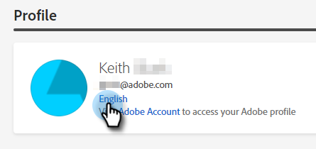

# Visão geral do bate-papo dinâmico {#dynamic-chat-overview}

O Dynamic Chat permite que você aproveite uma interface fácil de usar para direcionar pessoas e contas que visitam seu site. Colete conteúdo relevante, como nome, informações de contato e texto livre. Os visitantes do site também podem marcar reuniões com sua equipe de vendas. Os dados dinâmicos de atividade de bate-papo e envolvimento podem ser usados para adicionar membros a programas do Marketo e acionar atividades entre canais.

>[!NOTE]
>
>O Dynamic Chat está sendo lançado gradualmente e está atualmente em disponibilidade limitada. Esta página será atualizada com os detalhes de disponibilidade geral (GA) à medida que forem sendo disponibilizados.

>[!TIP]
>
>Visita [esta página](https://experienceleague.adobe.com/docs/marketo-learn/tutorials/dynamic-chat/dynamic-chat-overview.html) para visualizar vídeos tutoriais do Dynamic Chat.

## Integrações {#integrations}

Um componente essencial do Dynamic Chat é sua capacidade de fazer interface nativa com sua assinatura do Marketo. Para aproveitar todo o recurso dessa integração, primeiro será necessário iniciar a sincronização de dados. Dependendo do tamanho do banco de dados do Marketo, pode levar até 24 horas para os dados iniciais, [sincronização única](/help/marketo/product-docs/demand-generation/dynamic-chat/integrations/connect-dynamic-chat-to-marketo.md) para concluir.

O seguinte é sincronizado:

* Dados do campo de pessoa
* Dados do campo da empresa
* Dados da atividade

## Diálogos {#dialogues}

As caixas de diálogo representam um único envolvimento de chat. Pense nele como um contêiner com tudo o que você precisa para ter um diálogo de bate-papo envolvente com os visitantes do seu site. Em cada caixa de diálogo, você pode especificar em quais páginas gostaria que a caixa de diálogo fosse exibida, para quem gostaria que ela fosse exibida e o conteúdo e fluxo da própria caixa de diálogo. Além disso, você pode encontrar métricas para ver o desempenho da caixa de diálogo. [Saiba mais sobre Diálogos](/help/marketo/product-docs/demand-generation/dynamic-chat/dialogues/dialogue-overview.md){target=&quot;_blank&quot;}.

## Configuração {#configuration}

Na guia Configuração , personalize a aparência das várias caixas de diálogo. Alterar fonte, cores, tempo de resposta e muito mais! [Saiba mais sobre a configuração](/help/marketo/product-docs/demand-generation/dynamic-chat/configuration.md){target=&quot;_blank&quot;}.

## Calendário {#calendar}

Conecte seu calendário do Outlook ou Gmail para usar na programação de compromissos no chatbot. [Saiba mais sobre o Calendário](/help/marketo/product-docs/demand-generation/dynamic-chat/appointment-scheduling/calendar.md){target=&quot;_blank&quot;}

## Reuniões {#meetings}

É aqui que você verá todos os compromissos agendados pelos visitantes do site por meio de suas várias Diálogos. [Saiba mais sobre Reuniões](/help/marketo/product-docs/demand-generation/dynamic-chat/appointment-scheduling/meetings.md){target=&quot;_blank&quot;}

## Roteamento {#routing}

É aqui que você pode ver uma lista de todos os agentes que conectaram seus calendários, a ordem em que serão apresentados aos visitantes do site e criar regras de roteamento personalizadas. [Saiba mais sobre roteamento](/help/marketo/product-docs/demand-generation/dynamic-chat/appointment-scheduling/routing.md){target=&quot;_blank&quot;}

## Perguntas frequentes {#faq}

**Posso instalar o Chat Dinâmico em qualquer lugar do site da minha empresa ou ele só funciona nas páginas de aterrissagem do Marketo?**

O snippet do Dynamic Chat JavaScript pode ser instalado em qualquer site, bem como nas páginas de aterrissagem do Marketo.

**Os dados são armazenados por quanto tempo?**

90 dias (consulte a lista completa de limites [below](#limits-in-dynamic-chat)).

**O Bate-papo dinâmico permite o bate-papo ao vivo?**

Não, ele utiliza apenas respostas predeterminadas.

**O Dynamic Chat é compatível com idiomas além do inglês?**

Sim. O Dynamic Chat é compatível com os seguintes idiomas: Francês, alemão, japonês, espanhol, italiano, português do Brasil, coreano, chinês simplificado e chinês tradicional. Saiba mais na [seção abaixo](#changing-the-language).

**Você suporta a funcionalidade AI/NLP?**

Não oferecemos suporte à funcionalidade AI/NLP.

**Como posso direcionar pessoas anônimas?**

Na caixa de diálogo, é necessário usar o _O e-mail da pessoa está vazio_ atributo.

## Alterar o idioma {#changing-the-language}

Siga estas etapas para alterar a linguagem de bate-papo dinâmico.

>[!IMPORTANT]
>
>Alterar seu idioma no nível do perfil alterará o idioma para _all_ Aplicativos Experience Cloud, não apenas Dynamic Chat.

1. Na sua conta do Experience Cloud, clique no ícone de configurações e escolha **Preferências**.

   

1. Clique no idioma atual em seu endereço de email.

   

1. Escolha seu novo idioma (o segundo idioma é opcional) e clique em **Salvar**.

   

   >[!NOTE]
   >
   >No entanto, há algumas dezenas de idiomas para escolher, o Dynamic Chat oferece suporte apenas ao seguinte: Inglês, Francês, Alemão, Japonês, Espanhol, Italiano, Português do Brasil, Coreano, Chinês Simplificado e Chinês Tradicional.

Quando você atualiza o idioma, tudo no próprio aplicativo é alterado, exceto as palavras que você preencheu pessoalmente (por exemplo, transmitir respostas).

## Limites no bate-papo dinâmico {#limits-in-dynamic-chat}

<table>
  <th>Parâmetro</th>
  <th>Descrição</th>
  <th>Limite</th>
 <tr>
  <td>Total de caixas de diálogo</td>
  <td>Número total de Diálogos (publicados e rascunho)</td>
  <td>500</td>
 </tr>
 <tr>
  <td>Caixas de diálogo publicadas</td>
  <td>Número de caixas de diálogo publicadas salvas</td>
  <td>100</td>
 </tr>
 <tr>
  <td>Direcionar URLs por caixa de diálogo</td>
  <td>Número de URLs de destino que podem ser adicionados a uma única caixa de diálogo</td>
  <td>20º</td>
 </tr>
 <tr>
  <td>Atributos por caixa de diálogo</td>
  <td>Número de atributos que podem ser adicionados aos critérios de público-alvo para uma única caixa de diálogo</td>
  <td>100</td>
 </tr>
 <tr>
  <td>Grupos</td>
  <td>Número de grupos que podem ser adicionados a uma única caixa de diálogo</td>
  <td>10º</td>
 </tr>
 <tr>
  <td>Atributos por grupo</td>
  <td>Número de atributos que podem ser adicionados a um grupo</td>
  <td>10º</td>
 </tr>
 <tr>
  <td>Cartões</td>
  <td>Número de cartões que podem ser adicionados à tela por caixa de diálogo</td>
  <td>500</td>
 </tr>
 <tr>
  <td>Período Anônimo de Retenção de Dados de Lead</td>
  <td>Duração por quanto tempo as informações de um lead anônimo sem qualquer envolvimento serão retidas</td>
  <td>90 dias</td>
 </tr>
 <tr>
  <td>Período de retenção da atividade de meta</td>
  <td>A quantidade de tempo que os dados da atividade da meta são retidos</td>
  <td>24 meses</td>
 </tr>
 <tr>
  <td>Período de retenção da atividade do documento</td>
  <td>Tempo em que os dados da atividade do documento são retidos</td>
  <td>24 meses</td>
 </tr>
 <tr>
  <td>Interagido com Período de Retenção da Atividade de Diálogo</td>
  <td>A quantidade de tempo que interagiu com os dados da atividade Dialog é retida</td>
  <td>90 dias</td>
 </tr>
 <tr>
  <td>Período de Retenção da Atividade de Reserva de Reunião</td>
  <td>A atividade de reserva de horário será armazenada no Bate-papo dinâmico</td>
  <td>24 meses</td>
 </tr>
 <tr>
  <td>Conversas Envolvidas</td>
  <td>Número de conversas de bate-papo com as quais os visitantes da Web podem participar por dia</td>
  <td>1.000</td>
 </tr>
 <tr>
  <td>Conversas Disparadas</td>
  <td>Número de conversas de bate-papo que podem ser mostradas para visitantes da Web por dia</td>
  <td>25.000</td>
 </tr>
</table>
