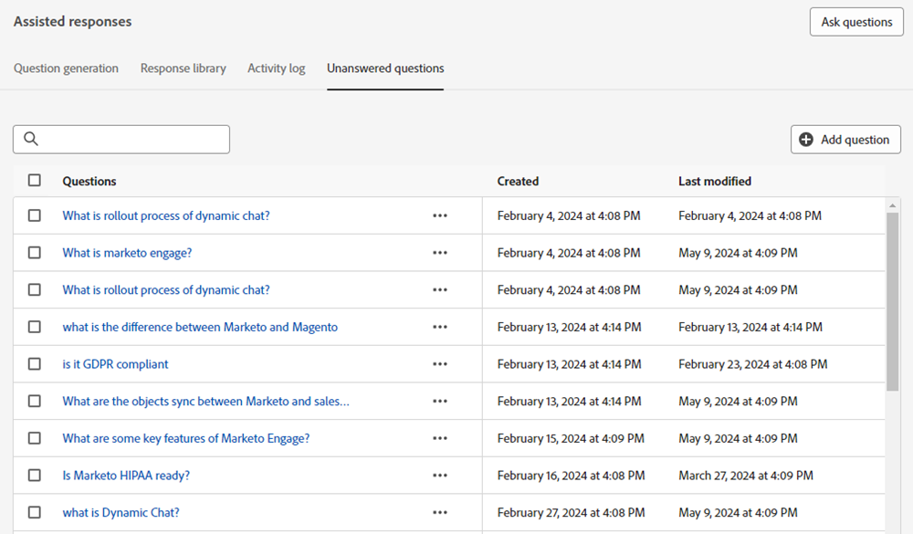

# Visão geral da IA gerativa {#generative-ai-overview}

A IA gerativa no Adobe Dynamic Chat processa sinais de intenção, preferências do usuário e comportamento anterior em tempo real para gerar mensagens relevantes e personalizadas para visitantes do bate-papo.

## Permissões {#permissions}

Para usar IA gerativa, conceda aos usuários desejados a proteção apropriada [permissões](/help/marketo/product-docs/demand-generation/dynamic-chat/setup-and-configuration/permissions.md).

## Cartão de resposta de geração {#generation-response-card}

Crie uma mensagem para o visitante para quando ele atingir um determinado ponto na conversa. Defina várias perguntas que podem ser feitas de uma só vez para atingir o indicador principal de desempenho desejado. Adicione até 5 perguntas de acompanhamento e inclua uma mensagem de fallback quando não houver resposta disponível para a pergunta de um visitante.

## Sumário da conversa {#conversation-summary}

Normalmente, para obter o contexto completo de uma conversa de visitante, é necessário percorrer toda a transcrição do chat. O Resumo da conversa gera um resumo para você em tempo real e inclui tópicos nos quais o visitante expressou interesse. Isso é particularmente útil para agentes de bate-papo que precisam de um contexto rápido de uma conversa quando estão alternando entre bate-papos com vários visitantes. Além de estarem visíveis na tela de bate-papo da Caixa de entrada do agente, os Resumos de conversas concluídos também podem ser encontrados no registro de atividades do Registro de pessoa do visitante no Banco de dados do Marketo Engage.

>[!NOTE]
>
>Um Resumo da conversa é gerado para bate-papos ao vivo e automatizados.

## Geração de perguntas {#question-generation}

[Elevar experiências de entrada](/help/marketo/product-docs/demand-generation/dynamic-chat/generative-ai/question-generation.md) com conversas assistidas por IA para visitantes que usam uma interface treinada com vendas, marketing e conhecimento sobre produtos.

## Biblioteca de respostas {#response-library}

[Produzir uma coleção personalizada](/help/marketo/product-docs/demand-generation/dynamic-chat/generative-ai/response-library.md) de perguntas e respostas, todas pré-aprovadas por você, para uso em campanhas de chat da IA gerativa.

## Log de atividade {#activity-log}

[Ver uma lista de todas as tarefas](/help/marketo/product-docs/demand-generation/dynamic-chat/generative-ai/activity-log.md) e os detalhes que os acompanham, incluindo nome, proprietário, tipo e quem os editou e quando.

## Perguntas não respondidas {#unanswered-questions}

[Criar respostas adicionais pré-aprovadas](/help/marketo/product-docs/demand-generation/dynamic-chat/generative-ai/unanswered-questions.md) para sua biblioteca de resposta usando IA com base em um repositório USE UMA PALAVRA DIFERENTE de perguntas não respondidas de conversas anteriores.

## Tópicos discutidos {#discussed-topics}

Os Tópicos discutidos estão disponíveis em Acionadores e filtros de Smart List como uma restrição, permitindo que você se aprofunde ainda mais nos seus insights de Dynamic Chat.

>[!IMPORTANT]
>
>Ao usar IA gerativa, você deve seguir as [Diretrizes de usuário da IA geradora da Adobe Experience Cloud](https://www.adobe.com/legal/licenses-terms/adobe-dx-gen-ai-user-guidelines.html) para que possamos garantir que os recursos do Adobe Experience Cloud que incorporam IA gerativa estejam sendo usados de maneira segura e responsável.

## Perguntas frequentes {#faq}

**A IA gerativa está disponível para todos os usuários do Dynamic Chat?**

A IA gerativa só está disponível para assinantes do Dynamic Chat Prime.

**Existe um limite para a quantidade de perguntas e respostas que eu posso ter gerado?**

Sim. No momento, há um limite de vida útil de 1000.

**Quais idiomas estão disponíveis na IA gerativa?**

Atualmente, somente o inglês é compatível com a IA gerativa.
