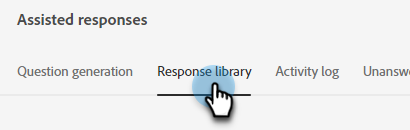

# Biblioteca de resposta {#response-library}

Em um local, visualize todas as suas perguntas, o status de aprovação e o nome da tarefa/tópico(s) atribuído(s) a elas.

## Adicionar uma pergunta manualmente {#manually-add-a-question}

1. Em IA gerativa, clique em **[!UICONTROL Respostas assistidas]**.

   

1. Clique na guia **[!UICONTROL Biblioteca de resposta]**.

   

1. Clique em **[!UICONTROL Adicionar pergunta]**.

   

1. Insira a pergunta e a resposta. Atribua um tópico e adicione um URL opcional que os usuários podem compartilhar com os visitantes. Clique em **[!UICONTROL Salvar]** quando terminar.

   

1. Clique em atualizar e sua nova pergunta aparecerá na parte superior com o status de &quot;[!UICONTROL Processando].&quot;

   

1. Após alguns minutos, atualize novamente e o status mudará para &quot;Aprovado&quot;.

   

## Editar uma pergunta/resposta individual {#generate-a-new-question}

>[!NOTE]
>
>Por padrão, todas as perguntas e respostas geradas recebem o status &quot;[!UICONTROL precisa de revisão]&quot;. Apenas &quot;[!UICONTROL perguntas e respostas aprovadas]&quot; são disponibilizadas para os visitantes do chat.

1. Na **[!UICONTROL Biblioteca de respostas]**, clique na pergunta desejada.

   

1. Faça suas edições e clique em **[!UICONTROL Salvar]**.

   

## Perguntas/respostas sobre edição e upload em massa {#bulk-edit-and-upload-questions-responses}

As instruções sobre como fazer edições em massa no arquivo do Excel baixado estão disponíveis abaixo. Eles também podem ser vistos na guia Task details do arquivo.

<table>
<thead>
  <tr>
    <th>Ação</th>
    <th>Instruções</th>
  </tr>
</thead>
<tbody>
  <tr>
    <td>Editar uma pergunta</td>
    <td>Insira a nova pergunta na coluna "editedQuestion" (coluna H)</td>
  </tr>
  <tr>
    <td>Editar uma resposta</td>
    <td>Insira a nova resposta na coluna "editedResponse" (coluna I)</td>
  </tr>
  <tr>
    <td>Adicionar uma nova pergunta</td>
    <td>Insira a nova pergunta na coluna "editedQuestion" (coluna H) e deixe questionResponded em branco. Você também deve inserir um tópico apropriado na coluna "tópicos" (coluna C) e um URL de origem na coluna "sourceUrl!"</td>
  </tr>
  <tr>
    <td>Adicionar uma pergunta e uma resposta</td>
    <td>Insira a nova pergunta na coluna "editedQuestion" (coluna H), a nova resposta na coluna "editedResponse" (coluna I) e deixe questionResponse em branco. Você também deve inserir um tópico apropriado na coluna "tópicos" (coluna C)</td>
  </tr>
</tbody>
</table>

1. Depois de concluir as edições no arquivo, volte para a guia **[!UICONTROL Biblioteca de respostas]** e clique em **[!UICONTROL Carregar respostas]**.

   

1. Insira o nome da tarefa aplicável. Arraste e solte o arquivo ou procure-o no dispositivo e selecione-o. Clique em **[!UICONTROL Salvar]** quando terminar.

   

1. A confirmação é exibida e você está pronto.

   

## Filtre suas perguntas {#filter-your-questions}

Por padrão, as perguntas são listadas em ordem por hora/data de criação, com as mais recentes sendo exibidas primeiro. Se estiver procurando uma pergunta específica, aplique filtros para restringir sua pesquisa. Filtrar por tópicos, nome da tarefa e/ou status de aprovação.

