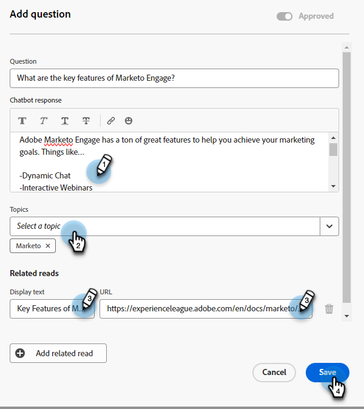

# Perguntas não respondidas {#unanswered-questions}

Veja todas as perguntas que o chatbot não pôde responder e/ou as que os visitantes marcaram como &quot;não úteis&quot; e use essas informações valiosas para criar respostas adicionais pré-aprovadas.

>[!NOTE]
>
>A lista de perguntas não respondidas é atualizada automaticamente a cada 24 horas.

1. Em IA gerativa, clique em **Respostas assistidas**.

   

1. Clique em **Perguntas não respondidas** guia.

   

1. Selecione a pergunta não respondida para a qual você deseja criar uma resposta.

   

1. Insira sua resposta. Atribua um tópico e adicione um URL opcional que os usuários podem compartilhar com os visitantes. Clique em **Salvar** quando terminar.

   

1. A pergunta não respondida agora é respondida e adicionada automaticamente à biblioteca de Resposta.

   
