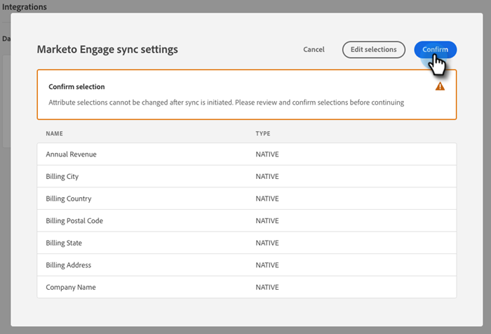

# Adobe Marketo Engage {#adobe-marketo-engage}

## Conectar o Dynamic Chat {#connecting-dynamic-chat}

Após concluir a [configuração inicial](/help/marketo/product-docs/demand-generation/dynamic-chat/setup-and-configuration/initial-setup.md){target="_blank"}, é hora de executar a sincronização única conectando o Dynamic Chat à sua assinatura do Adobe Marketo Engage.

>[!NOTE]
>
>O Dynamic Chat oferece suporte à sincronização de [campos nativos](https://experienceleague.adobe.com/en/docs/marketo-developer/marketo/rest/lead-database/field-types){target="_blank"} do Marketo e campos de pessoa personalizados e campos de empresa.

1. Em Minha Marketo, clique no bloco **[!UICONTROL Dynamic Chat]**.

   

   >[!NOTE]
   >
   >Se você não vir o bloco, entre em contato com o administrador do Marketo.

1. Se você tiver acessado anteriormente um aplicativo com uma Adobe ID, será direcionado diretamente ao Dynamic Chat. Caso contrário, [configure seu Adobe ID](https://helpx.adobe.com/manage-account/using/create-update-adobe-id.html){target="_blank"}.

1. Para conectar sua instância do Marketo, selecione **[!UICONTROL Integrações]**.

   

1. No cartão do Marketo, clique em **[!UICONTROL Iniciar sincronização]**.

   

1. Selecione até 50 atributos (campos padrão ou personalizados) da sua instância do Marketo para sincronizar com o Dynamic Chat para uso no direcionamento de público, mapeamento de dados e personalização. Clique em **[!UICONTROL Avançar]** quando terminar.

   

1. Revise suas seleções. Clique em **[!UICONTROL Confirmar]** para iniciar a sincronização.

   

>[!NOTE]
>
>Pode levar de 2 a 24 horas para que a sincronização seja concluída, dependendo do tamanho do banco de dados.

## Adicionar um atributo {#add-an-attribute}

Após a sincronização inicial, siga estas etapas para adicionar outros atributos.

1. Em **[!UICONTROL Integrações]**, verifique se a guia **[!UICONTROL Adobe Marketo Engage]** está selecionada e clique em **[!UICONTROL Adicionar Atributo]**.

   

1. Selecione os atributos que você deseja adicionar e clique em **[!UICONTROL Avançar]**.

   

1. Revise suas seleções e clique em **[!UICONTROL Confirmar]**.

   

## Remover um atributo {#remove-an-attribute}

Após a sincronização inicial, siga estas etapas para remover um atributo.

>[!NOTE]
>
>Você só verá a opção para remover um atributo se ele não estiver sendo usado por nenhuma caixa de diálogo.

1. Em **[!UICONTROL Integrações]**, verifique se a guia **[!UICONTROL Adobe Marketo Engage]** está selecionada e clique no atributo que deseja remover.

   

1. Clique em **[!UICONTROL Remover atributo]**.

   

>[!MORELIKETHIS]
>
>[Instalação Inicial](/help/marketo/product-docs/demand-generation/dynamic-chat/setup-and-configuration/initial-setup.md){target="_blank"}
