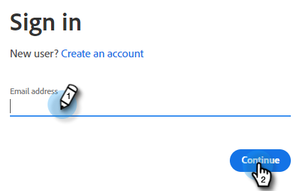
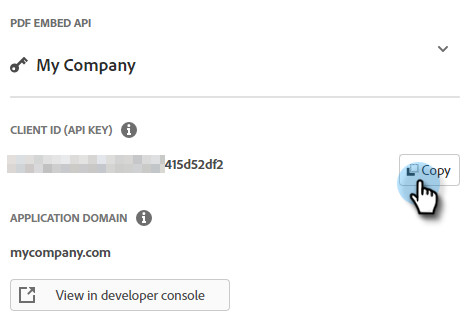

# API incorporada do Adobe PDF {#adobe-pdf-embed-api}

O cartão Documento permite incorporar documentos do PDF em caixas de diálogo e rastrear a atividade de engajamento de documentos dos visitantes. Veja como configurar isso.

1. Navegue até [API Incorporada do Adobe PDF](https://udp.adobe.io/document-services/apis/pdf-embed/){target="_blank"}.

1. Clique em **[!UICONTROL Obter Credenciais]**.

   

1. Faça logon em sua conta da Adobe.

   

1. Insira suas credenciais, aceite os termos e clique em **[!UICONTROL Criar credenciais]**.

   

   >[!IMPORTANT]
   >
   >Você precisará usar o domínio em que hospedará o chatbot (por exemplo, se estiver hospedando o chatbot em mycompany.com, insira isso na Etapa 4).

1. Clique em **[!UICONTROL Copiar]** para copiar a ID do cliente.

   

1. De volta ao Dynamic Chat, clique em **[!UICONTROL Integrações]**. No cartão de API Incorporada do Adobe PDF, clique em **[!UICONTROL Ativar]**.

   

1. Cole sua [!UICONTROL ID do Cliente] e clique em **[!UICONTROL Salvar]**.

   

Agora você pode usar o cartão Documento em suas [Stream Designer](/help/marketo/product-docs/demand-generation/dynamic-chat/automated-chat/stream-designer.md){target="_blank"} das caixas de diálogo!
