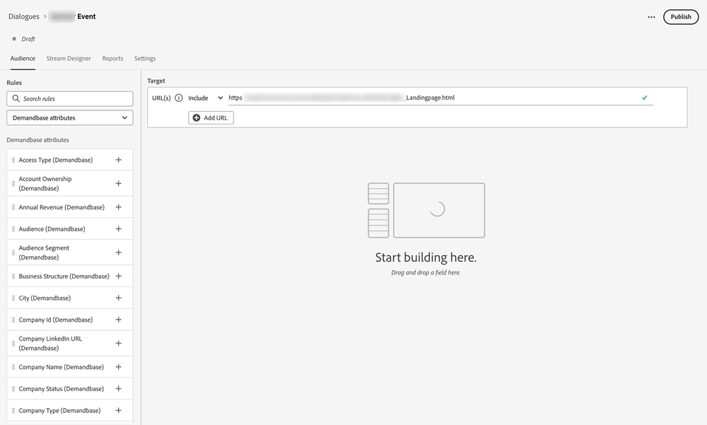
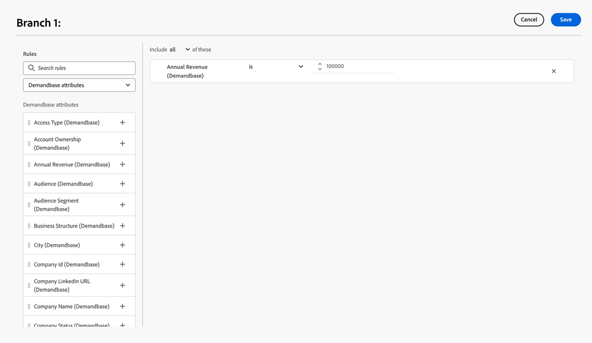
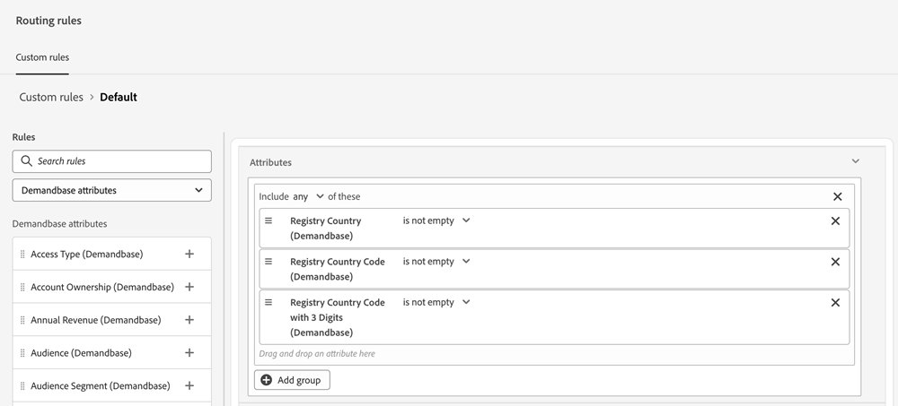

# Demandbase {#demandbase}

Os usuários da Demandbase podem usar atributos de pessoa da Demandbase para direcionamento de diálogo, identidade visual condicional e roteamento personalizado no Dynamic Chat.

## Acesse a chave de API do Dynamic Chat {#access-the-api-key-for-dynamic-chat}

As etapas abaixo devem ser executadas _em sua conta do Demandbase_.

1. No Demandbase, clique no ícone _Configurações_.

   

1. Em _Integrações_, selecione **Conector de conta**.

1. Clique no botão **+ Criar novo**.

1. No menu suspenso _Nome da Integração_, selecione **Adobe Dynamic Chat**.

1. Selecione o botão de opção **Lado do servidor**.

1. Clique em **Criar**.

1. Usando o ícone _copiar_, copie a cadeia de caracteres do token da API na parte inferior da página.

1. Envie um tíquete com o [Suporte da Marketo](https://nation.marketo.com/t5/support/ct-p/Support) e forneça a Cadeia de Token da API para ativar a integração com o Demandbase.

>[!NOTE]
>
>Para obter mais informações, consulte [Configurar Demandbase para enviar dados a uma integração (Conector de conta)](https://support.demandbase.com/hc/en-us/articles/360057169531-Set-Up-Demandbase-to-Send-Data-to-an-Integration-Account-Connector){target="_blank"} no site de ajuda do Demandbase.

## Recursos de integração {#integration-features}

Direcione seu público com base em atributos do Demandbase, além de atributos nativos e personalizados, ao criar uma caixa de diálogo ou um fluxo de conversação.

Use Atributos do Demandbase como uma condição na sua ramificação condicional, uma caixa de diálogo ou um fluxo de conversação.

Use os Atributos do Demandbase ao definir qualquer lógica de roteamento personalizada.

