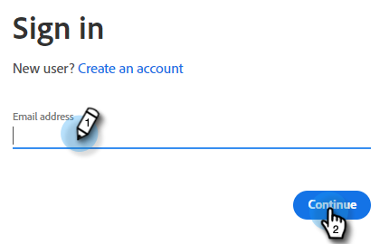

# Uso do Cartão de Documento {#using-the-document-card}

O cartão Documento permite incorporar documentos PDF em caixas de diálogo e rastrear a atividade de engajamento de documentos dos visitantes. Veja como configurar isso.

1. Navegue até [API incorporada do Adobe PDF](https://udp.adobe.io/document-services/apis/pdf-embed/){target="_blank"}.

1. Clique em **Obter credenciais**.

   

1. Faça logon em sua conta Adobe.

   

1. Insira suas credenciais, aceite os termos e clique em **Criar credenciais**.

   

   >[!IMPORTANT]
   >
   >Você precisará usar o domínio em que hospedará o chatbot (por exemplo, se estiver hospedando o chatbot em mycompany.com, insira isso na Etapa 4).

1. Clique em **Copiar** para copiar a ID do cliente.

   

1. De volta ao Dynamic Chat, clique em **Integrações**. No cartão de API incorporado do Adobe PDF, clique em **Ativar**.

   

1. Cole a ID do cliente e clique em **Salvar**.

   

Agora você pode usar o Cartão de documento nas caixas de diálogo [Designer de fluxo](/help/marketo/product-docs/demand-generation/dynamic-chat/dialogues/stream-designer.md)!
