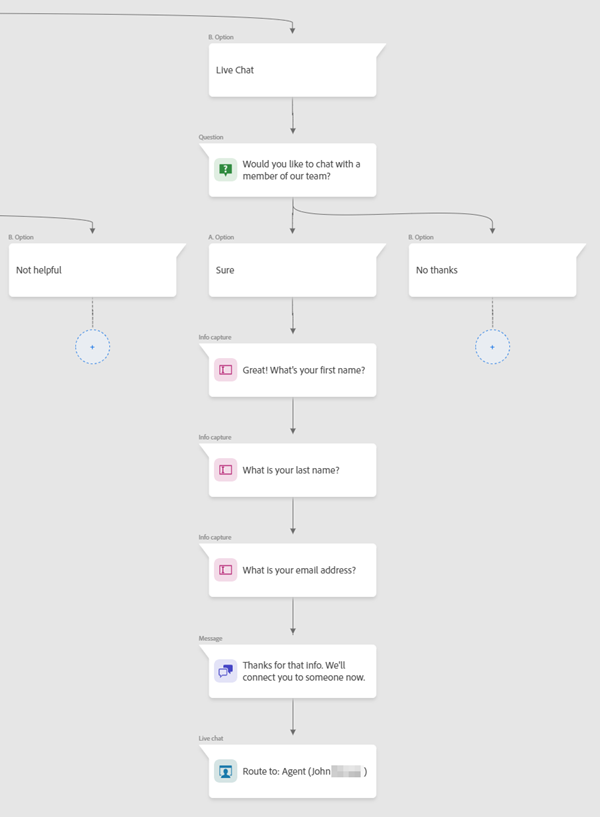
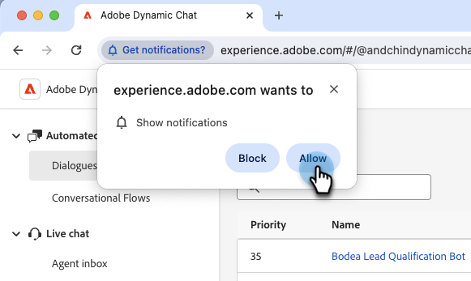

# Visão geral do bate-papo ao vivo {#live-chat-overview}

O bate-papo ao vivo permite que os visitantes do site se envolvam em conversas de bate-papo em tempo real com seus agentes de vendas.

>[!NOTE]
>
>Para aqueles que estão no pacote Dynamic Chat Select, o chat ao vivo é um recurso de avaliação com um limite de vida útil de 100 envolvimentos. Quando esse limite é atingido, os visitantes que solicitarem o chat com um agente ao vivo não serão conectados e receberão a mensagem de fallback global. Para aumentar o limite, entre em contato com o representante de conta da Adobe para saber mais sobre as opções de atualização do pacote.

## Adicionar agentes de bate-papo ao vivo {#add-live-chat-agents}

Para começar a usar o chat ao vivo, você precisará adicionar seus agentes de chat ao vivo como [usuários na Adobe Admin Console](/help/marketo/product-docs/demand-generation/dynamic-chat/setup-and-configuration/add-or-remove-chat-users.md#add-a-chat-user){target="_blank"} e conceder a eles a [permissão de Chat ao Vivo](/help/marketo/product-docs/demand-generation/dynamic-chat/setup-and-configuration/permissions.md){target="_blank"}. Depois disso, você poderá adicionar um [cartão de chat ao vivo](#using-the-live-chat-card) a uma caixa de diálogo nova ou existente.

Quando os visitantes solicitarem o chat com um agente por meio da sua Caixa de diálogo, os agentes terão várias [opções de notificação](/help/marketo/product-docs/demand-generation/dynamic-chat/live-chat/agent-inbox.md#live-chat-notifications){target="_blank"}. Ao clicar na notificação, ele será levado para sua [Caixa de Entrada do Agente](/help/marketo/product-docs/demand-generation/dynamic-chat/live-chat/agent-inbox.md){target="_blank"}, onde poderá começar a conversar com o visitante.

>[!NOTE]
>
>O avatar do agente ao vivo usa a foto do perfil da conta do Adobe do agente. Para atualizar a imagem, siga [estas etapas](https://helpx.adobe.com/br/manage-account/using/edit-adobe-account-personal-profile.html){target="_blank"}.

## Usar o cartão de chat ao vivo {#using-the-live-chat-card}

Use o cartão de chat ao vivo no [Stream do Designer](/help/marketo/product-docs/demand-generation/dynamic-chat/automated-chat/stream-designer.md){target="_blank"} quando quiser que os visitantes conversem com um agente ao vivo.

>[!IMPORTANT]
>
>O cartão de chat ao vivo deve ser sempre o último cartão na ramificação. Se a placa for colocada em um ponto aleatório na ramificação, o visitante poderá se surpreender ao conectá-la repentinamente a um agente.

### Práticas recomendadas {#best-practices}

* Use um cartão de perguntas antes do cartão de chat ao vivo perguntando ao visitante se ele deseja se conectar.
* Depois que o visitante concordar em se conectar, use o cartão de captura de informações para coletar algumas informações, como nome/sobrenome, endereço de email, cargo etc. (é recomendável solicitar pelo menos o nome e o endereço de email).

## Opções de Cartão de Bate-papo ao Vivo {#live-chat-card-options}

Clicar no cartão de chat ao vivo no stream permite escolher como o visitante é roteado. Escolha entre round robin, um agente, regras personalizadas ou uma equipe.

<table> 
 <tbody> 
  <tr> 
   <td><b>Round Robin</b></td>
   <td>Os bate-papos são atribuídos aos agentes em ordem sequencial.</td>
  </tr> 
  <tr> 
   <td><b>Agente</b></td>
   <td>Escolha um agente específico para receber o chat.</td>
  </tr>
    <tr> 
   <td><b>Regras personalizadas</b></td>
   <td>Todas as regras personalizadas serão percorridas ao considerar para onde encaminhar o visitante. Se o visitante não se qualificar para nenhuma regra personalizada, ele receberá a <a href="/help/marketo/product-docs/demand-generation/dynamic-chat/setup-and-configuration/agent-management.md#live-chat-fallback" target="_blank">mensagem de fallback de chat em tempo real</a>.</td>
  </tr> 
  <tr> 
   <td><b>Equipe</b></td>
   <td>Escolha uma equipe específica para receber o chat. Se essa opção for escolhida, ela será atribuída em rodízio dentro dessa equipe.</td>
  </tr>
 </tbody> 
</table>

## Notificações de bate-papo ao vivo {#live-chat-notifications}

>[!IMPORTANT]
>
>Para receber notificações do navegador para bate-papo ao vivo, todos os agentes de bate-papo ao vivo devem ativar as notificações do navegador para o Dynamic Chat quando solicitado.

### Ativar notificações {#enabling-notifications}

Os agentes de bate-papo ao vivo verão um banner na parte superior da tela quando fizerem logon com a mensagem &quot;Ative as notificações do navegador para receber notificações de bate-papo ao vivo&quot;. Clique em **Habilitar**.

Os agentes de bate-papo ao vivo serão solicitados pelo navegador a mostrar as notificações. Clique em **Permitir**.

Se os agentes não receberem notificações do navegador mesmo depois de permitirem no navegador, talvez seja necessário ativar as notificações para o navegador nas configurações de notificação do SO:

[Etapas para Mac](https://support.apple.com/guide/mac-help/change-notifications-settings-mh40583/mac){target="_blank"}

[Etapas para Windows](https://support.microsoft.com/en-us/windows/change-notification-settings-in-windows-8942c744-6198-fe56-4639-34320cf9444e){target="_blank"}

### Quando um bate-papo ao vivo é roteado para um agente {#when-a-live-chat-is-routed-to-an-agent}

Quando um chat ao vivo for roteado para um agente, ele verá um banner azul na parte superior da tela pedindo que ele aceite, bem como um som de notificação para ajudar a evitar notificações perdidas.

>[!TIP]
>
>Você também tem a opção de configurar as notificações do navegador, que alertarão você caso não esteja conectado ao Dynamic Chat.
>
>* Habilitar notificações do navegador no [Google Chrome](https://support.google.com/chrome/answer/3220216?hl=en&amp;co=GENIE.Platform%3DDesktop){target="_blank"}
>* Habilitar notificações do navegador no [Mozilla Firefox](https://support.mozilla.org/en-US/kb/push-notifications-firefox){target="_blank"}

### Notificações de Ação com Falha {#failed-action-notifications}

Quando uma ação, como uma reserva de reunião ou um chat ao vivo, falha, os usuários são notificados por email.

### Itens a Observar {#things-to-note}

* Os agentes têm 100 segundos para responder antes que a mensagem &quot;Accept chat&quot; expire. Depois disso, os visitantes receberão a [mensagem de fallback](/help/marketo/product-docs/demand-generation/dynamic-chat/setup-and-configuration/agent-management.md#live-chat-fallback){target="_blank"}. Para assinantes do Dynamic Chat Prime que têm a opção de roteamento definida como **Equipe**, haverá mais uma tentativa antes que a mensagem de fallback seja exibida.
* No momento, há um limite de 10 bate-papos ao vivo por agente.

>[!MORELIKETHIS]
>
>[Caixa de entrada do agente](/help/marketo/product-docs/demand-generation/dynamic-chat/live-chat/agent-inbox.md){target="_blank"}
