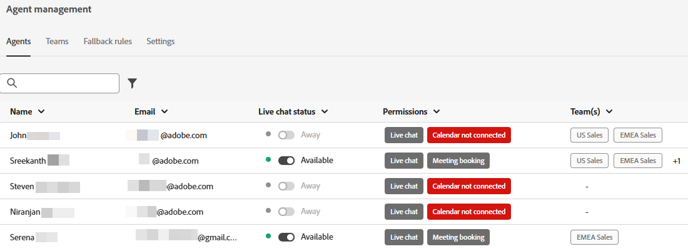
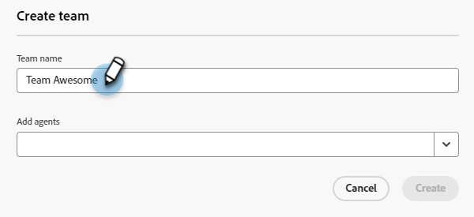

# Gerenciamento de agentes {#agent-management}

No Gerenciamento de agentes, visualize uma lista de agentes na instância do Dynamic Chat, gerencie equipes e defina suas regras de fallback.

## Agentes {#agents}

Essa guia lista todos os agentes na instância do Dynamic Chat e inclui informações como nome, endereço de email, status do chat ao vivo e muito mais.

{width="800" zoomable="yes"}

>[!NOTE]
>
>Não vê um agente que você _acabou_ de adicionar? Pode levar até duas horas para que sejam exibidas aqui após adicioná-las ao Admin Console do Adobe.

## Equipes {#teams}

Os administradores podem criar equipes de agentes para facilitar o roteamento para grupos específicos de agentes de vendas.

>[!AVAILABILITY]
>
>O acesso ao Teams exige uma assinatura do Dynamic Chat Prime. Entre em contato com a equipe de conta da Adobe (seu gerente de conta) para obter mais detalhes.

### Criar uma equipe {#create-a-team}

1. Clique em **+ Criar Equipe**.

   

1. Nomeie sua equipe.

   

1. Clique na lista suspensa **Adicionar agentes** e selecione os agentes desejados.

   

1. Clique em **Criar**.

   

## Regras de Fallback {#fallback-rules}

### Fallback de Reunião {#meeting-fallback}

Selecione uma mensagem padrão (sistema) ou escreva uma personalizada para os visitantes verem quando a reserva da reunião não estiver disponível.

### Fallback de bate-papo ao vivo {#live-chat-fallback}

Selecione uma mensagem padrão (sistema) ou escreva uma personalizada para os visitantes verem quando o bate-papo ao vivo estiver indisponível.

>[!NOTE]
>
>* Marcar a caixa de seleção _Incluir Opção de Reserva de Reunião_ dará ao visitante do chat a opção de marcar uma reunião quando nenhum agente estiver disponível para o chat ao vivo.
>
>* **Para quaisquer regras/Equipes personalizadas como um cartão de Chat ao Vivo**: ao verificar agentes, se eles não estiverem disponíveis ou não puderem se conectar, recorrerá ao Round Robin para tentar &quot;Agentes Disponíveis&quot; (todos os que estiverem disponíveis naquele momento, independentemente de qual lógica/regra de roteamento foi colocada no fluxo).

>[!TIP]
>
>Ao criar uma mensagem personalizada, você pode estilizar a fonte, usar links e até mesmo inserir emojis! `:)`

## Configurações {#settings}

### Limite de chats ao vivo simultâneos {#concurrent-live-chat}

Defina o número de bate-papos ativos simultâneos que um agente pode realizar de uma vez. Pode definir entre 1 e 10.

### Limite de tempo de espera do visitante {#visitor-wait-time}

Controle a quantidade máxima de tempo que um visitante aguardará (em segundos) para ser conectado a um agente ativo antes que o visitante receba uma mensagem de fallback. Pode ser definido entre 10 e 500 segundos.

