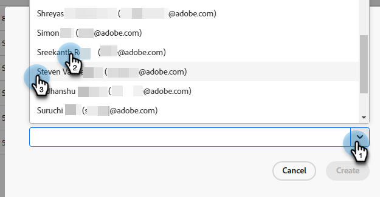

# Gerenciamento de agente {#agent-management}

No Gerenciamento de agentes, visualize uma lista de agentes na instância do Dynamic Chat, gerencie equipes e defina suas regras de fallback.

## Agentes {#agents}

Essa guia lista todos os agentes na instância do Dynamic Chat e inclui informações como nome, endereço de email, status do chat ao vivo e muito mais.

>[!NOTE]
>
>Não vejo um agente que você _apenas_ adicionado? Pode levar até duas horas para que eles apareçam aqui após adicioná-los ao Admin Console do Adobe.

## Equipes {#teams}

Os administradores podem criar equipes de agentes para facilitar o roteamento para grupos específicos de agentes de vendas.

>[!AVAILABILITY]
>
>O acesso ao Teams exige uma assinatura do Dynamic Chat Prime. Entre em contato com a equipe de conta do Adobe (seu gerente de conta) para obter mais detalhes.

### Criar uma equipe {#create-a-team}

1. Clique em **+ Criar equipe**.

   

1. Nomeie sua equipe.

   

1. Clique em **Adicionar agentes** e selecione os agentes desejados.

   

1. Clique em **Criar**.

   

## Regras de Fallback {#fallback-rules}

### Fallback de Reunião {#meeting-fallback}

Selecione uma mensagem padrão (sistema) ou escreva uma personalizada para os visitantes verem quando a reserva da reunião não estiver disponível.

### Fallback de bate-papo ao vivo {#live-chat-fallback}

Selecione uma mensagem padrão (sistema) ou escreva uma personalizada para os visitantes verem quando o bate-papo ao vivo estiver indisponível.

>[!NOTE]
>
>Selecionar o **Incluir Opção de Reserva de Reunião** a caixa de seleção dará ao visitante do chat a opção de agendar uma reunião quando nenhum agente estiver disponível para o chat ao vivo.

>[!TIP]
>
>Ao criar uma mensagem personalizada, você pode estilizar a fonte, usar links e até mesmo inserir emojis! `:)`
