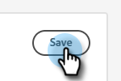

# Configuração {#configuration}

Saiba como personalizar a aparência da janela de diálogo do chatbot.

Para começar, clique em **Chatbot** em **Configuração**.

Há várias opções de personalização diferentes.

## Guia Estilo {#style-tab}

### Estilo {#style}

É aqui que você irá definir a aparência e comportamento do chatbot onde os seus Diálogos serão apresentados, incluindo: cores, fontes, posicionamento do widget do bot e o nome/avatar do chatbot.

A cor de cada categoria é determinada por um [valor de cor hexadecimal](https://color.adobe.com/create/color-wheel){target="_blank"} (por exemplo, branco = #ffffff, vermelho = #bf1932 etc.).

A Âncora permite que o visitante do site abra/feche a caixa de diálogo. Você pode escolher se deseja que esse ícone apareça na parte inferior direita ou inferior esquerda. Você também pode aumentar/diminuir o preenchimento (a quantidade de espaço entre o ícone e a parte inferior da página da Web).

### Configurações de bot {#agent-settings}

Nas Configurações de bot, você pode adicionar um rótulo à sua caixa de bate-papo (por exemplo: &quot;Assistente do Adobe&quot;) que aparecerá na parte superior. Você também pode determinar o atraso de resposta (em segundos) e alterar o avatar do bate-papo. Para carregar sua própria imagem de avatar, clique no botão **+**.

>[!NOTE]
>
>Os avatares personalizados devem ser imagens quadradas com menos de 256 kb e menores de 200x200 px. Os tipos de arquivos suportados incluem: .jpg, .png, .gif, .webp, .svg.

**Novo som de notificação de mensagem**

Clique na lista suspensa para selecionar um som para o visitante sempre que o chatbot for acionado em uma sessão. Há várias opções de sons para escolher.

**Habilitar mensagens poke em dispositivos móveis**

Selecione o controle deslizante para ativar &quot;Poke&quot;, que exibe a pergunta de abertura ao lado do ícone do bate-papo sem que o visitante precise clicar nele para vê-lo, para que os visitantes possam conversar a partir de um dispositivo móvel.

>[!NOTE]
>
>O Poke só está disponível no primeiro [cartão](/help/marketo/product-docs/demand-generation/dynamic-chat/automated-chat/stream-designer.md#stream-designer-cards){target="_blank"} da conversa.

Quando terminar de fazer alterações, lembre-se de clicar em **Salvar**.

## Guia Privacidade {#privacy-tab}

Clique na guia **Privacidade** para adicionar/editar a URL da política de privacidade do site (opcional).

## Guia Instalação {#installation-tab}

Para que o chatbot seja exibido no seu site, primeiro será necessário instalar o trecho Dynamic Chat JavaScript. Clique nessa guia para localizar/copiar o código necessário. Se você não estiver familiarizado com essa operação, entre em contato com a equipe da Web ou o departamento de TI para obter assistência.

>[!TIP]
>
>Olhe abaixo o código para saber o que adicionar se o site usar a Política de segurança de conteúdo (CSP).

>[!NOTE]
>
>O Suporte da Marketo não está configurado para ajudar na solução de problemas do HTML. Para obter assistência da HTML, consulte um desenvolvedor da Web.
