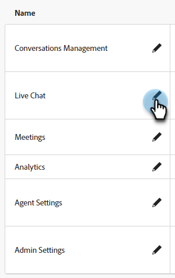
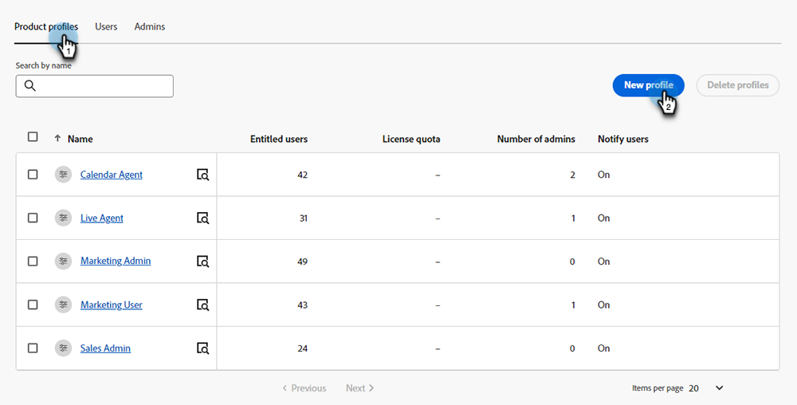

# Permissões {#permissions}

Há cinco perfis padrão com permissões predefinidas que podem ser editadas no Dynamic Chat. Você também pode criar um perfil personalizado com um conjunto personalizado de permissões. Vamos analisar os dois.

## Editar permissões existentes {#edit-existing-permissions}

1. No [Adobe Admin Console](https://adminconsole.adobe.com/){target="_blank"}, clique em **Dynamic Chat**.

   

1. No **Perfis de produto** selecione o perfil que deseja editar. Neste exemplo, estamos escolhendo **Agente em tempo real**.

   

1. Clique em **Permissões** guia.

   

1. Selecione a área do perfil que deseja editar. Neste exemplo, estamos escolhendo Bate-papo ao Vivo. Clique no ícone de lápis.

   

1. Os itens de permissão disponíveis estão listados à esquerda. Você pode optar por adicionar permissões uma por uma ou todas de uma vez. Neste exemplo, há apenas um disponível, então estamos adicionando esse. Clique em **+** assinatura.

   

   >[!NOTE]
   >
   >Ativar a Inclusão automática adicionará todos os itens de permissão à lista incluída. Quando novos itens de permissão se tornarem disponíveis, eles serão incluídos automaticamente para esse perfil de produto.

1. Clique em **Salvar**.

   

Agora é possível repetir esse processo para qualquer/todas as outras áreas de Dynamic Chat.

## Criar um perfil {#create-a-profile}

1. No [Adobe Admin Console](https://adminconsole.adobe.com/){target="_blank"}, clique em **Dynamic Chat**.

   

1. No **Perfis de produto** clique em **Novo perfil**.

   

1. **Nome** seu perfil de produto. Como opção, você pode fornecer um nome de exibição e/ou descrição e optar por notificar os usuários quando eles forem adicionados/removidos. Clique em **Salvar** quando terminar.

   

1. O novo perfil aparecerá na guia Perfis de produto. Selecione-o.

   

1. Agora, siga as etapas 3 a 6 do [seção acima](#edit-existing-permissions) para cada área desejada.

## Lista de permissões {#list-of-permissions}

Abaixo você encontrará uma lista de todas as permissões disponíveis para cada área.

<table>
<thead>
  <tr>
    <th style="width:30%">Área de Dynamic Chat</th>
    <th>Permissões</th>
  </tr>
</thead>
<tbody>
  <tr>
    <td>Gerenciamento de Conversas</td>
    <td><li>Exibir caixas de diálogo</li>
    <li>Gerenciar caixas de diálogo (criar, excluir)</li>
    <li>Caixas de diálogo de publicação</li>
    <li>Exibir Fluxos de Conversa</li>
    <li>Gerenciar Fluxos de Conversação (criar, excluir)</li>
    <li>Publicar Fluxos de Conversação</li></td>
  </tr>
  <tr>
    <td>Chat ao vivo</td>
    <td><li>Exibir minhas conversas</li>
    <li>Exibir Todas as Conversas</li>
  </tr>
  <tr>
    <td>Reuniões</td>
    <td><li>Gerenciar Todas as Reuniões</li>
  </tr>
  <tr>
    <td>Analytics</td>
    <td><li>Exibir Relatórios de Desempenho Global</li>
    <li>Exibir Relatórios de Bate-papo ao Vivo</li>
    <li>Exibir Relatórios de Reuniões</li>
    <li>Exportar relatórios</li></td>
  </tr>
  <tr>
    <td>Configurações do agente</td>
    <td><li>Gerenciar Disponibilidade do Live Chat</li>
    <li>Conectar seu calendário</li>
    <li>Gerenciar Disponibilidade de Calendário</li></td>
  </tr>
  <tr>
    <td>Configurações de admin</td>
    <td><li>Exibir Round-robin</li>
    <li>Exibir Regras Personalizadas</li>
    <li>Gerenciar regras personalizadas (adicionar, editar, excluir)</li>
    <li>Exibir lista de contas <b>*</b></li>
    <li>Gerenciar contas (adicionar, editar, excluir) <b>*</b></li>
    <li>Gerenciar configurações de Chatbot</li>
    <li>Gerenciar configurações de fluxos de conversa</li>
    <li>Gerenciar privacidade e segurança</li>
    <li>Gerenciar integrações</li>
    <li>Gerenciar agentes</li>
    <li>Exibir equipes de agentes <b>*</b></li>
    <li>Gerenciar equipes de agentes (adicionar, editar, excluir) <b>*</b></li></td>
  </tr>
</tbody>
</table>

**&#42;** Atualmente disponível apenas para usuários do Dynamic Prime

## Permissões de perfil padrão {#default-profile-permissions}

Abaixo estão os cinco perfis padrão e as permissões que são ativadas por padrão.

<table>
<thead>
  <tr>
    <th style="width:30%">Perfil</th>
    <th>Permissões padrão</th>
  </tr>
</thead>
<tbody>
  <tr>
    <td>Usuário de campanha de marketing</td>
    <td><i>Gerenciamento de Conversas</i>
    <li>Exibir caixas de diálogo</li>
    <li>Gerenciar caixas de diálogo (criar, excluir)</li>
    <li>Caixas de diálogo de publicação</li>
    <li>Exibir Fluxos de Conversa</li>
    <li>Gerenciar Fluxos de Conversação (criar, excluir)</li>
    <li>Publicar Fluxos de Conversação</li>
    

    <i>Chat ao vivo</i>
    <li>n/d</li>
    

     <i>Reuniões</i>
    <li>n/d</li>
    

     <i>Analytics</i>
    <li>Exibir Relatórios de Desempenho Global</li>
    <li>Exibir Relatórios de Bate-papo ao Vivo</li>
    <li>Exibir Relatórios de Reuniões</li>
    

     <i>Configurações do agente</i>
    <li>n/d</li>
    

     <i>Configurações de admin</i>
    <li>Exibir Round-robin</li>
    <li>Exibir Regras Personalizadas</li>
    <li>Exibir lista de contas <b>*</b></li>
    <li>Exibir equipes de agentes <b>*</b></li>
    </td>
  </tr>
  <tr>
    <td><b>LiveAgent</b></td>
    <td><i>Gerenciamento de Conversas</i>
    

    <li>Exibir caixas de diálogo</li>
    <li>Exibir Fluxos de Conversa</li>
    

    
<i>Chat ao vivo</i>

    <li>Exibir minhas conversas</li>
    

    
<i>Reuniões</i>

    <li>n/d</li>
    

    
<i>Analytics</i>

    <li>Exibir Relatórios de Desempenho Global</li>
    <li>Exibir Relatórios de Bate-papo ao Vivo</li>
    <li>Exibir Relatórios de Reuniões</li>
    

    
<i>Configurações do agente</i>

    <li>Gerenciar Disponibilidade do Live Chat</li>
    <li>Conectar seu calendário</li>
    <li>Gerenciar Disponibilidade de Calendário</li>
    

    
<i>Configurações de admin</i>

    <li>Exibir Round-robin</li>
    <li>Exibir Regras Personalizadas</li>
    <li>Exibir lista de contas <b>*</b></li>
    <li>Exibir equipes de agentes <b>*</b></li>
    </td>
  </tr>
  <tr>
    <td><b>Agente de calendário</b></td>
    <td><i>Gerenciamento de Conversas</i>
    

    <li>Exibir caixas de diálogo</li>
    <li>Exibir Fluxos de Conversa</li>
    

    
<i>Chat ao vivo</i>

    <li>n/d</li>
    

    
<i>Reuniões</i>

    <li>n/d</li>
    

    
<i>Analytics</i>

    <li>Exibir Relatórios de Desempenho Global</li>
    <li>Exibir Relatórios de Bate-papo ao Vivo</li>
    <li>Exibir Relatórios de Reuniões</li>
    

    
<i>Configurações do agente</i>

    <li>Conectar seu calendário</li>
    <li>Gerenciar Disponibilidade de Calendário</li>
    

    
<i>Configurações de admin</i>

    <li>Exibir Round-robin</li>
    <li>Exibir Regras Personalizadas</li>
    <li>Exibir lista de contas <b>*</b></li>
    <li>Exibir equipes de agentes <b>*</b></li>
    </td>
  </tr>
  <tr>
    <td><b>Administrador de marketing</b></td>
    <td><i>Gerenciamento de Conversas</i>
    

    <li>Exibir caixas de diálogo</li>
    <li>Gerenciar caixas de diálogo (criar, excluir)</li>
    <li>Caixas de diálogo de publicação</li>
    <li>Exibir Fluxos de Conversa</li>
    <li>Gerenciar Fluxos de Conversação (criar, excluir)</li>
    <li>Publicar Fluxos de Conversação</li>
    

    
<i>Chat ao vivo</i>

    <li>n/d</li>
    

    
<i>Reuniões</i>

    <li>n/d</li>
    

    
<i>Analytics</i>

    <li>Exibir Relatórios de Desempenho Global</li>
    <li>Exibir Relatórios de Bate-papo ao Vivo</li>
    <li>Exibir Relatórios de Reuniões</li>
    <li>Exportar relatórios</li>
    

    
<i>Configurações do agente</i>

    <li>n/d</li>
    

    
<i>Configurações de admin</i>

    <li>Exibir Round-robin</li>
    <li>Exibir Regras Personalizadas</li>
    <li>Gerenciar regras personalizadas (adicionar, editar, excluir)</li>
    <li>Exibir lista de contas <b>*</b></li>
    <li>Gerenciar contas (adicionar, editar, excluir) <b>*</b></li>
    <li>Gerenciar configurações de Chatbot</li>
    <li>Gerenciar configurações de fluxos de conversa</li>
    <li>Gerenciar privacidade e segurança</li>
    <li>Gerenciar integrações</li>
    <li>Exibir equipes de agentes <b>*</b></li>
    </td>
  </tr>
  <tr>
    <td><b>Administrador de Vendas</b></td>
    <td><i>Gerenciamento de Conversas</i>
    

    <li>Exibir caixas de diálogo</li>
    <li>Exibir Fluxos de Conversa</li>
    

    
<i>Chat ao vivo</i>

    <li>Exibir minhas conversas</li>
    <li>Exibir Todas as Conversas</li>
    

    
<i>Reuniões</i>

    <li>Gerenciar Todas as Reuniões</li>
    

    
<i>Analytics</i>

    <li>Exibir Relatórios de Desempenho Global</li>
    <li>Exibir Relatórios de Bate-papo ao Vivo</li>
    <li>Exibir Relatórios de Reuniões</li>
    <li>Exportar relatórios</li>
    

    
<i>Configurações do agente</i>

    <li>Gerenciar Disponibilidade do Live Chat</li>
    <li>Conectar seu Calendário</li>
    <li>Gerenciar Disponibilidade de Calendário</li>
    

    
<i>Configurações de admin</i>

    <li>Exibir Round-robin</li>
    <li>Exibir Regras Personalizadas</li>
    <li>Gerenciar regras personalizadas (adicionar, editar, excluir)</li>
    <li>Exibir lista de contas <b>*</b></li>
    <li>Gerenciar contas (adicionar, editar, excluir) <b>*</b></li>
    <li>Gerenciar agentes</li>
    <li>Exibir equipes de agentes <b>*</b></li>
    <li>Gerenciar equipes de agentes <b>*</b></li>
    </td>
  </tr>
</tbody>
</table>

**&#42;** Atualmente disponível apenas para usuários do Dynamic Prime
