# Roteamento {#routing}

As reuniões reservadas no Dynamic Chat podem ser encaminhadas de duas maneiras. Round robin ou usando uma regra personalizada.

Round robin: as reuniões são atribuídas a agentes sequencialmente. Então, se você tiver cinco agentes e o agente três tiver realizado a última reunião, o agente quatro terá a próxima reunião, seguido do agente cinco, e então voltará para o agente um.

Regra personalizada: você pode escolher agentes específicos para receber reuniões com base nos atributos selecionados.

>[!NOTE]
>
>O Roteamento de conta recebe a prioridade mais alta. Quando um visitante atinge o ponto na conversa para marcar uma reunião ou iniciar um chat ao vivo, o [Roteamento de Conta](#account-routing) é verificado primeiro antes que outras opções de roteamento sejam consideradas.

## Criar uma regra personalizada {#create-a-custom-rule}

Neste exemplo, todas as reuniões dos estados inferidos de CA, OR e WA são encaminhadas para o agente John.

1. Em Configuração, clique em **Regras de Roteamento**.

   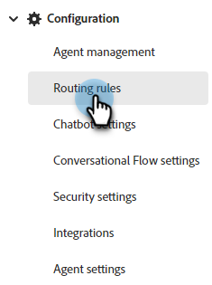

1. A guia **Regras personalizadas** é aberta por padrão.

   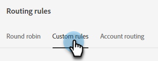

1. Clique em **Criar regra**.

   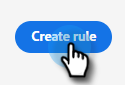

1. Dê um nome à regra. Como opção, você pode adicionar uma descrição e definir seu nível de prioridade. Clique em **Next**.

   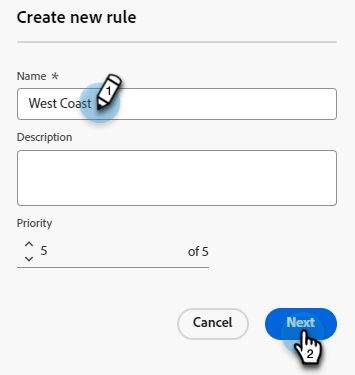

1. Escolha os agentes desejados.

   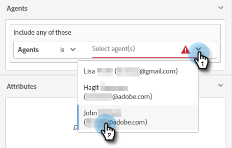

1. Arraste sobre os atributos desejados.

   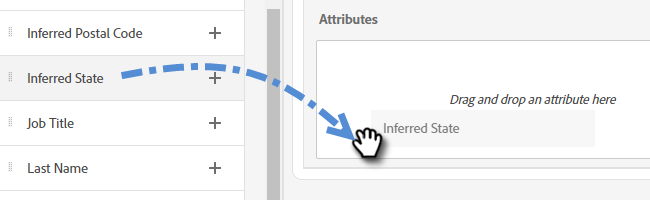

1. Localize e selecione os valores desejados.

   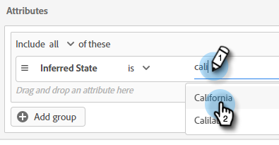

1. Quando todos os valores desejados forem selecionados, clique em **Salvar**.

   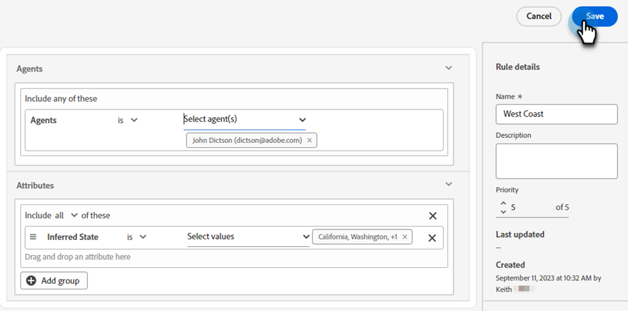

## Roteamento de Conta {#account-routing}

Identifique e faça upload da sua conta de público alvo e respectivos proprietários de vendas e encaminhe os visitantes provenientes dessas contas diretamente para o respectivo proprietário da conta.

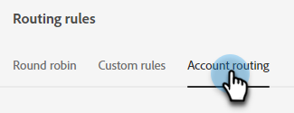

>[!PREREQUISITES]
>
>Antes que o _Roteamento de Conta_ esteja visível no Dynamic Chat, as permissões devem ser habilitadas no Admin Console. Consulte [Habilitar permissões](#enable-permissions) abaixo.

### Ativar permissões {#enable-permissions}

+++ Habilitar Permissões de Roteamento de Conta

1. Faça logon em [https://adminconsole.adobe.com/](https://adminconsole.adobe.com/){target="_blank"}.

1. Em _Produtos_, selecione **Dynamic Chat**.

   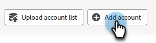

1. Em _Perfis de produto_, selecione o perfil desejado.

   

1. Clique na guia **Permissões**.

   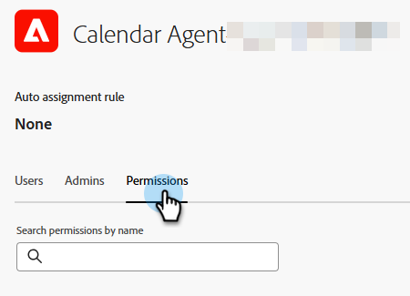

1. Clique no ícone de edição () ao lado de _Configuração_.

   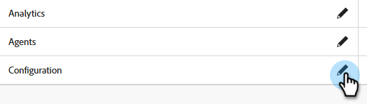

1. Clique no sinal **+** ao lado de _Exibir roteamento de conta_.

   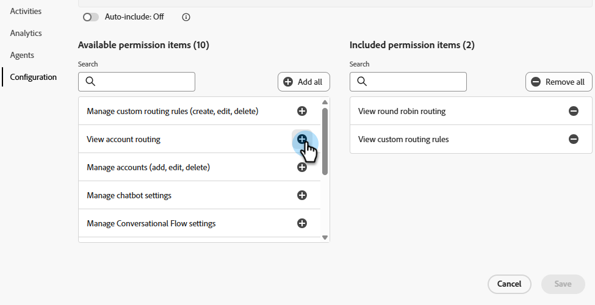{width="600" zoomable="yes"}

1. Clique em **Salvar** quando terminar.

+++

### Adicionar uma conta {#add-an-account}

Neste exemplo, todos os funcionários da Lego são encaminhados diretamente ao agente Steven.

1. Na guia Roteamento de Conta, clique em **+ Adicionar Conta**.

   

   >[!TIP]
   >
   >É possível criar várias contas de uma só vez, clicando em **Carregar lista de contas** e carregando um CSV.

1. Insira o nome da empresa, o domínio e selecione o agente desejado.

   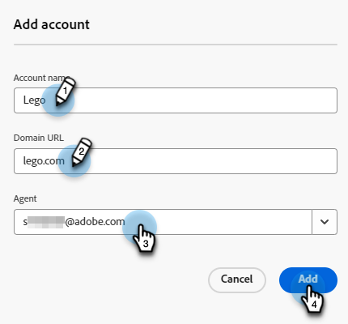
